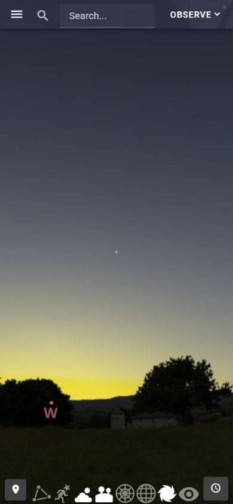

# 整场晨昏与地景亮度：当前有限修正

Goal active、无预算、未完成。本轮只改云观星的共享大气显示和地景亮度责任。低太阳颜色被蓝色通道上限压回深蓝、黄昏照片仍过亮这两个差距已经在实际软件 WebGL1 输出中修正；完整环境质量、普通 WEAPP 合成与目标性能仍未验收。当前执行只看唯一 [PLAN](../PLAN.md)，完整义务和商业排除不变。

## 参照与实际差距

Stellarium Web 的[保存原图](experience-twilight-paused-reference-2026-09-30.jpg)和[条件读回](experience-twilight-reference-conditions-2026-09-30.json)提供了新的可用参照：公共测试正式点 22.4826799°N／114.5557147°E，界面地点经纬度读回相符，自动定位未选；暂停在当地 2026-09-30 18:35:53／UTC 10:35:53。界面时间只有秒，亚秒未知，比较保 ≤1s 不确定性。DSS／Milky Way 明确关闭；本轮不采用其数据。大角星居中，方位 280°52′50.8″／高度 26°26′40.0″；朝向由可见资料及居中画面推定，横滚按默认直立地平线推定，没有读取参考引擎内部状态。

参考实际 Canvas CSS 为 390.3999939×844，像素节点390×844，保存 JPEG 解码390×843。参考短边视场40.78913365°（界面40.8°）按现有球面投影转换为本软件竖向85.00000121°。软件 Canvas 为390×844。相机、秒级时刻及数据差异因此不支持整图像素相同验收。当前HR:5340几何位置为280.8754336°／26.4177578°，不把它写成参考资料的完全同值。图层隔离的两张 reference-twilight 行关闭星座及网格；其它行恢复实际组合。参考有网页控件，软件 Canvas 没有 WXML；来源照片及各目录也不同。

当前实际 Sun 几何高度 −6.674655°、方位269.622986°。修前大气在太阳方位10°高处仍为RGB(9,17,31)，朝太阳低空缺暖色；原照片地景的暮光曝光与天空不相称。第一份仅增加视线消光的[冻结试绘](../../../../output/playwright/cloud-sky-twilight-display-trial-0930/result.json)虽令2°低带变暖，但10°仍蓝、且暖带大多被山体遮住，未采用；没有重做选型或源素材。

## 共享实现与恢复边界

- `sky-gpu-renderer.ts` 保留已采用的 Rayleigh／Mie、光学空气质量、同帧太阳、ENU逆投影和同一可选绘制层。低太阳的相对半程透过率持续参与民用暮光，近太阳压缩按当前有效 Mie 权重退去，低太阳改用受限中性通道上限和显示转移，保上方／反太阳方向蓝色。系数是固定模拟显示选择，不能当当地天气、测量亮度或光谱／多次散射精度。普通模式深色上限、−18°以下夜间大气分支及红光不提交该层的规则保持。
- `sky-landscape.ts` 为照片及程序回退共同持有昼光／环境光函数，沿原exact solar frame让前景在民用／航海暮光退到微弱夜间亮度。照片仍是固定拍摄照明，只能做统一曝光，不能按当前太阳重建源阴影／高光；程序材质继续处理自己的法线／方向光和雾化。没有新时间、相机、请求、纹理或资源owner。
- 原全景PNG、RLE、科学目录、图片透明度、虚拟地平配准和已绘帧遮挡／点选没有变化。图像失败保粗档及程序回退、太阳缺测保独立层、可选shader失败重试、Canvas代次与资源释放沿已有owner。本輪没有改变这些接口或恢复语义；此前[完整地景边界](experience-landscape-boundary-2026-09-30.md)仅保其原软件条件及alpha／投影责任，不升级本轮颜色或native证据。

## 实际组合验证

[生产软件结果](../../../../output/playwright/cloud-sky-environment-composition-0930-r3/result.json)由当前公共接口的报告／BSC、88星座出版／实际图片、合法2MASS全景、两档地景与M31来源链输入，编译真实scene／GPU／加载／点选owner。对冻结修前两源文件与当前源分别绘制同样24个条件，覆盖日落前、民用／航海暮光、夜间、日出方向，照片／程序回退／OFF，红光，局部9.1°含真实屏幕横滚、广角85°、全天274.9°、星座识别、M31局部及缩回。GL错误和独立图层失败为0。

| 对应实际输出 | 修前 | 当前／证据界限 |
| --- | --- | --- |
| 参照时刻太阳方位2°／10°高处的纯大气 RGB | (10,18,31)／(9,17,31) | (56,41,29)／(32,31,30)，暖色抵达照片上方可見区；旧源10°不满足暖色回归，当前满足 |
| 同方向50°高处 RGB | (9,16,32) | 同值，上方没有全局染暖；全天反太阳10°仍偏蓝 |
| 参照组合中的低于地平10°照片 RGB | 见冻结before行 | 当前(8,6,3)，实际前景退场，红通道低于修前30% |
| 高太阳白天广角／全天 | 原完整场景 | 分别1／2个像素最多一个8位色阶差；无超过一个色阶的差，不宣称整图SHA相同 |
| 无地景夜间、照片红光、程序红光、M31广角／局部 | 原完整场景 | 五组完整RGBA SHA相同；夜间大气分支相同 |
| 星座广角→局部→缩回、地景OFF→ON、参照场景返回 | 有实际图层 | 各自回到同一完整RGBA SHA；所有条件修前／当前的真实对象与已绘帧点选结果相同 |
| GPU及文件退休 | 真实分配 | 两组退出后textures／buffers／programs／shaders均0，文件写入1／释放1；两组创建数量相同，没有新增GPU资源种类或绘制层。仍不能推出总峰值或帧时合格 |

软件本轮没有加载SAO、W3或精细日月行星纹理，不能称为全部图层／完整星空旅程。源图片预解码仍是诊断条件，不能代替WEAPP图片加载时延、GC或CPU／GPU峰值。已实际查看参照时刻、日落、夜间全天和程序回退输出：当前仍比参考暮光暗、带宽和色调也有差异，固定照片照明的限制继续存在；不能把暖色像素通过当环境整体对齐完成。后续按其对整场识别的影响排序，不循环精调单色或追加现场测量硬依赖。

验证中的两项错误预期也保留原日志：第一轮把白天1色阶数值差当整图相同失败；第二轮把device gamma当纯screen roll，导致窄视场样本在画外。均修正验证条件，没有因此修改产品相机／姿态。最终使用不改变forward的真实屏幕横滚。失败目录与日志保留，不把它们说成成功。

## 当前运行、候选与检查

本輪实际发现旧60065／55700监听及PID24728不存在，先确认后只恢复同一份owned服务：当前60065／内部55803、PID5304／exec46700，已加载模块及中文出版hash与前轮相同。旧Context读回404；通过正式点公开resolve获得新revision1，保同一PUBLIC_REFERENCE地点与当地09月30日21:50:33时间意图，GET持久读回一致；没有复制旧ID或执行时间PUT。新报告见[报告](../tmp/v53-current-public-report.json)，Context只给摘要绑定，不在本文件明文展示ID。软件临时时刻选择不写公共时间。原生当前Context／SDK／Sky仍未知，末次v47／s8欢迎页只保历史，不声明它已运行新版。

Mini Program TSC、相关场景／地景／太阳／点选／失败恢复检查（46项）与Context结构检查通过；普通v53-final WEAPP构建通过，保3项原有构建警告。当前候选无诊断／fixture／feedback，尚未打开、未预览手机、不是settled candidate。原v52全部字节保留。精确源、构建树、接口、截图和日志见[当前绑定](experience-environment-composition-binding-2026-09-30.json)。独立审查没有覆盖本次改变，自审不补足该缺口。

本轮保存的参考已取到；恢复时标签页4实际不存在、浏览器tabs为空，未另开重复页，已清临时viewport override。没有IDE启动／刷新、手机操作、BFF重新编译、部署、提交推送或商业范围调整。

下一依赖回到浏览识别组合的共享资源共存／恢复与暖帧上传／峰值，再集中处理星点／星座／面状辅助、连续交互和整场质量；目标设备、普通Canvas＋WXML、姿态／校准、OS／GPU恢复、新月面手机、首屏／帧时／实际包体费用和最终必要审查仍开放。
