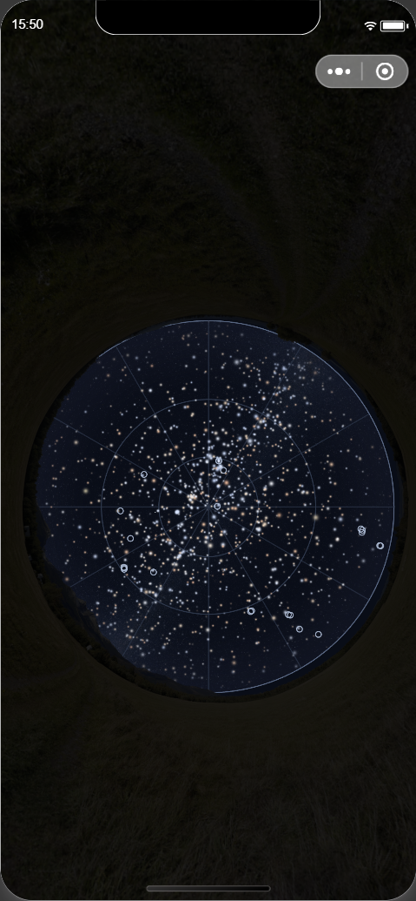
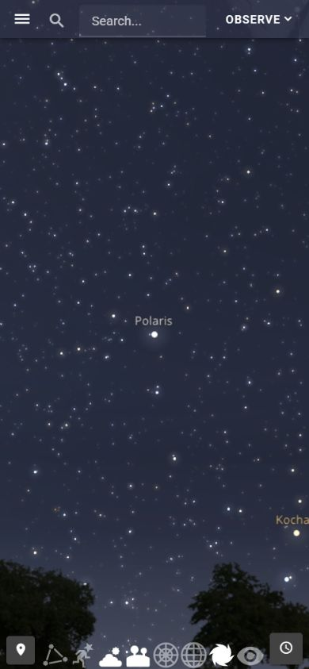
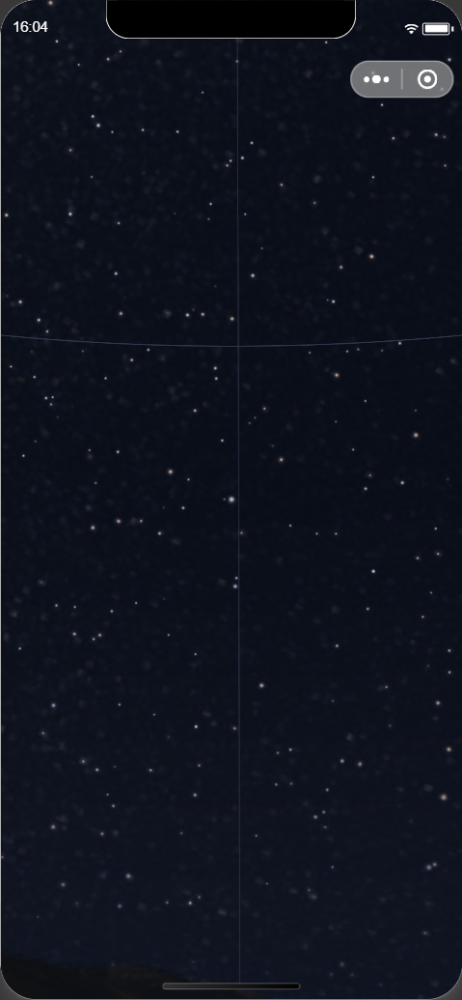

# v26 云观星全天、局部与参考条件核对

本轮遵守用户最新范围：地图CSS已恢复修前完全相同字节，含撤回改动的v27未打开、采用或投递；不新增范围外模块修复依赖。大字号继续暂停。Goal active、无预算，原33项云观星义务和商业排除理由仍有效。

[冻结验证](experience-sky-whole-scene-validation-2026-09-29.json)重新核同一v26的包指纹、99生产源码和既有测试输入未变，71事件/13原始479×1035截图与前轮来源/M42 trace保持。冻结后不追加；没有新增产品源码改动或重做数据获取。

从示例点公开 Sky 入口重进，同Context/revision2、民用2026-09-30 05:00、观测夜2026-09-29、UTC21:00、4208亮星目录对象/3目标。跟随方向不可用时明确“当前不可绘制”；公开手动入口后呈现45°星场，不冒充手机朝向。新页面恢复默认意愿：星座/地景/地平网格ON，W3/赤道网格OFF；这与来源 Back 保页内意愿是不同生命周期。

官方SDK在每次操作前测量实际Canvas size/offset，向同一Canvas发送双点 start/move/end。45°→183.9°→230.8°尚有圆盘两侧裁切；继续到270.2°才看到完整地平圆盘位于图内。因此名为full-dome的230.8°历史捕获不能被文件名认证为全天完成。

反向同组双点缩放回45°，同Context/时刻保留；排除系统栏、胶囊和底部安全区后的x4–475/y106–1015星图区与首张手动45°图0像素变化。这只证此输入/手动方向的开发回程，不证明真实双指、传感器或控件合成。

45°关闭/恢复星座意愿的相同裁切也各为0变化。当前共享渐显在40°以上隐藏详细层，这是正确门槛下的意愿切换，不能证明有可见星座效果。随后北极星方向25°已实际看到连线/插画；该局部中中文名称锚点没有进入视场，保留识别/拥挤及合成待验，不从代码或开关状态反推已可读。

公开中文“北极星”搜索得到唯一 Polaris/HR424；实际资料含中文介绍、方位359.6°/高度23.0°及可信身份。公开定位到45°后，当前渲染标记位于逻辑Canvas中心x195.1999969/y422。放至85°后同对象标记y477.2438642，证实共享全天浏览相机已开始转向天顶；这个85°画面不是以Polaris为中心的同朝向参考。返回25°/85°并关闭公开银河来源，再回45°，最终标记恢复中心，Context不变。45°往返有51像素变化、最大通道差1，85°有1像素变化、最大差1；如实保留这些差异，未自行设容差或写成0差。

参考复用唯一Stellarium Web标签页。实际公开 Share link 提供/skysource/Polaris路径；用同公开地点/已确认FOV定义构造局部45°可比输入。按既有[官方projection接口](https://github.com/Stellarium/stellarium-web-engine/blob/29870744c470ddc62fa869e153178c82a7824fa4/src/projection.h)与[stereographic实现](https://github.com/Stellarium/stellarium-web-engine/blob/29870744c470ddc62fa869e153178c82a7824fa4/src/projections/proj_stereographic.c)只核定义/数学关系，没有复制引擎代码。Mini垂直45°对应参考短边21.027648827109495°；两端实际CSS Canvas390.3999939×844。参考通过公开暂停控件读到2026-09-30 05:00:01，比Mini晚1秒；准确观察保存在[参考绑定](experience-v26-polaris-reference-matched45-2026-09-29.json)。参考FOV文字在移动布局隐藏，DOM文字为21.0°，不冒充可见工具栏。早先05:01:57的调箭头尝试未完成精确时刻对齐，time-fixed文件名不证明成功；最终局部对照来自后续明确绑定。

参考星表深度、地景/大气素材、显示曝光、相机总览语义和捕获编码不同；仅用于外观与辨认评估，不作跨图像素/密度/配准验收。先前若仅凭同名目标、名义FOV写“同朝向”，不足以证明实际已绘相机匹配；后续必须核实际中心/相机，旧开发结论不升级。

当前45°背景颗粒在关闭星座详细层时保持，不能归因于星座插画。实际公开对象列表展开了2MASS历史J/H/K来源、2048×1024限制、原图/条款和LANCZOS加工说明；现行publication f6aeb37d…/image e3a70f83…正常。共享galacticImage shader在同一精确观察帧绘图；但来源存在、shader路径和相似外观仍不独立证明这些颗粒全部来自该图。下一步复用已取输入做完整生产场景的同帧因果对照，再按其对浏览/辨认的实际影响修正；不重下载、不伪造mask、不隐藏银河凑完成。

最终同一v26/PID25916，DAY/标准字号、Polaris方向45°手动、无跟踪/modal，W3/赤道OFF，其余默认意愿ON。8789内存和共享服务保留；8791 source/context/resource pass，当前epoch PUT0、held/active0。浏览器临时viewport已reset，参考标签保留交接。

普通Sky控件/名称/modal在原生截图中仍不可见，不能宣布整页体验通过。新月面手机、真实姿态/完整旋转校准/OS后台、Android/iOS、整场质量/配准覆盖、目标性能/官方包体/实际费用及必要最终审查继续开放。范围外问题不增加为本Goal硬依赖，唯一当前顺序见PLAN。
