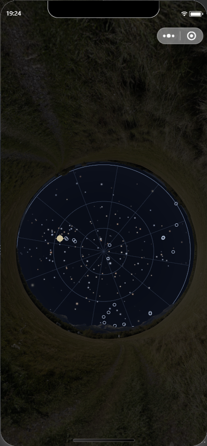
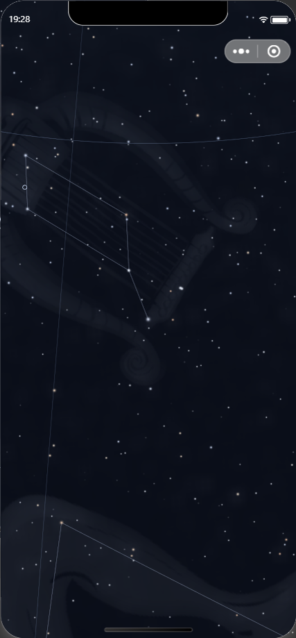
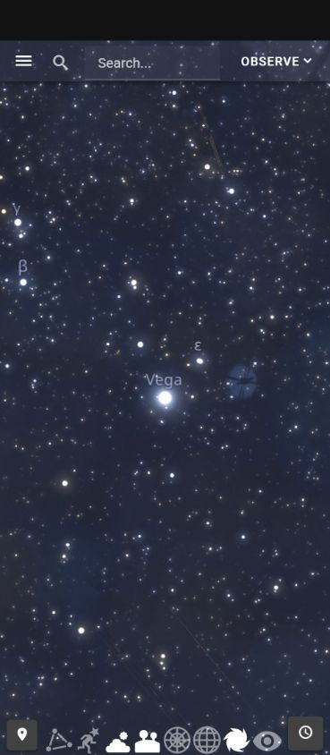

# 同一 v30 的浏览、识别、时间跟踪与返回

Goal active、无预算、未完成。只处理云观星。本轮没有修改产品源码、服务源码或候选，没有新构建、设备操作、云部署、Git操作或新增/复派 Agent；只收当前候选的组合证据并更新原唯一 PLAN 与恢复记录。大字号继续暂停。

[冻结绑定](experience-v30-combined-native-validation-2026-09-29.json)包含82事件、12张427×919原图、候选/106生产输入/相关检查输入/上一轮冻结证据的重新核验。12张原图全部由 root 实际查看，自查不等于独立审查。trace SHA256 为 `354e255e3106731013983a094d13310b9c208c603aa73a4d6fbb49d8f9998940`。该轮 helper 在冻结后拒绝再次加载，后续动作必须使用新 trace。

固定候选仍为 v30，SHA256 `bbc5f610b9d15d18ba0a3553db25c78da8fe120653de60a91b3f124270d82e42`，257文件/4,488,797 rawB。唯一开发者工具窗口 PID25916，SDK3.17.4，平台devtools、debug关闭；DAY、标准字号。本轮没有重跑已通过且输入未变的类型、行为、构建或Context检查。前轮有限光学修复、原构建三条警告和各历史故障证据保其原条件。

## 用户流程的实际结果

| 用户结果 | 同一候选的实际证据 | 验证边界 |
| --- | --- | --- |
| 局部连续浏览全天再返回 | 19:00下，实际SDK双指由M63附近0.15°依次至0.76°、3.8°、18.9°、89.6°、256.5°、274.9°；全天圆盘完整进入画面，再回108.8°、23.5° | 同一Context；最大视场钳制后回程不是原18.9°，不称精确相机或像素相同。SDK触摸不是手机双指 |
| 星座辨认 | 18.9°实际帧列出猎犬座；274.9°按现有已确认语义隐藏星座；搜索定位后的23.5°帧列出天琴座，Canvas插画/连线实际出现 | 名称节点已挂载，但当前捕获没有普通名称/dock/modal合成，不认证用户能看到名称或整页可操作 |
| 中文搜索、定位与自然点选 | 实际输入“织女星”得到Vega/HR7001；公开定位后按测得Canvas中心触摸，资料仍为Vega/HR7001/HIP91262。19:00的方位338.4°/高度72.2°；21:00再自然点选为同一身份，方位305.5°/高度53.5° | 证明当前帧实际消费者一致；不以该局部身份样本认证全目录、低空/边缘、中文键盘或手机合成 |
| 时间变化与跟踪 | 公开选择跟踪Vega，再从实际公共时间刻度提交21:00；帧、资料和持久Context一起更新，仍跟踪Vega，天琴座仍在 | 原图19:00→21:00星图区330,391像素有变化、最大通道差223；不是只核代码或状态。没有验证未提交时间预览的取消 |
| 跟踪中资料来源往返 | 独立来源页可读，公开Back后资料仍是Vega；关资料后保持跟踪、23.5°、21:00及同一Context | 原星图区实际25像素不同、最大通道差1/255；**不能称像素相同**，微小差异机制未证明。普通星空控件合成仍缺 |
| 退出释放、同身份重新进入 | 公开停止跟踪/返回原入口，Context仍为正式示例点/21:00/revision3；云观星编码文件7→0。原入口云观星重进后，方向不可用给出手动入口，公开手动恢复45°实际星场与同一Context，文件重新加载3份 | 返回原入口只作为Sky消费者验证，没有修改地图。重新进入按现有入口语义恢复默认手动视场；不宣称恢复原Vega相机/跟踪、真实姿态或OS后台 |

本轮当前民用时间为2026-09-29 21:00 Asia/Shanghai、观测夜09-29、UTC13:00/revision3。Context ID摘要 `893b8fd5c919dc7b2f99fa6d9e922d76966fef9b75238ba9dcca663c618d4ad6`，fingerprint `0bb9648591a78754efb9b0e488c2b4624b723af1041ce379979e5e4a02b5f095`；身份/fingerprint与本轮19:00/revision2及前轮v30相同，时间revision真实递增。4039是该时刻真实亮星**目录对象**数量，不是截图中已画星点数量。当前Sky45°手动、地景/星座/地平ON、W3/赤道OFF，无跟踪/modal/list/timepanel。

## 原图与未完成的控件显示

全天原图能查看圆盘、几何地平、网格、星场及圆盘外的通用模拟地景。照片不表示该地点实测山体。普通页面控件没有出现在此捕获中：

21:00跟踪原图能查看实际星场和天琴座插画/连线；公开的名称/资料控件仍缺完整显示证据：

本轮进一步区分状态与画面：dock实际display:flex/opacity1/visibility:visible/z-index12；时间按钮88×44、offset12/766，实际Canvas390.3999938964844×844。依据当前测量向逻辑坐标56/788作SDK坐标tap，aria-expanded变为true；原图仍只有Canvas。这个结果证明有事件效果，**不证明按钮已可见、层级正确或真实手机触摸有效**。SDK systemInfo的window390×762与测得Canvas几何分别保留，不混同。没有盲目改为CoverView，也没有用另一渲染器补画页面控件。

## 资源、服务与历史证据

本轮编码Sky文件：全天6份/4,951,097B，退出前7份/1,696,787B，返回原入口0份，重新进入3份/4,874,512B；摘要和原图保于冻结绑定。这是临时编码文件归属/释放/重载证据，不是解码内存、GPU峰值、真实首屏或目标性能。

8791/PID4924/exec17379及controller64485保原epoch `2026-09-29T09:14:20.175Z`、8789/PID22124/exec54820保原Context内存；共享8787/8788未动。最终source/context/resource均pass、phase settled、held/active0、PUT4([200,200,200,200])、totalObserved349。相对前轮261，只取sequence262–349的88个native非probe记录：29个200、59个304，全部upstreamEnded/downstreamFinished。不能凭复用的native-progression phase把以前198个记录全算成本轮，也不能把普通成功响应当作故障恢复/解码/GPU证据。

前轮[v30有限视场](experience-optical-boundary-2026-09-29.md)仍是独立冻结记录，其M63回程0差和revision2/19:00不覆盖本轮Vega25像素差、revision3/21:00。v29[网络重试](experience-sdss-image-recovery-2026-09-29.md)/[正文取消](experience-sdss-cancel-2026-09-29.md)不升级为新版或手机验收。

地图CSS SHA256仍为 `81283f7b2849cd55eed4a82d322885e1c76d7f8aa81ab26fc2fc584d198c0e82`，全部106候选生产输入保持；其它分包没有重新构建或改变，v27未采用。

## 参考对照的实际限制

经公开URL请求正式示例点的经纬度和21:00/Vega，参考页面可见Vega、HR7001及对应资料。依据现有立体投影视场定义换算请求短边10.900173185479138°，实际参考Canvas CSS390.3999938964844×844与本轮测得Sky Canvas一致。浏览器viewport设置390×844时实际Canvas仅796高，随后临时设置390×892才得到844高；已恢复viewport。不能把设置值当成实际渲染几何。

但网页时钟持续走动，语义/当前截图坐标点击均没有打开可固定时刻的面板；数值地点也未在可见编辑器中核定。[参考条件原文](experience-v30-vega-reference-provisional-2026-09-29.json)和JPEG保留为**未匹配参考**。截图实际369×844，包含宿主缩放/顶部黑带，不与原生427×919逐像素比较。当前视角/roll/实际FOV未完整确证；原参考DSS/更深恒星等数据差异和商业排除继续保留。没有采用受限来源、注入隐藏引擎状态或重启选型。

官方微信Canvas文档导航被浏览器site-safety策略阻止，没有使用另一网络入口获取被阻止页面。对本机已安装截图实现的只读检查未建立完整合成路径，不能据此断言产品控件已坏或已正常；该缺口保持未验证。

## 诊断纠正与剩余义务

三次native工具失败保在trace：旧selector与两次CLI字符串引用失败；更正引用后的实际只读SDK/显示/route读回成功。早期service/SDK字段提取为null的诊断不作产品结果，由最终实际读回取代。冻结脚本首轮错把语义result字符串当RPC wrapper；第二轮自行假定来源返回必须0像素差，实测25/max1后保真实差异，未改变源码、原图或缩小裁区。[两次诊断原文](experience-v30-combined-native-close-diagnostic-2026-09-29.txt)保留，最终exec6ddcb0成功。

剩余工作按唯一PLAN继续：整场可辨认质量与实际配准/覆盖、普通名称/dock/modal组合、原生解码/GPU恢复及未验失败机制；真实姿态/完整旋转校准/OS后台、Android/iOS/新版月面手机、目标冷启动/帧时/资源峰值/官方包体/实际费用、最终必要独立审查。所有33项义务、原商业范围/排除理由、统一共享owner与已有成果保留。没有因手机不可用或缺少现场数据暂停整个Goal；也没有把本轮开发证据当作整体交付完成。
