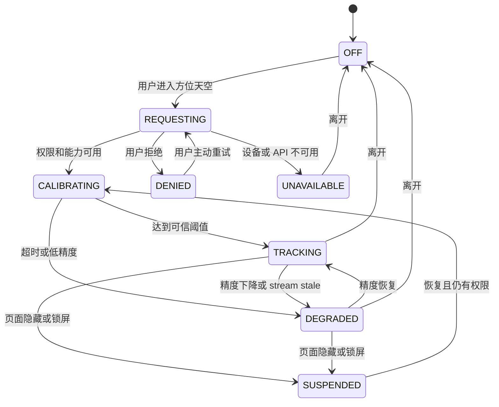
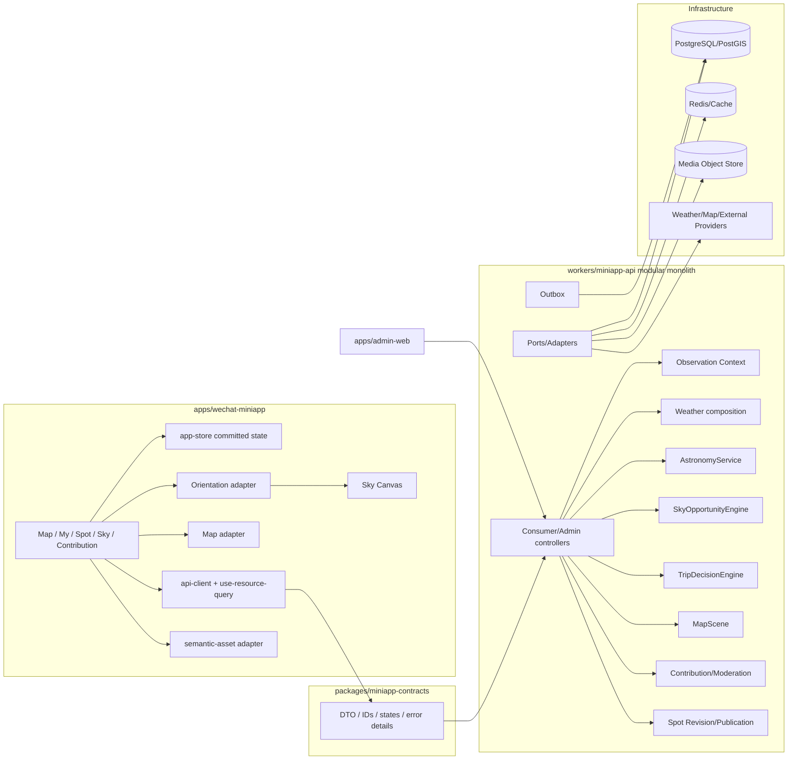

# 《今晚去观星》微信小程序体验重构、天文能力与内容治理完整产品与技术方案

> 状态：当前实施方案，已对齐现行 Product/Architecture Context、Mini Program/Operations Screen Contract 与 Sky Canvas Design Authority。
> 日期：2026-08-25
> 覆盖：微信小程序、独立 Owner 运营 Web、共享契约、Mini Program BFF、数据、媒体、地图、传感器与验证边界。
> 资源状态：Sky Canvas 视觉系统已选定；本轮 DRA 页面资源已发布为 Mini Program 与 Operations 的正式 implementation constraints，并通过 handoff preflight；它们不是 pixel-exact target、生产实现或验收结果。
> 当前真值：只保留一个现行方案、一个现行 DRA 项目和一套现行产品实现；版本标签仅用于协议或历史来源，不建立并行产品。

## 0. 本轮交付结论

本轮 DRA 的约定范围已经完成，产品、交互、运营治理和开发消费信息均已纳入一个当前资源。现在交付的是与它同步后的完整产品与技术方案，而不是另一份“修订版”或旧/新并行稿。

当前唯一 DRA 项目：

```text
C:\Users\777\AppData\Roaming\Open Design\launcher\channels\stable
\namespaces\release-stable-win\versions\0.20.1\payload\resources\app
\prebundled\.od\projects\starward-sky-canvas-core-2026-08-25
```

当前浏览入口：

- 本地交互预览：<http://127.0.0.1:8765/index.html>
- 资源说明：`docs/design-resources/miniapp-design-system-2026-08-25-sky-canvas/current-dra-iteration.md`
- 当前预览图：`docs/design-resources/miniapp-design-system-2026-08-25-sky-canvas/current-preview.png`
- 人读开发 handoff：`docs/design-resources/miniapp-design-system-2026-08-25-sky-canvas/implementation-handoff.md`
- 机器可读规格：`docs/design-resources/miniapp-design-system-2026-08-25-sky-canvas/selected-source/implementation-handoff-spec.json`
- 正式 Mini Program handoff：`docs/design-resources/miniapp-design-system-2026-08-25-sky-canvas/selected-handoff/miniapp-sky-canvas-current.md`
- 正式 Operations handoff：`docs/design-resources/miniapp-design-system-2026-08-25-sky-canvas/selected-handoff/operations-sky-canvas-current.md`
- Open Design 索引：项目内 `README.md` 与 `artifact-manifest.json`

本轮资源共有 5 个入口、19 个命名画面：

| 入口 | 覆盖 |
| --- | --- |
| `index.html` | Map/Finder、地点详情、天文信息、方位天空与核心微交互 |
| `supporting.html` | 我的、今晚计划、设置、功能门控的内容导入 |
| `contribution.html` | 三类投稿、渐进表单、草稿/上传恢复、用户可见状态历史 |
| `operations.html` | Queue、Case、媒体、合并、发布评估、上下架、替换/退役、审计 |
| `workbench.html` | token、字体、图标、选择态、通知、Sheet、状态与开发映射 |

资源完成不等于生产完成：

- 已确认：视觉方向、关键页面结构、交互逻辑、状态表达、组件族、实现消费边界，以及两类 constraint handoff 的输入闭包。
- 未确认：WEAPP 原生渲染、腾讯地图账号/样式、真实传感器、真实数据、Admin 认证/RBAC、生产写入与读回、pixel-exact 或 production conformance。
- 若未来另有逐像素、逐状态的 machine-bound fidelity 要求，应从当前唯一上游生成新的不可变 `exact-target` handoff；不得把当前 constraint handoff 改名冒充，也不得保留并行视觉方向。

## 1. 原始需求与本次修正闭环

| 需求 | 当前产品结论 | DRA 资源 | 技术 owner / 验证 |
| --- | --- | --- | --- |
| 整体视觉、搜索筛选、卡片、字号、颜色、动效重做 | 采用 Sky Canvas：户外、活力、轻量、简洁、略可爱；地图/天空优先 | Core、Supporting、Workbench | `DESIGN.md` → Mini Program token projection；WEAPP 多尺寸/大字/动效验证 |
| 个性化地图，不呈现默认腾讯产品感 | 保留腾讯地图引擎，定制底图与项目自有 marker、callout、分析层、控件和 Sheet | `index.html` Map/Finder | `MapScene` + Map adapter；账号配置与真机 native layer 验证 |
| 用户上传、后台审核、上下架与替换 | 三类投稿；审核、canonical merge、publication assessment、publish/suspend/unpublish/replace/retire 分离 | Contribution、Operations | Mini Program BFF、PostgreSQL/PostGIS、Admin Web、Object Store、outbox |
| 地点天文信息可切日期/时间并丰富表达 | 摘要、主/备时窗、共享时间轨、对齐条件带、目标、星图、来源与完整度 | Core astronomy | `ObservationContext`、`SkyReport`、`SkyScene`、服务端天文与决策引擎 |
| 参考给定天文网页的单地点逻辑 | 吸收“地点 × 夜晚 × 时段 × 数据层”的组织，不复制视觉、代码或品牌 | Core astronomy | 自有契约与数据来源；专属验收见第 8 节 |
| 举起手机后画面随方向更新 | `方位天空` 只从天文信息进入，只跟随设备方向；没有手动方向按钮或拖拽改 heading | Core orientation | Orientation adapter + Canvas；权限、校准、精度、生命周期、对象列表降级 |
| 能用组件库就使用 | 允许复用现有组件、成熟轻量依赖或边界自实现；统一经过项目 adapter | Workbench | 实现阶段基于 WEAPP/Admin 兼容、主题、包体、a11y 和退出成本选择 |

原始问题没有遗漏。“天文信息”和参考网页逻辑是本方案的独立核心能力，不是地图或字体修正的附属项。

## 2. 产品定义

### 2.1 产品目标

消费者需要在一个连续任务里回答：

1. 今晚值不值得去？
2. 去哪个正式观星点？
3. 主观测时窗和备选时窗是什么？
4. 地点是否可达、开放、合法且安全？
5. 选中时间能看到什么，天空条件为什么好或不好？
6. 到现场后，手机正对方向有哪些可见目标？

运营者需要在独立的认证工作台中回答：

1. 投稿类型、证据与风险是什么？
2. 媒体能否安全、合法地进入证据链？
3. 哪些字段可合并到 canonical spot revision？
4. 新 revision 是否通过完整性与发布门槛？
5. 如何上架、暂停、下架、替换或退役，并保留历史和恢复点？

### 2.2 目标用户与信息优先级

| 用户 | 首要判断 | 首屏信息 | 下钻信息 |
| --- | --- | --- | --- |
| 新手 | 今晚是否去、去哪、几点 | 结论、主时窗、车程、主要风险 | 原因、目标、准备 |
| 摄影用户 | 银河/月亮/流星雨窗口 | 时窗、月光、云、方向 | 分层云、风、湿度/露点、目标高度 |
| 目视观测用户 | 暗度、透明度、遮挡、安全 | 暗度、总云、开放方向、道路 | 来源、模型一致性、设施 |
| 现场用户 | 当前方向能看到什么 | 校准/精度、方向天空、相关目标 | 文本对象列表、来源和时间 |
| 投稿者 | 如何提交真实证据 | 类型、必填项、媒体/位置同意 | 草稿、上传、审核、合并/公开影响 |
| Owner | 如何安全变更正式事实 | 队列、风险、差异、发布阻断 | revision、审计、恢复与读模型 |

全产品采用三级信息：

1. 结论：是否值得、最佳时窗、硬阻断。
2. 行动：筛选、选点、选时间、导航、收藏、计划、投稿、审核。
3. 证据：逐时矩阵、来源、有效期、模型、算法、revision 与局限。

### 2.3 成功定义

产品北极星是“形成一次可执行的地点 + 时间决策”：用户选择正式点位和主/备时窗，并完成收藏、计划或外部导航中的至少一个动作。

辅助信号：

- Map → Callout → Detail → Spot Night → Plan/Nav 漏斗。
- Search 无结果率、快速条件使用、Finder `peek/expanded` 到结果选择的转化。
- 时间轨交互、主/备时窗查看、证据抽屉使用和上下文恢复。
- 方向天空权限、校准、可用、降级、恢复和退出。
- 投稿草稿、上传、提交、补充、接收、合并和公开影响的耗时。
- Admin 队列积压、revision 冲突、发布阻断、下架与替换恢复。

埋点不默认记录精确坐标、原始查询文本与位置组合、连续姿态、相机帧、EXIF 或投稿媒体内容。

### 2.4 非目标

- 不自研地图引擎，不做转弯级导航。
- 不做通用天气仪表盘、天文百科或公开社交信息流。
- 不允许投稿或审核接收直接改变公开正式点。
- 不用 H5、静态稿或 DRA fixture 替代真实 WEAPP/Admin/API 验收。
- 当前 `方位天空` 不是相机 AR：不显示实时相机画面，不做 SLAM、空间锚点或环境理解。
- 不做完整深空目录；只覆盖当前决策相关的亮星、星座骨架、太阳/月亮/行星和推荐目标。
- 内容导入功能关闭时不在当前路由树保留旧入口。

## 3. 信息架构与页面责任

当前主导航严格只有 Map 和 My：

```text
Map
├─ 地图探索画布
├─ Search + 快速条件
├─ Finder Bottom Sheet（closed / peek / expanded）
├─ 观测条件 SourceLift（同一张地图、一个时间、一个分析层）
├─ Marker / 整卡 Callout
└─ 正式点位详情
   ├─ Tonight 判断
   ├─ 今晚夜空（唯一整行入口）
   │  ├─ 天文信息父页
   │  ├─ 方位天空（sensor-follow-only）
   │  └─ 目标详情
   ├─ 概览 / 指南 / 场地
   ├─ 去这里 / 收藏 / 计划
   └─ 反馈现场情况

My
├─ 账户概况
├─ 今晚计划
├─ 投稿与状态
└─ 设置
   ├─ 显示模式
   ├─ 观测红光进入/退出
   ├─ 权限与提醒
   └─ 数据操作

Owner Operations Web
├─ Queue
├─ Case / media review
├─ canonical merge
├─ publication assessment
├─ publish / suspend / unpublish
├─ replace / retire
└─ audit / recovery
```

关键责任：

| Surface | 唯一责任 | 禁止 |
| --- | --- | --- |
| Map | 空间发现、快速比较、地图分析和选中地点 | 完整地点文档、全量专业矩阵 |
| Finder | 搜索、快速/高级筛选、`想去`/`其他观星点`结果 | 重复快速条件、默认大框、直接跳详情 |
| Callout | 让用户决定是否进入详情 | “查看地点判断”文字行、设施/来源堆叠 |
| Spot Detail | 地点身份、今晚判断、路线、开放、安全、设施、媒体 | 复制 Spot Night 矩阵、拥挤动作行 |
| Astronomy | 某正式点某夜的时间、天空、目标与证据 | 任意当前位置天空、fixture 伪装实时 |
| Orientation | 同一地点/时间的手机方向呈现 | 手动 heading、天文计算、伪造方向 |
| Contribution | 采集 provisional evidence 并反馈生命周期 | 投稿后直接改正式点 |
| Operations | 审核、媒体、合并、发布、替换与审计 | 第二份点位真值、绕过 publication gate |

## 4. Sky Canvas 设计系统与 DRA 消费规则

### 4.1 Authority 顺序

```text
Product / Architecture Context
  → Product Surface / Screen Contract
  → DESIGN.md Sky Canvas exact system values
  → selected DRA implementation constraints
  → production token/component/route owners
  → current-candidate runtime verification
```

- Context/Screen Contract 决定页面做什么、状态如何变化、信息/动作/反馈归谁。
- `DESIGN.md#wechat-mini-program--sky-canvas-v1` 是唯一视觉系统精确值 owner。
- DRA 展示当前方向在页面和状态中的应用，但不拥有业务、数据、权限或算法规则。
- 生产 token、组件和页面只能消费上游，不得反向把实现默认值写成产品真值。

### 4.2 设计特征

- 户外：路径、地形、天际线、月/日事件和方位是画面结构，不靠露营贴纸。
- 活力：periwinkle/indigo 表示选择和时间，trail green 表示路线/地形，lunar gold 表示月日事件，risk coral 表示阻断。
- 轻量：删重复标题、无效说明、重复筛选和分隔线墙；内容不拆成卡片墙。
- 简洁：地图、天空、时间轨是主要工作对象，chrome 后退。
- 偏可爱：友好圆角、紧凑 icon well、半裁星角和短因果动效；不使用玩具字体、吉祥物、闪粉、光晕或循环粒子。

### 4.3 字体与信息密度

- 中文使用平台常规系统字体：`-apple-system / BlinkMacSystemFont / PingFang SC / Microsoft YaHei / system-ui`。
- 不下载装饰性中文字体；气质通过层级、图标、间距、轨道和动效建立。
- 普通正文/辅助信息使用 400–500；普通动作 500–600；section 600；650–700 仅用于地点/夜晚身份、决定性结论或主时间。
- instrument mono 只用于时间、角度、百分比、距离、风速和 tabular data。
- 750rpx 基准：普通控件 24rpx/32rpx、正文 28rpx/42rpx、section 30rpx/42rpx、唯一 display 44rpx/52rpx。
- 320/375/430 CSS px 和大字模式不得出现页面级横向滚动。

### 4.4 控件与动效修正

- 所有动作保留至少 88rpx/44px hit region；可见控件可以更小。
- 快速条件/筛选项的可见 capsule 为 60–64rpx 高，18–20rpx 横向 padding，12rpx gap，16rpx radius。
- 选中星角为 36–40rpx 的圆润实心五角星，中心位于 capsule 右上角，外部裁掉，视觉约占四分之一且不遮字。
- pointer hover 只能改变表面/透明度，不增加几何 outline；键盘 `:focus-visible` 贴合可见控件而非无形 hit box。
- 手机内的纵向滚动 owner 保留触摸/滚轮/键盘可达性，但隐藏 scrollbar chrome 且不占布局宽度。
- 图标只用于真实对象、状态或动作；不在每行文字前装饰性撒 icon。

### 4.5 当前资源状态与正式 handoff

本轮 DRA commission 内没有剩余的页面/组件资源生成工作。当前页面资源已固定为两个正式 implementation constraints：

- `target-miniapp-sky-canvas-current-constraint`：Mini Program 页面、组件、状态、交互与动效组合约束。
- `target-operations-sky-canvas-current-constraint`：独立认证 Operations Web 的审核、合并、发布与审计组合约束。

它们共同提供不可变 selected source、human handoff、machine-readable specification、feasibility input、Inspector/Fact manifest 和正式 preflight，可用于：

- 产品/技术评审；
- 实现拆分、组件族识别、状态与动效说明；
- 第一个生产纵切的设计参照；
- 实现阶段的正式组合与状态约束。

它暂时不可用于宣称：

- pixel-exact target；
- production pixel fidelity；
- WEAPP native interaction；
- real-data、sensor、RBAC 或 side-effect acceptance。

正式 constraint preflight 只证明交付输入完整、闭包一致且未超出声明边界，不证明生产候选符合它。若未来需要 formal `exact-target`，下一步不是再做一套视觉，而是从当前唯一上游生成新的不可变精确目标、完整 Inspector/Fact closure 与对应 preflight。

## 5. 核心产品体验

### 5.1 Map、Finder 与观测条件

默认地图：

1. Map 首屏不展示 Finder 大框，`extent = closed`。
2. 顶部是一个 conventional Search field；其下只显示 quick filters。
3. 第一次提交查询或第一次把 quick filter 从未选变为选中时，可进入 `peek`。
4. 安静的把手既支持上拉，也支持 44px/88rpx 的 tap/accessibility toggle 进入 `expanded`。
5. `expanded` 只展示高级筛选和 `想去`/`其他观星点`结果，不重复 quick filters，也没有“找今晚的观星点”“展开筛选”之类解释性头部。
6. Back/Escape/下拉按 `expanded → peek → closed` 返回；关闭不清空已提交 query、quick filters 或 selected spot。

筛选语义：

- quick filters 立即提交；
- advanced filters 在进入时保存 opening snapshot；
- draft 变化后才显示紧凑的提交/恢复动作；
- 关闭 Sheet 丢弃未提交 advanced draft；
- 18 个 terminal choices 保持一个 filter truth，不分裂成两个 store。

结果语义：

- Finder 只有 `想去` 和 `其他观星点`两个一级分区；
- 激活结果会关闭 Sheet、选择并聚焦现有地图 marker/callout；
- 不直接进入 Detail；用户再激活整张 callout 才进入。

`观测条件`：

- 点击后确实把选择的观测分析结果覆盖到同一张地图上；
- 只允许 `NONE / LIGHT / TOTAL_CLOUD / OPPORTUNITY` 中一个动态/分析层；
- SourceLift 使用 `mapCoupled`，不 clone、不 remount 第二张地图；
- 聚焦层只有一个可见 selected local time，拖动时用已加载 frame 本地预览；
- 有效松手才提交唯一 `ObservationContext.selectedAt`；
- 控制区不做内部滚动，必要内容通过紧凑 reflow；用户手机不显示滚动条。

### 5.2 Marker、Callout、Spot Detail 与 Favorite

- marker、Finder row、callout、route context 和 accessibility list 共享一个 formal `spotId`。
- 整张 callout 是点击区域，右侧只保留 chevron；不显示“查看地点判断”。
- callout 只放地点名和少量比较字段，如今晚条件、停车、车程/距离、暗度；完整证据进入 Detail。
- Spot Detail 顺序为：地点身份/路线 → Tonight 判断 → `今晚夜空`整行入口 → Overview/Guides/Site tabs → 证据与计划动作。
- `今晚夜空`是 104–112rpx 的紧凑 whole-row action，含 horizon/constellation icon、选中时间摘要和 chevron；不再使用大面积主按钮。

Favorite：

- inactive：透明中心、白色描边星。
- activation：主星旋转并轻微缩至约 0.92 后填充淡黄；短弧拖尾出现；最多 3 颗 12/16/20rpx 的流星从 effect stage 外沿不同曲线进入并停下。
- active：主星始终占主导；卫星总视觉面积小于主星约 45%，距离越远透明度越低；主星和卫星保留短而淡的静态拖尾，无持续旋转、环绕、发光或循环。
- deactivation：主星回到基础大小，填充、卫星和拖尾淡出。
- rapid tap：从 live presentation state retarget，不排队。
- reduced motion：不移动、不旋转、不出现流星，只用不超过 100ms 的 fill/opacity 变化。
- optimistic mutation 失败时回到服务端关系，并通过统一 notification 提示；Finder `想去`与 Detail 保持一致。

### 5.3 天文信息

参考项目：<https://perseids.giraffetree.cn/>。

吸收的是信息组织逻辑：

- 地点是上下文；
- 夜晚/日期是一等状态；
- 选中时间贯穿摘要、时窗、条件、目标和天空；
- 云、月、黑夜、风、降水等在同一时间轴上比较；
- 普通结论和专业证据同时存在；
- 空间图层参与选点。

不吸收：

- 品牌、视觉、文案、代码和页面构图；
- 无来源的 fixture；
- 把“天空好”直接等价为“可以安全出行”。

页面层级：

1. Sky/arc visual：地点、夜晚、当前时间和稀疏目标。
2. Tonight conclusion：主时窗、备选时窗、开始/结束原因、硬阻断。
3. Shared Time Rail：now、日落/日出、暮光、月升/月落、主/备时窗。
4. Aligned Condition Bands：天文黑夜、总云/低中高云、月亮高度/照明、降水、风、湿度/露点、可见度和机会分。
5. Target list：目标、方位、高度、原因、可信度和最佳时间。
6. Evidence drawer/matrix：来源、更新时间/有效期、模型一致性、算法/catalog revision、限制。

用户拖动时间时，天空对象、条件值、目标方位和游标一起预览；有效提交后所有关联查询使用同一 context revision。缺失字段保留稳定槽位并显示 partial/unavailable，不能用 0 或晴天替代。

### 5.4 方位天空

- 只从天文信息父页进入，必须携带 formal `spot_id`、selected time、timezone、data/catalog/algorithm revision。
- 只跟随手机方向，不提供手动方向按钮、步进器、slider 或 drag-to-heading。
- 手机姿态只改变视口，不改变服务端天文事实或 committed time。
- 权限、校准、可用、拒绝、低精度、stream stale 和设备不可用均有明确状态。
- 无法获得可信方向时停止宣称 heading/altitude，不生成假运动；天空仍可显示无方位承诺的内容，celestial-object list 继续可用。
- 顶部状态是一个短标签；下方恢复面板只有 icon、友好标题、一句隐私/用途说明、紧凑主动作和安静的稍后处理。
- 页面隐藏、锁屏、跳转、卸载都释放 listener；返回后重新验证 permission、capability、quality 和 context。

这里复刻的是“手机移动时星图与手机朝向同步更新”的能力，不是相机画面 AR。相机 AR 是另一个隐私、性能和原生层级边界，本次不纳入当前 product scope。

### 5.5 My、Plan、Settings 与内容导入

- My 是常规账户中心：标题、一个 Settings gear、账户概况和少量日常入口。
- My 不展示 Favorite 数量、列表或重复 route；收藏浏览属于 Map Finder 的 `想去`。
- Plan 拥有出发准备、路线节点、时窗和可恢复动态条件，不复制 Spot Detail 的地点事实。
- Settings 独立拥有显示模式、观测红光进入/退出、权限、提醒和数据动作。
- 观测红光是全局 presentation state，不是 Spot Night 内的第二入口或第二 store；退出恢复进入前上下文。
- 内容导入在 feature disabled 时不进入 route tree；启用后遵循 `SOURCE → EDIT_DRAFT → ASSOCIATE_SPOT → PREVIEW → SUBMIT`，保护编辑、权利、URL 安全和 `spot_id` / `spot_proposal_id` 分离。

### 5.6 用户投稿

三类投稿：

- `FIELD_REPORT`：对已有正式点的到访、道路、设施、开放、安全、地平线或媒体事实。
- `CORRECTION`：指出已有事实错误或过期，并提交建议值/依据。
- `NEW_SPOT_PROPOSAL`：提出尚未成为正式点的新地点。

表单按类型和 topic 渐进展示。已有 formal spot 的报告不读取当前位置；只有新点提议在单独同意后采集精确位置。媒体必须有权利确认、MIME/size 校验、metadata sanitation 和可恢复 upload session。

用户可见的三条状态轴：

```text
submissionState:
  DRAFT → PENDING_REVIEW ↔ CHANGES_REQUESTED
        → ACCEPTED | REJECTED | WITHDRAWN

mergeState:
  NOT_STARTED → READY → MERGED | SUPERSEDED

publicationImpact:
  NONE | CANDIDATE_UPDATED | ACTIVE_REVISION_UPDATED | SPOT_PUBLISHED
```

“已接收”只表示投稿可进入 canonical processing；不表示事实已合并或地点已公开。

### 5.7 Owner 运营闭环

Owner Operations 是独立认证的响应式 desktop Web，不是小程序内 demo：

1. Queue：筛选、优先级、重复/风险提示。
2. Case：原始投稿、revision、地点、来源、用户可见历史。
3. Media review：格式、权利、净化结果、接受/拒绝单个媒体。
4. Canonical merge preview：逐 claim 对比当前值、投稿值和新候选值。
5. Merge commit：绑定 submission revision、spot revision、idempotency key、receipt 和 audit；生成 candidate revision，不发布。
6. Publication assessment：重新检查完整性、来源有效性、安全硬阻断、并发 revision 和 public projection。
7. Publish / suspend / unpublish：区分公开、暂时不可去和从公开读取移除。
8. Replace / retire：保留历史和关系，预览收藏/计划影响，禁止 successor cycle。
9. Audit / recovery：append-only、redacted；恢复通过 operation recovery point 和 readback，不编辑历史。

## 6. 关键产品状态与不变量

### 6.1 Observation Context

地点、夜晚、时区、选中时间、目标、天气视图和版本组成一个协调状态：

```text
spot/location + timezone + localDate/nightBounds + selectedAtUtc
+ targetProfile + weatherView + eventInstance
+ contextRevision + weather/astronomy/opportunity/trip/catalog versions
```

Map、Detail Tonight、Astronomy、Orientation 和 Plan snapshot 引用同一个 context 或显式 immutable snapshot。禁止另建长期 `mapTime`、`skyHour`、`selectedNight` 第二真值。

### 6.2 Finder

```text
extent = closed | peek | expanded
openReason = quick_filter | query | manual
committedQuery
committedQuickFilters
advancedOpeningSnapshot
advancedDraft
partitionExpandedState
resultScrollPosition
selectedSpotId
```

Sheet extent 与打开原因分离；用户手动操作后，后续筛选变化只更新结果，不意外关闭 Sheet。

### 6.3 SkyOpportunity 与 TripDecision

- `SkyOpportunity` 对每个时间切片组合天文、天气、黑夜、月亮、光污染和可选 horizon evidence，score 与 confidence 分离，并生成连续主/备时窗。
- `TripDecision` 只接受 formal spot evidence，先检查 access、openness、road、legal 和 safety blocker，再解释是否适合出行。
- 天空好不能覆盖地点关闭、违法、道路或安全硬阻断。
- 客户端不重算这两套规则。

### 6.4 Formal Spot

PostgreSQL/PostGIS 是唯一正式点位真值。公开读取只能投影通过 completeness/publication policy 的 active revision。

建议公开生命周期：

```text
DATA_INSUFFICIENT
  → PUBLISHED
  ↔ TEMPORARILY_CLOSED
  → UNPUBLISHED
  → RETIRED
```

- `TEMPORARILY_CLOSED`：地点身份仍可见，但出行结论硬阻断。
- `UNPUBLISHED`：普通地图/搜索不再返回，运营和审计可读。
- `RETIRED`：不再作为 active formal spot，可关联 successor 或明确无替代原因。
- 发布绑定 `spotId + activeRevision + assessmentDigest`，同一事务内检查未过期。
- 暂停、下架、替换都需要 actor、reason、requestId、expected revision 和 readback。

## 7. 个性化地图产品与技术方案

### 7.1 可行性结论

可以做到明显不同于默认腾讯地图的小程序体验。边界是“腾讯地图引擎 + 定制底图 + 项目自有产品层”，不是修改腾讯地图内核。

官方能力入口：

- [Taro Map 组件](https://docs.taro.zone/docs/components/maps/map)
- [腾讯位置服务](https://cloud.tencent.cn/solution/lbs)

腾讯地图账号、`subkey/layerStyle`、样式发布、目标区域许可和实际微信设备行为仍需要外部配置与当前候选验证。

### 7.2 分层

| 层 | Owner | 责任 |
| --- | --- | --- |
| Base Map | 腾讯地图配置 | 低噪声、道路可读、降低非任务 POI 干扰 |
| Coordinate | server + coordinate adapter | WGS84 存储/天文真值；GCJ-02 只做国内地图展示 |
| MapScene | Mini Program BFF | 视口受限的 formal spots、时间帧、单层 polygons 和来源状态 |
| Marker/Callout | project components | 普通/选中/数据不足/暂停；整卡动作 |
| Finder | project surface | Search、quick filters、advanced filters、结果分区 |
| Analysis | Map adapter | 同时一个 `LIGHT / TOTAL_CLOUD / OPPORTUNITY` |
| Time | Observation Context | 地图、Astronomy 和 Plan 共用 committed selectedAt |

### 7.3 同一物理地图

- analysis focus 不 clone、不 remount、不叠放第二张 Map。
- map pan/pinch/tap 归 native Map；Sheet drag 和 result scroll 不偷手势。
- region change 过程中不发请求；end 后以 viewport fingerprint 合并/取消旧请求。
- `MapScene` payload 有 formal spot、polygon 数量和复杂度上限。
- 用户主动 pan 后，自动 camera 不与其争夺；必要时提供“搜索此区域”。
- 切换底图 style 可能触发重建或闪烁，因此首发优先一套低噪定制底图；日/夜/观测差异主要由项目 chrome、marker 和 overlay 表达。

### 7.4 外部确认

下列项必须在真实账号和设备建立，不能从 DRA 推断：

- Tencent style/subkey 是否已创建、发布并覆盖目标区域；
- Map native component 的层级、事件、callout 和 overlay 限制；
- iOS/Android 微信中的 viewport restore、safe area、触摸竞争和闪白；
- 商用/分发许可、配额和成本。

## 8. 天文信息与参考逻辑实现

### 8.1 数据 owner

- `AstronomyService`：地点/时间到太阳、月亮、目标和局部水平坐标的版本化投影。
- weather composition：QWeather primary/alert + Open-Meteo layered/model evidence，保留 `PRIMARY_FALLBACK` 和来源。
- `SkyOpportunityEngine`：每时刻天空机会与连续时窗。
- `TripDecisionEngine`：正式地点的出行判断和硬阻断。
- `MapScene`：同一 hourly truth 的 viewport-bounded 地图投影。
- Client：只做时间 frame 预览、Canvas 投影和交互，不拥有天文/天气/安全算法。

### 8.2 契约

现有 `SkyReport` 驱动摘要、时窗、条件带和专业矩阵。独立 `SkyScene` 驱动高频 Canvas：

```ts
interface SkyScene {
  schemaVersion: "sky-scene-v1";
  contextId: string;
  contextRevision: number;
  atUtc: string;
  coordinateFrame: "LOCAL_HORIZONTAL";
  field: {
    stars: ReadonlyArray<{
      id: string;
      azimuthDeg: number;
      altitudeDeg: number;
      magnitude: number;
      label?: string;
    }>;
    constellationSegments: ReadonlyArray<{ fromId: string; toId: string }>;
    bodies: ReadonlyArray<{
      id: string;
      kind: "SUN" | "MOON" | "PLANET";
      azimuthDeg: number;
      altitudeDeg: number;
      label: string;
    }>;
    targets: ReadonlyArray<{
      targetId: string;
      azimuthDeg: number;
      altitudeDeg: number;
      confidence: number | null;
    }>;
  };
  catalogVersion: string;
  algorithmVersion: string;
  generatedAt: string;
}
```

客户端可以缓存相邻 SkyScene/time frame，但 context revision 改变后不得复用错误场景。

### 8.3 时间交互

- 拖动：改变 transient preview index，用已下载 frame 同步更新 sky、bands、targets 和 map feedback，不发逐帧请求。
- 取消：回到 committed selectedAt。
- 有效松手：带 expected revision 提交唯一 Observation Context。
- 成功：替换 committed context，失效相应 Map/Sky/Plan queries。
- 冲突：展示服务端当前 revision 和安全恢复，不 last-write-wins。

### 8.4 参考网页逐项映射

| 参考逻辑 | 当前处置 | 产品落点 |
| --- | --- | --- |
| 地图与日期联动 | 吸收 | Map 观测条件 + shared selectedAt |
| 光污染/云图层参与选点 | 吸收 | 单一 analysis overlay |
| 地点前后夜 | 吸收 | Astronomy night ribbon / context resolve |
| 当晚摘要 | 吸收并加强 | hard-blocker-aware conclusion |
| 逐时天气/月亮/黑夜 | 吸收 | aligned condition bands + matrix |
| 多夜趋势 | 仅在真实 provider 有效期内显示 | bounded night outlook，不硬编码天数 |
| 目标方向/高度 | 吸收 | target list + SkyScene |
| 来源与新鲜度 | 比参考更严格 | source/validity/completeness drawer |
| 暗色表达 | 不复制 | Sky Canvas night/observation roles |

### 8.5 天文专属验收

1. Map、Detail、Astronomy 和 Orientation 显示同一地点、夜晚、时区与 committed time。
2. 切换夜晚会解析新 context，而不是只改标签。
3. 时间预览同步更新 sky、bands、targets 和 selected window。
4. 黑夜、云、月、降水、风、湿度/露点、可见度和机会分可在同轴比较。
5. 缺失值不显示 0、晴天或默认成功。
6. 主/备时窗可解释开始/结束原因并定位证据。
7. 多夜只覆盖真实有效期，天气不可用时只保留天文确定项并标注。
8. 午夜后的本地“观星夜”边界正确。
9. 天体位置随地点/时间改变；视口只随可信姿态改变。
10. sensor unavailable 时不显示假 heading，对象列表与时间/天气信息仍可完成非方位任务。

## 9. 方位天空技术实现

### 9.1 Adapter 边界

`OrientationAdapter` 统一负责：

- capability 和 permission；
- compass / motion stream；
- 屏幕方向和平台坐标归一化；
- accuracy/calibration/stale 检测；
- 异常值过滤和可中断平滑；
- route/app 前后台 start/stop；
- 不含天文数据或业务判断。

具体滤波系数不写死在方案中，必须使用录制姿态轨迹和代表设备测量后确定。

### 9.2 状态机



状态机中没有 `MANUAL`。DENIED/UNAVAILABLE/DEGRADED 不会生成或允许用户编辑 heading。

### 9.3 渲染与降级

- Canvas 2D 只绘制视锥内对象，并使用服务端 SkyScene。
- heading/pitch 只在 accepted quality boundary 内驱动视口。
- accuracy 不足时使用“方向暂不可用/东南附近”等 truthful coarse presentation；不显示伪精确角度。
- object list 展示目标、方向范围、高度范围、最佳时间和 confidence，是 canvas 的无障碍/降级替代。
- reduced motion 去除惯性、弹性和装饰运动，不冻结实时状态。
- listener release、重复进入、快速退出、后台恢复和 stream interruption 都有自动化/真机检查。

## 10. 用户投稿、媒体与内容治理技术方案

### 10.1 数据和服务边界

- PostgreSQL 保存 draft、submission revision、upload session、moderation history、merge event 和 publication impact。
- `MediaObjectStorePort` 隔离存储实现；普通读模型只返回净化派生物。
- contributor identity scope 和 idempotency 防止跨用户/重复写入。
- abandoned upload session 到期后删除对象并留下可审计的 cleanup outcome。
- formal spot projection 只有在 operations merge 和 publication policy 通过后改变。

### 10.2 媒体

- 服务端检查 magic bytes、MIME、尺寸、像素上限、数量和 hash，不信任扩展名。
- 生成移除 EXIF 的派生图；原始路径、EXIF 和精确 contributor coordinate 不进入普通读模型/日志。
- object key 不包含姓名、手机号、原文件名或精确坐标。
- 上传会话有 owner、submission、TTL、状态和幂等；失败按保留进度恢复，已完成项不重传。
- 权利确认是提交条件；运营单独决定媒体是否进入 canonical evidence。

### 10.3 API 增量

| Route | 责任 | 不变量 |
| --- | --- | --- |
| `GET/POST/PUT /v2/me/contributions...` | draft、提交、历史、补充 | current user scope、revision、idempotency |
| upload session / complete | 媒体上传与确认 | MIME/size、TTL、owner、cleanup |
| `GET /v2/admin/moderation/cases/:caseId` | Case 全量读取 | RBAC、redacted projection |
| `POST .../request-changes` | 退回补充 | reason、event、user-visible feedback |
| `POST .../merge-preview` | 逐 claim 预览 | read-only、绑定 submission/spot revisions |
| `POST .../merge` | canonical merge | expected revisions、idempotency、transaction |

## 11. Formal Spot、发布与替换技术方案

### 11.1 建议数据结构

| 结构 | 目的 | 不变量 |
| --- | --- | --- |
| `spot_revisions` | 保存不可变 formal spot 内容 | 同 spot revision_no 唯一；source lineage |
| `spots.active_revision_id` | 当前 canonical pointer | 与 assessment/status 事务一致 |
| `contribution_revisions` | 保存补充/提交历史 | 提交后不可原位改 |
| `moderation_case_events` | 审核事件 | append-only、redacted |
| `contribution_merge_events` | 逐 claim 合并 | 绑定 case/submission/spot revision |
| replacement relation | successor/retirement | 禁止自指和环 |

### 11.2 迁移

1. Expand：新增 revision table、active pointer 和 DTO。
2. Backfill：现有 spot 建 revision 1，校验 payload、坐标、source/version。
3. Compare：新路径生成 shadow read model，与旧投影做 digest 比较；不双写两份真值。
4. Switch：Admin mutation 只创建 revision，consumer 读 active revision。
5. Contract：删除/锁死旧原位写路径和无消费者的兼容字段。

迁移波次也遵守“只保留一个当前实现”：兼容 adapter 只能存在于明确外部边界，有 removal condition，不能成为第二业务路径。

### 11.3 一致性

- Merge commit 在一个事务中写 new revision、merge event、audit/outbox；失败整体回滚。
- Publication commit 重新检查 active revision 和 assessment digest，防止评估后被替换。
- read model/cache/media cleanup 通过 outbox 重试，dead-letter 对 Operations 可见。
- replacement 保留原始 favorite/plan reference，展示迁移建议，不静默换坐标或 spotId。

## 12. 目标技术架构



关键选择：

| 决策 | 当前选择 | 理由 |
| --- | --- | --- |
| 服务形态 | Nest/Fastify modular monolith | 事务与一致性强，当前无拆微服务收益 |
| 天文/决策 truth | BFF | 多客户端一致、可版本化与重放 |
| 高频姿态 | client Orientation adapter | 本地低延迟，只影响呈现 |
| 地图 | 腾讯引擎 + project layers | 复用成熟能力，保留产品表达 |
| formal spot | Postgres/PostGIS + immutable revision | 空间查询、审核和历史一致 |
| 媒体 | upload session + Object Store Port | 隔离生命周期和存储 |
| Operations | existing Admin Web owner | 差异、审核、审计适合 desktop |

依赖方向：

- Page 通过 application hook、store、API client 和 device adapter；不直接调用 provider SDK。
- `packages/miniapp-contracts` 不依赖 Taro、Nest、DB 或 UI library。
- decision engine 只接收 normalized fact，不依赖 Controller/UI。
- repository 实现 ports；service 不依赖 SQL row shape。
- Admin 与 WEAPP 共享契约/服务端规则，不共享页面组件和认证假设。
- Mini Program 不导入 native App token module。

## 13. 代码 owner 与实施面

### 13.1 Mini Program

| Owner | 实施责任 |
| --- | --- |
| `apps/wechat-miniapp/src/pages/map/index.tsx` | 唯一 Map route；编排 Search、quick filters、Finder、MapScene、callout、observing conditions |
| `apps/wechat-miniapp/src/components/**` | 共享 primitive/pattern、semantic assets、notification、sheet、states |
| `apps/wechat-miniapp/src/styles/tokens.scss` | `DESIGN.md` Mini Program profile 的唯一 runtime projection |
| `apps/wechat-miniapp/src/state/app-store.ts` | committed context、filter、favorite relation、route-restorable state |
| `apps/wechat-miniapp/src/services/api-client.ts` | Mini Program 到 BFF 的唯一网络 port |
| `apps/wechat-miniapp/src/hooks/use-resource-query.ts` | request generation、stale reuse、refetch、cancel/supersession |
| `apps/wechat-miniapp/src/spot/**` | Detail、Guides/Site、Astronomy parent |
| `apps/wechat-miniapp/src/sky/**` | Orientation child、target drilldown、Canvas projection |
| `apps/wechat-miniapp/src/content/contribution/**` | 投稿、上传、恢复、用户历史 |

禁止创建 `vnext` 平行 route tree、第二 reducer/store、旧 `.card/.soft-button` 兼容语义或 DRA fixture data source。

### 13.2 Server / Contracts / Admin

| Owner | 实施责任 |
| --- | --- |
| `packages/miniapp-contracts/**` | shared DTO、IDs、states、structured errors、SDK closure |
| `workers/miniapp-api/**` | observation、weather、astronomy、map scene、contribution、moderation、publication |
| PostgreSQL/PostGIS repositories | formal spots、revisions、submissions、events、read models |
| `apps/admin-web/src/app` | authenticated Queue/Case/Media/Merge/Publication/Replacement/Audit |
| `tools/miniapp/admin-operations.mjs` | diagnostics/operations carrier；不是 UI Authority |

## 14. API 与协议规则

保留现有：

- `POST /v2/observation-contexts/resolve`
- `GET/PATCH /v2/observation-contexts/:contextId`
- `GET /v2/map/scene`
- `GET /v2/spots/:spotId/overview|guides|field|sky`
- `GET/POST/PUT /v2/me/contributions...`
- media upload session / complete / submit
- admin moderation、spot edit、publication APIs

建议增量：

| Route | 作用 | 关键约束 |
| --- | --- | --- |
| `GET /v2/spots/:spotId/night-outlook` | 真实有效期内多夜摘要 | provider validity、显式 dataState |
| `GET /v2/spots/:spotId/sky-scene` | 指定 context/time 的 SkyScene | formal spot、catalog/algo version、ETag |
| `GET /v2/admin/spots/:spotId/revisions` | revision history | RBAC、redaction |
| `POST /v2/admin/spots/:spotId/revisions` | candidate revision | expected active revision |
| `POST .../publication-assessments` | 重新评估 | server policy 唯一 owner |
| `POST .../unpublish` | 下架 | reason、expected revision/status |
| `POST .../retire` | 替换/退役 | successor 或明确无替代原因 |

协议不变量：

- reads 使用 `ApiEnvelope<T>`，含 `dataState / generatedAt / validAt / etag / sources / warnings / requestId / contextRevision`。
- mutations 使用 idempotency key + expected revision。
- conflict 返回 current revision 和安全恢复动作，不自动覆盖。
- publication blockers、upload expiry、invalid claims 使用 structured domain details，不解析中文 message。
- Admin mutation 返回 revision/assessment digest/receipt；UI 读回后才显示完成。
- SAMPLE_DATA 只用于明确 test/dev scenario；非测试运行不能在 provider failure 后切 fixture 成功路径。

## 15. 组件库 Build / Reuse / Buy

### 15.1 Allowed solution set

1. 复用 `@tarojs/components`、现有 project primitives 和 semantic-asset adapter。
2. 通过项目 adapter 引入成熟、轻量、Taro/WEAPP 或 Admin-compatible 的 dependency。
3. 为 Sky Canvas 独特组件做有边界的 shared implementation。
4. 对只出现一次、语义不稳定的结构保持 non-abstraction。

### 15.2 当前选择

本方案不预选一个生产 UI library。实现阶段先做小范围兼容 Spike；通过后只复用其擅长的基础控件。允许的候选不因未选中而变成“禁止”。

可交给成熟库：

- dialog/popover/picker/calendar；
- form field、checkbox/radio/switch；
- uploader 基础交互；
- Admin table/form primitives。

必须由项目 owner：

- Search + Finder 组合；
- Map marker/callout/analysis SourceLift；
- Tonight decision、Time Rail、Condition Bands、Sky Canvas；
- Favorite ritual、observation roles、notification/data-state；
- submission/merge/publication state presentation。

### 15.3 Spike 证据

- 当前 Taro/React/WEAPP/Admin build 兼容；
- mode token/theme 注入，无硬编码白底、shadow、motion；
- native Map layer、portal、scroll lock、safe area；
- 按需打包、分包和 bundle delta；
- keyboard/focus/label/large text/reduced motion；
- license、maintenance、upgrade 和 exit cost；
- production adapter 可以替换依赖而不改 Surface/Screen Contract。

禁止 failure modes：

- 重型第二设计系统；
- unthemeable dependency；
- 业务页直接到处 import vendor；
- duplicate component behavior/state；
- per-screen icon drawing；
- 第二套 token/icon truth。

DRA 中的 Lucide/Font Awesome 文件是评审资源资产和许可记录，不代表生产依赖已选。

## 16. 安全、隐私、可靠性与资源生命周期

### 16.1 身份与授权

- WEAPP 使用微信身份换服务端 session；投稿、上传、favorite 等全部校验 user ownership。
- Admin 使用服务端 session/RBAC；长期 token 不进入浏览器 bundle。
- high-impact publish/unpublish/replace 需要权限、impact preview、明确确认、expected revision 和审计。
- telemetry/log 默认 redacted。

### 16.2 位置与传感器

- 精确会话位置不进入普通持久 store、分析或运营列表。
- 新点精确位置有目的、可见策略和单独同意。
- restricted/hidden spot 不从 API、错误、日志、地图 payload 或媒体泄漏坐标。
- 原始姿态流不入库、不上报；只记录 capability/permission/quality outcome。

### 16.3 并发与恢复

- draft/upload/submit/review/merge/publish 均有 idempotency identity。
- mutations 带 expected revision，禁止 last-write-wins。
- request、Map、orientation listener、timer、upload worker 都有唯一 owner 和 teardown。
- stale/partial/provider unavailable 不抹掉可用 static fact 或 favorite relation。
- outbox retry/dead-letter、upload cleanup 和 read-model lag 对 Operations 可见。

## 17. 性能、容量、成本与可观测性

以下是待真实设备校准的初始预算，不是当前声明：

| 路径 | 初始目标 | 证明方法 |
| --- | --- | --- |
| Map pan | pan 中不发请求；region end 合并一次 | WEAPP trace + request log |
| Time scrub | 已加载 frame 本地预览；release 单次 commit | frame/request instrumentation |
| Sky Canvas | 代表设备目标 ≥30fps；sensor-to-paint p95 待设备基线 | recorded sensor trace + Canvas timing |
| MapScene | viewport bounded；点/多边形复杂度上限 | payload/parse/projection measurement |
| Upload | 可恢复，无完成项重传，无 orphan leak | integration + cleanup readback |
| Admin merge/publish | revision conflict 可复现，无 double effect | API/DB/read-model integration |
| Bundle | 满足当前 WEAPP limits 并保留 headroom | build artifact report |

成本继续受 Mini Program 当前外部服务 ceiling 控制；地图、天气、对象存储/CDN、媒体派生和监控进入台账。预算不授权购买、商用或自动升档。

关键 observability：

- requestId、context fingerprint/revision、spot/submission revision；
- provider/source、validity、cache、payload、latency；
- Map native error、overlay projection error、request cancellation；
- orientation permission、quality、degrade/recover、listener count；
- upload create/complete/expire/cleanup/reject；
- moderation age、merge conflict、publication blocker；
- outbox retry/dead-letter 和 read-model lag。

## 18. 实施波次

波次表示依赖顺序，不产生产品版本或并行代码树。

### Wave 0：生产前置闭合

- 把当前方案、Context、Screen Contract、DESIGN 和 DRA resource keys 绑定到实施任务。
- 生产实现消费两个已选 constraint handoff；不把它们当作 pixel-exact target，也不声称 exact fidelity。
- 完成 Tencent Map style/account、Orientation capability、UI library、Admin auth 的最小 PoC。
- 建立 current candidate 的真实 WEAPP/Admin/BFF 运行入口。

### Wave 1：第一个可运行纵切

- Map clean default；
- Search + quick filter；
- quick selection → Finder `peek`；
- Sheet handle → `expanded`；
- result → existing map callout；
- whole callout → Spot Detail；
- 一条真实/明确 fixture-gated API path；
- 320/375/430、大字、reduced motion、hidden scrollbar。

这是首个独立可运行反馈点。它应在扩大全量实现前交给真实 WeChat DevTools 评审。

### Wave 2：Design system 与地图完整链

- Mini Program token projection、shared primitives、semantic assets；
- complete quick/advanced filters、suggestions、partitions 和 recovery；
- custom base map、markers/callout、single analysis overlay；
- Spot Detail hierarchy、Favorite、Tonight/Night entry；
- 删除受影响旧 card/button 页面语义，不保留兼容页面。

### Wave 3：天文信息与方位天空

- SkyReport UI、night ribbon、time rail、condition bands、targets、evidence；
- SkyScene API/cache/Canvas；
- shared Observation Context preview/commit/conflict；
- sensor-follow-only state machine、object list 和 listener lifecycle；
- night/observation mode、reduced motion 和 large text。

### Wave 4：用户投稿

- 三类渐进表单；
- durable draft/upload session/resume；
- rights/EXIF/location privacy；
- submission/merge/publication 三轴用户状态；
- ownership、rate-limit、expiry、idempotency。

### Wave 5：运营、revision 与 publication

- authenticated Queue/Case/Media/Merge；
- spot revision migration；
- publication assessment、publish/suspend/unpublish；
- replacement/retirement、audit、outbox/readback；
- consumer projections 与 Operations 状态一致。

### Wave 6：全量收敛

- My/Plan/Settings、feature-gated import；
- loading/empty/partial/stale/error/permission states；
- 移除所有 superseded ordinary resources、route/component/store、临时 feature flag 和兼容 write path；
- current-candidate cold-start、engineering conformance 和 Context drift。

## 19. 验证与验收

### 19.1 DRA 资源验证

本轮已完成的 DRA 检查包括：

- 5 个入口互链且本地资源可加载；
- 320/390/430 与 contribution large-text 无页面级横向 overflow；
- phone scroll owner 隐藏 scrollbar 且 scrolling 仍可用；
- focused mobile/operations actions 不小于 44px；
- operations 1440/820 responsive；
- contribution、upload recovery、merge/publication/replacement/audit 交互状态；
- core Map/Detail/Astronomy/Orientation 回归和 clean browser console。
- Mini Program constraint handoff：20 个目标、0 blocker，正式 preflight 通过。
- Operations constraint handoff：10 个目标、0 blocker，正式 preflight 通过。

这些证明设计资源自身可评审，且 constraint handoff 的输入闭包完整；不证明生产实现一致性。

### 19.2 项目检查

实现后以仓库当前 scripts 为准，至少覆盖：

```text
pnpm --filter @starward/miniapp-contracts typecheck
pnpm --filter @starward/miniapp-contracts test
pnpm --filter @starward/miniapp-contracts check:sdk
pnpm --filter @starward/miniapp-api typecheck
pnpm --filter @starward/miniapp-api test
pnpm --filter @starward/miniapp-api test:integration
pnpm --filter @starward/wechat-miniapp typecheck
pnpm --filter @starward/wechat-miniapp test
pnpm --filter @starward/wechat-miniapp build:weapp
pnpm --filter @starward/admin-web build
make validate-context
make validate-harness
```

### 19.3 WEAPP、设备与 Admin

- H5 不作为 Mini Program acceptance proxy。
- 使用真实 WEAPP route、Taro build 和 WeChat DevTools cold start。
- 覆盖定位/传感器允许、拒绝、撤销、低精度、stream stale、前后台和 teardown。
- 覆盖 Map native layer、safe area、keyboard/focus、large text、reduced motion、day/night/observation。
- Admin 使用真实身份和 API，验证 revision conflict、idempotency、DB/read-model readback。
- 真机/户外条件不能在当前主机建立时，明确记为 external confirmation，不用静态证明替代。

### 19.4 冷启动旅程

1. Map default → quick filter → peek → expanded → result → callout → Detail。
2. Map `观测条件` → analysis overlay/time preview → commit → 返回同一 Map。
3. Detail → `今晚夜空` → time scrub → bands/targets/sky 一致 → Back 恢复。
4. Astronomy → Orientation permission → calibrate → tracking → degraded/unavailable → object list → cleanup。
5. Favorite activate/deactivate/rapid tap/server reject → Finder relation 一致。
6. Contribution draft → media fail/resume → submit → changes requested → resubmit → user status。
7. Admin Case → media → merge preview/commit → assessment → publish → consumer readback。
8. suspend/unpublish/replace/retire → Map/Finder/Plan/Audit 正确。
9. provider stale/partial/unavailable → 不伪造成功，保留确定天文项和恢复。

### 19.5 能力完成标准

| 能力 | 完成标准 |
| --- | --- |
| 视觉重构 | Sky Canvas token/component grammar 进入真实 owners；旧普通资源退出；多模式/宽度/大字/状态通过 |
| Finder | clean closed、quick→peek、handle→expanded、高级草稿、两分区和恢复均在 WEAPP 可用 |
| 个性化地图 | 定制底图、自有 marker/callout/control、一个 overlay、一张 physical Map |
| Detail/Favorite | 整卡 callout、紧凑 Night entry、收藏状态/动效/失败恢复与 relation 一致 |
| 天文信息 | 可切夜/时间；摘要、时窗、bands、targets、SkyScene、evidence 同 context |
| 方位天空 | sensor-follow-only；permission/calibration/quality/unavailable/object list；无假 heading 和 listener leak |
| 投稿 | 三类、动态字段、media、draft、resume、submit、补充和三轴状态闭环 |
| Operations | authenticated real API；Queue/Case/Media/Merge/Assessment/Lifecycle/Audit 可读回 |
| 上下架替换 | gate、revision、publish/suspend/unpublish/replace/retire 的 side effect 和恢复可复现 |
| 组件库 | 仅经 adapter；compat/theme/bundle/a11y/exit evidence；无第二设计系统 |

## 20. 决策与未验证边界

已决定：

- Sky Canvas 是现行 Mini Program visual system。
- 当前页面方向是户外、活力、轻量、简洁、略可爱。
- 主导航只有 Map/My。
- Finder default closed，无 textual expand button、无 header、无 quick filter duplication。
- 整张 callout 导航；无“查看地点判断”。
- `今晚夜空` 是紧凑整行入口。
- 方位天空 sensor-follow-only，无 manual control。
- submission、merge、publication 三轴分离。
- 只保留一个现行实现/方案/DRA resource。
- 当前页面资源已作为两个正式 implementation constraints 选定并 preflight；没有 pixel-exact target 声明。

仍需外部或实施证据：

1. Tencent style/subkey、目标区域许可和真实设备行为。
2. production UI library 是否采用以及采用哪一个。
3. Admin session/RBAC 与部署入口。
4. 代表性 iOS/Android 微信设备矩阵和性能预算。
5. 亮星/星座/catalog 的来源、许可和覆盖边界。
6. 投稿从 owner-only/邀请制扩展到更广用户时的治理门槛。

以上未知不改变产品 owner；它们阻止相应的无条件生产完成声明。

## 21. 架构审议结论

选择：

- 原位重构同一 WEAPP 和同一 current resource。
- 复用现有 Context、DESIGN、Screen Contract、BFF、PostGIS、Observation Context 和 adapters。
- 腾讯地图引擎 + custom product layers。
- 服务端拥有天文、机会、安全和 publication truth；客户端拥有高频投影。
- immutable spot revisions 和一个 canonical publication gate。
- independent authenticated Operations Web。
- sensor-follow-only orientation。

保留为合法替代但未预选：

- current primitives；
- mature lightweight compatible library；
- bounded shared self-implementation；
- intentional non-abstraction。

放弃：

- 只改 CSS；
- 新建平行 `vnext` UI 或旧/新资源；
- 全量套第二 UI system；
- 自研地图；
- client-side weather/astronomy/trip calculation；
- manual orientation fallback；
- submission acceptance 直接 publication；
- current scale 下拆 microservices。

未来变化：

- provider 变化落在 ports/adapters 和 source summary；
- catalog 扩展落在 versioned SkyScene；
- device capability 变化落在 Orientation adapter；
- operations 角色扩展落在 RBAC/audit；
- formal design fidelity 变化通过新的不可变 selected handoff，不覆盖当前 selected source。

不可妥协：

- 一张 physical Map；
- 一个 Observation Context；
- 一个 formal spot truth；
- 一套 Mini Program visual authority；
- 审核接收 ≠ merge ≠ publication；
- sensor 只改变 presentation；
- 缺失/过期/部分数据不伪造成成功；
- listener/upload/request 有确定 cleanup；
- 精确位置、EXIF、连续姿态和原始媒体不进入无必要读取/日志。

## 22. 推荐下一步

1. 把本方案作为当前唯一实施方案。
2. 开发直接消费当前两个正式 constraint handoff，同时保持 `DESIGN.md` 的精确 token authority 与 Screen Contract 的产品责任 authority。
3. 先做 Wave 1：Map closed → quick → peek → expanded → result → callout → Detail 的真实 WEAPP 纵切。
4. 同时完成 Tencent Map、Orientation、UI library 和 Admin auth 的最小 PoC。
5. 第一个真实纵切评审通过后，再扩展天文、投稿和运营闭环；每个生产候选单独建立 runtime conformance，不从 DRA preflight 推断验收。

这能最早验证两个最高风险：Sky Canvas 在真实 WEAPP 是否仍保持当前的轻量户外气质，以及地图/传感器/运营边界是否在真实运行环境成立。
