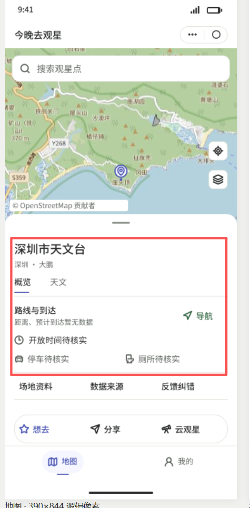
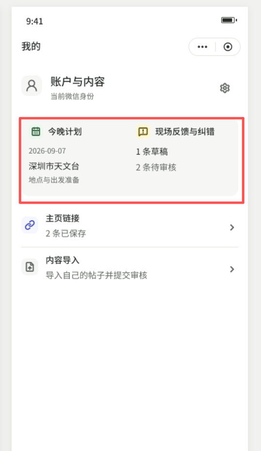
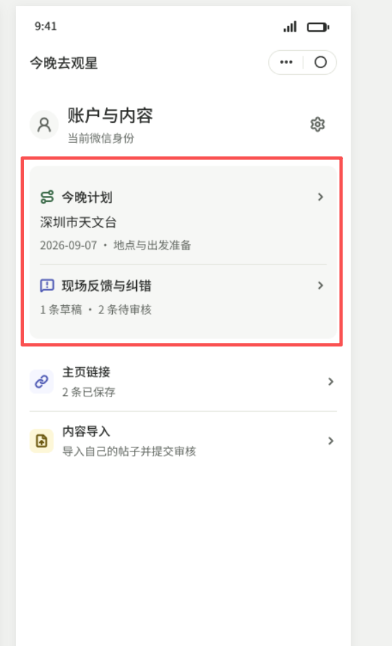
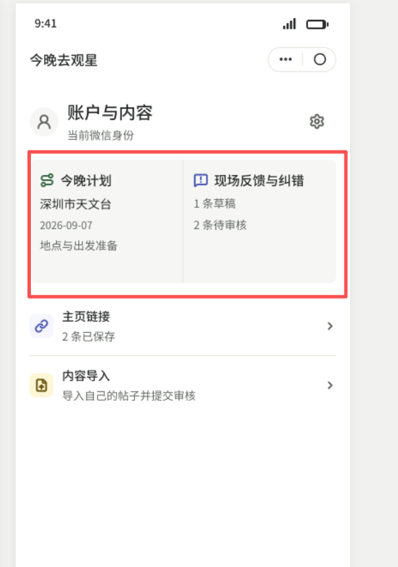

# 新版局部偏好记录（2026-09-07）

用户明确要求：**先记下来，先不用继续。** 当前只保存反馈和标注原图，不继续设计、测试或修改Skill。

- 7d0651de 地图页：图1红框中的观星点信息区域还不错，仅限该局部。
- 我的页：图2 789268fb、图3 7d0651de、图4 f946c266，红框中的“今晚计划＋现场反馈与纠错”组合区域还不错。用户未指定三者排序，也未选定双栏或上下排列。
- 评价强度：这两类局部“只能说还不错，没到特别好的地步”，其他“一般般”。不记录为整套认可、特别满意、视觉验收通过或生产授权。

四张用户标注原图已逐字节保存，来源与SHA见user-feedback-v2.json；属于experiment-4匿名候选。旧版全部拒绝记录、独立评分与失败不变。

