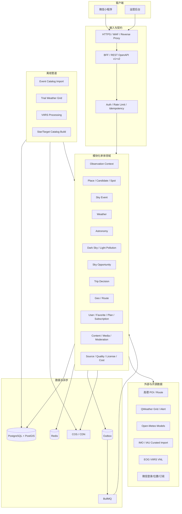
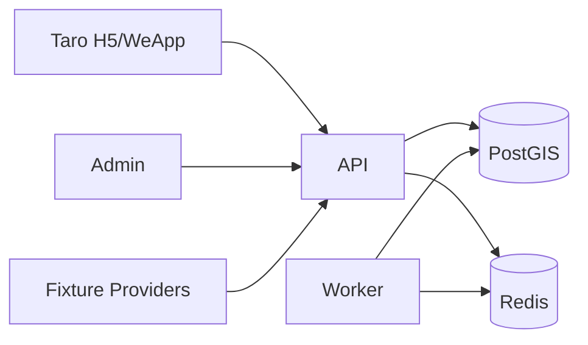
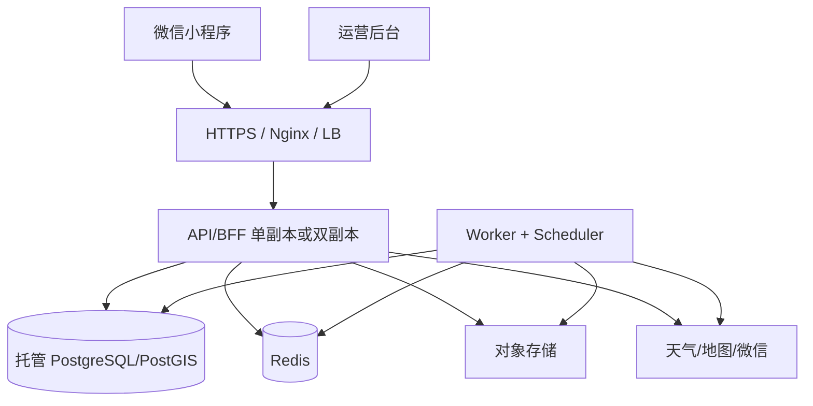
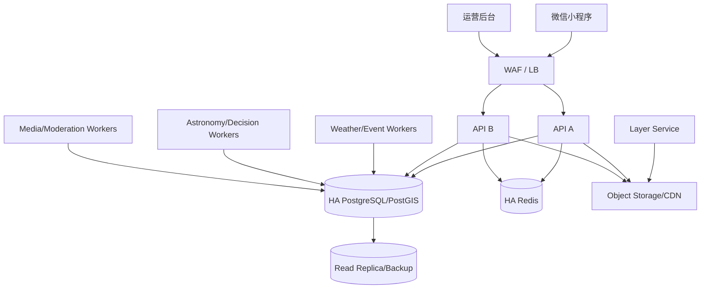

# 《今晚去观星》微信小程序技术架构与技术实现方案 V2.1

## DRA 最终选择与需求对账版

- 文档版本：V2.0
- 产品形态：微信小程序
- 文档日期：2026-08-20
- 关联产品文档：《今晚去观星》微信小程序产品方案 V2.0——产品漂移纠偏 + 天象观测机会增强版
- 当前代码仓库：`Seven128/Starward`
- 当前实施基线：`main@a9f6616bc08fcbcc1a1876704c88a642dbd50a72`
- 文档性质：目标逻辑架构、领域与数据设计、外部数据源方案、接口与缓存、算法、前端与后台实现、部署与运维、现有仓库迁移方案
- 适用范围：Demo V2 基线及后续商用增强；两者共用同一代码库、领域模型、业务主键和接口语义

> 权威原则：产品含义以产品方案 V2.0 为最高依据；本技术方案负责选择实现方式。仓库中的现有 Contract、测试和代码若与产品方案冲突，应修改派生内容与实现，不能用现状反向改写产品。

---

# 0A. DRA 最终选择后的技术责任对账（本版新增，规范性优先）

## 0A.1 技术优先级与最终输入

本文件与同名产品方案 V2.1 是 2026-08-22 完成 DRA 后的最终实现 Source。凡旧正文涉及“夜空—地图—我的”三级主导航、无 `spot_id` 的全局夜空、普通/候选地点 Spot Night、地图详细证据卡、独立 Favorites/Filter/点位列表入口、永久地图方向/缩放 chrome、My 四平级 tabs 或 Spot Night 内红模式入口，均由本章替代。

Exact visual token 继续由 `DESIGN.md#wechat-mini-program--soft-instruments-v1` 持有；selected HTML 是 implementation constraint，不是生产代码或像素 exact target。

## 0A.2 路由、包与状态所有权

- Persistent primary navigation：`pages/map/index`、`pages/my/index`，Map 默认；删除全局 `pages/night/index` 入口。
- Spot package：`spot/detail` 拥有 Overview/Guides/Site；`spot/sky` 是正式详情子路由，入口必须校验 `spot_id` 并继承 date/selectedAt/timezone/dataRevision。
- User package：My root、Plan child、Settings child；Routine Favorite browsing 不建立 My/Favorites route，Finder“想去”与 Detail Favorite 使用同一 favorite relation。
- 一个 route/store owner 持有 `selectedSpot`、`selectedAt`、`activeOverlay`、map viewport、committed filters、Finder query/partition state、favorite relation、display mode 与 SourceLift lifecycle。禁止页面私有副本和第二地图。
- 普通地点/候选地点仍可用于搜索、地图重心、候选发现或分析输入；它们不得调用 formal `spot/sky`、生成 `spot_id` 或输出正式出行/安全结论。后端通用天文/天气计算能力可保留，但不能投影成被删除的全局 Night UI。

## 0A.3 组件与交互实现合同

1. `SourceLiftFocusLayer` 是稳定共享抽象，variants 为 `panelOnly` 与 `mapCoupled`。Lifecycle：IDLE → LIFTING → FOCUSED → RESTORING → IDLE，并允许 CANCELLED/interrupt retarget。必须使用同一个 live node、layout-neutral placeholder、单一 overlay owner、manual history/Back 协调和 atomic owner swap；任何重挂载第二 map、双占流、`display:none` 终帧或恢复时 scroll snap 都不合规。
2. Finder：一个 compact source Bar；focused header 自身 toggle；query suggestion/filter editor 互斥 anchored overlay；18 terminal filters 共用 draft snapshot、revert、atomic commit；result owner 仅含 Wanted/Other 与 city headings。结果激活只提交 selectedSpot/viewport/callout，禁止直接 push Detail。
3. Observing Conditions：一个 in-map Bar、一个 optional overlay enum `NONE|LIGHT|TOTAL_CLOUD|OPPORTUNITY`、一个 `selectedAt`；LIGHT 不随小时 scrubber 伪变化。`mapCoupled` 只重排同一 map 的几何，控制面板在三宽度/大字下无内部纵向滚动。
4. Spot Detail：header Favorite 为透明 44px hit；route action 是 trailing text；Night entry 唯一；Overview/Guides/Site 使用单 indicator + cancellable 160ms panel opacity transition，reduced motion 即时或 ≤100ms。
5. Notification：一个共享 renderer/contract，tone 与 placement 正交；inline 在 owner 文档流，floating 固定 safe-area；同 owner 按 error→warning→info→success 仲裁并保留 residual queue。Map permission/stale/provider、Spot Night offline、Plan sync 与 Settings observation feedback 不得再各写一套 banner。
6. My：root 只含 title、gear、profile summary、Plan/Settings rows；Plan/Settings 使用 route-owned child view。Back/popstate/keyboard Back 恢复 My root exact scroll 与 logical opener focus。Settings 独占显式 observation enter/exit；Spot Night 只消费 active mode。

## 0A.4 UI 依赖、图标与样式边界

- Allowed set：既有项目组件/icon owner、成熟轻量且微信/许可证兼容的可主题化库、或有清晰边界的少量自实现。生产选择必须复用 DESIGN token，并通过 adapter/primitive boundary 维持 44px、ARIA/role、三模式与 reduced motion。
- Prohibited：复制候选 inline SVG 为第二套图标真源、引入完整重型 UI 系统只为少量 primitive、复制京东/淘宝/天猫品牌或商业模块、组件库默认 token 覆盖 Soft Instruments、hover-only 说明或 color-only 状态。
- Filter/Conditions selected card 复用同一半裁切 rounded gradient star decorator，但 accessible selected state 由 border/role/name/check 同时表达。
- 所有纵向滚动 owner 隐藏 native scrollbar chrome 但保持 wheel/touch/keyboard reachability；横向 matrix indicator 必须 overlay、零占位、白色半透明。

## 0A.5 API、数据与一致性影响

- 移除/停用 global Night route/BFF projection；formal Spot Night 请求必须带 `spotId`。Map conditions 可使用普通位置分析输入，但响应类型不得伪装 formal spot evidence。
- Map scene 返回 base map、默认 formal markers、compact condition summary、selected callout fields 与 mutually-exclusive overlay descriptor；完整 route/facility/safety/media/provenance 只在 Spot Detail read model。
- Finder query 与 18-filter draft/commit 是一个 schema/store；favorite relation 不因动态 provider failure 删除，Wanted 分区只投影关系+当前可用摘要。
- `selectedAt` preview/commit 驱动 cloud/opportunity；LIGHT 绑定 dataset/version period。Notification queue、SourceLift lifecycle 和 route restoration 都需要 deterministic reducer/transition ownership。
- 原有 PostGIS、天气/事件/天文/光害 pipeline、安全、许可、缓存和审计设计在不与上述 UI/route projection 冲突时继续有效。

## 0A.6 测试与验收变更

- Cold start：首 viewport 内有 compact Search、map、Conditions Bar 与 Map/My nav；formal markers 默认可见，无 permanent arrows/zoom controls。
- Finder：query/history/fuzzy、18 filters、dirty revert/commit、Wanted/Other/city、result→same map callout、callout valid release→Detail；Back/Escape/scrim/focus/scroll restoration。
- SourceLift：panelOnly/mapCoupled opening, interrupt, reverse, reduced motion, single live node, placeholder equality, underlying geometry invariant, no flash/jump/blank terminal frame。
- Detail/Night/My：quiet actions、tab retarget、scrollbar policy、Settings-only observation control、Plan/Settings Back restoration、shared Notification arbitration、selection-star three-mode behavior。
- Viewports/modes：320/375/430 × normal/large × day/night/observation × normal/reduced；console/runtime errors、duplicate IDs、unnamed visible actions、horizontal overflow 与 <44px target 为 0。
- 微信原生 map/canvas/sensor、真实 provider、production pixels 与 accessibility 仍需真实入口验证；formal handoff preflight 不是运行时验收。

## 0A.7 最终需求状态

97 个唯一 disposition：73 covered、1 covered-active-remainder、3 partial、1 excluded、19 inactive-superseded、0 decision-required；78 active。Inactive IDs：`NAV-001`、`NAV-002`、`LOC-001`、`LOC-003`、`LOC-004`、`EVT-005`、`DETAIL-001`、`DETAIL-004`、`DEC-001`、`USER-MAP-SELECTION-FOCUS-001`、`USER-MAP-TIME-001`、`USER-MAP-LAYERS-002`、`USER-MAP-TIME-002`、`USER-MAP-FAVORITES-002`、`USER-SPOT-FINDER-001`、`USER-MAP-ANALYSIS-TIME-001`、`USER-SPOT-DETAIL-ACTIONS-001`、`USER-SEARCH-LIFT-COMPACT-001`、`USER-FINDER-COMPACT-HIERARCHY-001`。Active remainder：`USER-NIGHT-TIME-FOCUS-001`。Partial：`SPOT-001`、`SPOT-002`、`MY-004`。Excluded：`DATA-005`。

# 0. 结论先行

## 0.1 总体判断

V1.0 技术方向中的以下基础继续保留：

- Taro + React + TypeScript 微信小程序；
- NestJS + Fastify 模块化单体 BFF；
- PostgreSQL + PostGIS 作为核心业务与空间数据库；
- Redis + BullMQ + Transactional Outbox；
- Astronomy Engine 服务端天文计算；
- Port/Adapter 供应商隔离；
- 数据来源、新鲜度、规则版本、决策快照和诚实降级；
- Demo 与商用共用一套逻辑架构，不为 Demo 编写临时代码。

V2.0 不推倒现有架构，重点完成六项结构性升级：

1. **恢复产品权威**：恢复“夜空—地图—我的”、普通地点夜空和详情正确顺序；
2. **增加统一观测上下文**：地点、观测夜、时间、天象/目标、天气模型和图层成为跨页唯一状态；
3. **建立地点三级模型**：普通地点、暗夜候选地点和正式观星点使用不同 ID、数据责任和允许操作；
4. **建立天象事件与观测机会领域**：把全球事件活动、本地天文可见性、天气、光害和场地条件对齐到同一时间轴；
5. **把真实数据设为 Demo 默认成功路径**：真实天气、分层云、路线、正式点资料和版本化光害进入生产链路，Fixture 仅用于开发与显式故障演示；
6. **消除当前双事实源**：PostGIS 成为正式观星点唯一事实源，源码内 `DEMO_SPOTS` 不再参与运行时业务判断。

最终运行链路为：

```text
天象事件/日常目标
→ 解析地点与观测夜
→ 获取并规范化真实天气与多模型证据
→ 计算日月、晨昏、银河、行星、辐射点和目标高度
→ 读取版本化光害、遮挡和场地事实
→ 逐时间片计算天空观测机会
→ 提取主/备最佳连续窗口
→ 正式观星点叠加道路、开放、设施和安全，生成出行建议
→ 地图、夜空、详情、星图和观测模式共享同一上下文
```

## 0.2 核心技术决策

| 编号 | 决策 | 结论 |
|---|---|---|
| ADR-V2-001 | 架构形态 | 继续使用模块化单体；API、Worker 和数据管道可独立进程运行，暂不微服务化 |
| ADR-V2-002 | API 演进 | 新增 `/v2` 契约承载地点三级模型、全局夜空和双结论语义；`/v1` 在迁移期保留兼容层 |
| ADR-V2-003 | 统一上下文 | 引入 `ObservationContext`，服务端生成短期 `context_id`，客户端保存可恢复的非敏感投影 |
| ADR-V2-004 | 正式点事实源 | PostgreSQL/PostGIS 是唯一事实源；静态 Catalog 仅作为显式 Seed/Test Fixture |
| ADR-V2-005 | 天气主链路 | QWeather 格点/预警作为中国试点业务主源；Open-Meteo 提供低/中/高云与 ICON、GFS、ECMWF IFS/AIFS 多模型证据 |
| ADR-V2-006 | 天象事件 | IAU MDC 负责标准身份，IMO 年度日历负责年度参考，历史拟合来自审阅后的论文/数据集；不依赖逐星站点接口 |
| ADR-V2-007 | 光害 | EOG VIIRS Annual VNL 进入自有离线管道；输出“产品估算区间”，不把原始辐射直接声称为精确 Bortle |
| ADR-V2-008 | 决策 | 拆分 `SkyOpportunityEngine` 与 `TripDecisionEngine`；硬阻断先于任何评分 |
| ADR-V2-009 | 最佳窗口 | 按 15/30 分钟时间片计算，提取连续区间；整夜平均仅作为辅助摘要 |
| ADR-V2-010 | 星空地图 | Demo 使用动态 Canvas 2D；星表和天体数据版本化，时间滑杆本地平滑投影，服务端保持权威结果 |
| ADR-V2-011 | 地图动态图层 | Demo 使用试点区预计算粗网格/矢量单元，不在小程序实时拉取全国栅格 |
| ADR-V2-012 | 用户隔离 | 微信登录映射自有 `user_id`；收藏、计划、偏好、订阅和候选记录全部按用户隔离 |
| ADR-V2-013 | 非核心范围 | 外部主页和跨平台帖子导入保留代码但默认 Feature Flag 关闭，不再作为当前完成条件 |
| ADR-V2-014 | 迁移方式 | 按 Authority → Domain/Data → Providers → Decision → UI → Auth/Ops 的顺序增量迁移，不做一次性重写 |

## 0.3 推荐技术基线

| 层级 | 方案 |
|---|---|
| 微信小程序 | 继续使用 Taro 4 + React 18 + TypeScript；地图、定位、罗盘、Canvas 等通过平台适配器 |
| 前端服务端状态 | TanStack Query；查询键统一使用 `context_fingerprint`、资源 ID 和数据版本 |
| 前端任务状态 | Zustand；拆分 `mapSlice`、`observationContextSlice`、`modeSlice`、`userDraftSlice` |
| 运营后台 | React + TypeScript + Vite；从当前静态 JSON 面板升级为可编辑、可核验的业务后台 |
| API/BFF | NestJS 11 + Fastify；按领域模块拆分 Controller/Application Service，不拆部署服务 |
| API 契约 | OpenAPI 3.1 + Zod/JSON Schema 运行时校验；生成小程序 SDK 和 operations manifest |
| 数据库 | PostgreSQL 17 + PostGIS；现有 `001_demo_baseline.sql` 冻结，后续全部新增迁移 |
| 缓存 | Redis；天气网格、上下文、Read Model、幂等、熔断和预算状态 |
| 异步任务 | BullMQ + PostgreSQL Outbox；天气、事件、天文、光害、决策、Read Model、审核和备份 |
| 天文计算 | Astronomy Engine 2.x；扩展流星雨辐射点、活动曲线、银河中心和版本化目标目录 |
| 天气 | QWeather Adapter + Open-Meteo Adapter；统一 Canonical Weather Schema |
| 地图/路线 | 微信原生 `map` 负责展示；高德 WebService 作为 Demo 路线/POI 基线，保留腾讯适配器边界 |
| 光害管道 | Python + GDAL/Rasterio + PostGIS；输出地点采样、试点区网格和来源清单 |
| 星空数据 | Demo 使用独立许可的数据资产包；星表、星座线、目标目录和署名与应用代码分离 |
| 对象存储 | COS；媒体、原始外部快照、光害数据产品、地图图层和离线快照 |
| 可观测性 | OpenTelemetry + 结构化日志 + Sentry/云日志；增加数据质量、模型分歧和许可到期指标 |
| Demo 部署 | Docker Compose/托管容器，单区域；API、Worker、PostGIS、Redis、后台、反向代理完整启动 |
| 商用部署 | WAF/LB + API 多副本 + Worker 独立扩容 + 高可用 PostgreSQL/Redis + CDN；按指标决定是否 Kubernetes |

---

# 1. 产品需求到技术责任的映射

## 1.1 两条主路径

```text
地图优先
Map Scene → 正式点/候选点/普通地点 → Spot/Place Summary
→ Sky Opportunity → 正式点 Trip Decision → Route → Observation Mode

天象优先
Active Events → Event Detail/Activity Profile → Observation Context
→ Local Effective Night → Map Comparison → Formal Spot → Plan/Observation Mode
```

二者共享：

- `ObservationContext`；
- `ObservationNight`；
- `WeatherTimeline`；
- `AstronomyTimeline`；
- `SkyOpportunitySnapshot`；
- `SkyMapScene`；
- `DataSourceSnapshot`。

正式点路径额外拥有：

- `SpotEvidence`；
- `RouteSnapshot`；
- `FacilityEvidence`；
- `AccessAndSafetyState`；
- `TripDecisionSnapshot`。

## 1.2 稳定需求编号的工程约束

代码、OpenAPI、测试和 Screen Contract 必须记录对应需求编号。推荐方式：

- OpenAPI operation 增加 `x-requirements`；
- React 页面根节点增加 `data-requirements`；
- 测试名称使用 `[NAV-001][CTX-001]`；
- 数据迁移和 ADR 文档标注受影响编号；
- CI 运行需求覆盖检查，禁止核心编号没有实现或验收入口；
- 改变 `NAV-*`、`CTX-*`、`LOC-*`、`DEC-*` 的语义时，先修改产品方案。

## 1.3 当前不作为技术基线的能力

- 完整逐向导航；
- 全国实时云图和全国候选点作为 Demo 前置；
- 实时 ZHR；
- 完整 AR；
- 持续轨迹；
- 公共评论和无审核 UGC；
- 支付、会员、短信；
- 外部主页和跨平台内容导入作为主路径；
- 为“系统看起来先进”提前引入微服务、Kafka、Kubernetes、OpenSearch 或 ClickHouse。

---

# 2. 当前 Starward 基线与差距

## 2.1 可直接复用的现有资产

当前仓库已经具备：

- `apps/wechat-miniapp`：真实 Taro 微信小程序工程；
- `workers/miniapp-api`：NestJS/Fastify BFF、PostgreSQL Repository、Redis Cache、BullMQ/Outbox Worker；
- `packages/miniapp-contracts`：小程序 DTO、过滤、API operations；
- `packages/coordinate-system`：WGS84/GCJ-02；
- `packages/astronomy-core`、`weather-schema`、`scoring-engine`、`data-source-runtime` 等共享包；
- `database/miniapp/migrations/001_demo_baseline.sql`：较完整的 Demo 数据表；
- 地图、详情、夜空、星图、黑红观测模式、收藏、计划和数据来源 UI；
- 数据状态、错误恢复、缓存、幂等、来源展示、硬阻断规则与自动验收框架。

这些资产应作为 V2 的实施基础，不重新创建平行工程。

## 2.2 必须纠正的现状

| 当前现状 | V2 目标 | 主要改动位置 |
|---|---|---|
| TabBar 只有地图/我的 | 夜空—地图—我的 | `apps/wechat-miniapp/src/app.config.ts`、Screen Contract、验收 |
| 夜空只允许正式 `spot_id` | 当前位置、普通地点、候选点和正式点均可形成天空上下文 | `features/sky/*`、API `/v2/observation-contexts` |
| 普通地点仅为无坐标占位 | 实际 POI/地图点可查看夜空、移动地图、找附近正式点 | `places` 模块、Geo Adapter、地图搜索 |
| 详情顺序为概览—攻略—场地—夜空 | 概览—场地—夜空—攻略 | `spot-detail-page.tsx` 与测试 |
| 天气为 `SampleWeatherAdapter` | 真实天气默认成功路径 | Weather Adapters、Worker、数据库和回退策略 |
| 路线能力关闭 | 明确请求时真实估算，失败再回退 | Route Adapter、`POST /v2/routes/estimate` |
| 光害是径向粗估 | VIIRS 版本化估算 + 试点网格 | Pipeline、`light_pollution_*` 表与图层 |
| `DEMO_SPOTS` 参与运行时 | PostGIS 唯一事实源 | `catalog.ts`、前端静态导入、AstronomyService、Repository |
| 服务启动重新 Seed 并覆盖数据 | Seed 仅显式执行且不更新已有业务数据 | `PostgresMiniappRepository.initialize`、独立 seed 命令 |
| 所有用户使用固定 Demo 用户 | 微信登录、自有用户 ID、数据隔离 | Auth/User 模块与所有用户表查询 |
| 星空图大量固定坐标 | 地点/时间驱动的动态投影 | `sky/map`、星表包、共享投影库 |
| 外链主页和帖子导入被提升为稳定范围 | P2，默认关闭 | Feature Flags、导航入口和验收范围 |
| CI 只运行 Harness | 增加业务类型、单测、构建、集成和契约门禁 | `.github/workflows/miniapp-ci.yml` |

## 2.3 迁移原则

- 不删除已经可用的正确降级与来源展示；
- 不修改已接受的 `001_demo_baseline.sql`，新增 `002_*` 起的迁移；
- 不在一个提交中同时重写 Contract、数据库、页面和算法；
- 先建立新语义和兼容接口，再切换页面，最后移除旧路径；
- 每个阶段必须有可运行候选和反向验证；
- Sample Adapter 保留为测试适配器，但不能被生产启动配置选中；
- P2 页面可保留，但不再阻塞 P0/P1 验收。

---

# 3. 架构目标与质量属性

## 3.1 核心质量属性

| 优先级 | 属性 | 实现含义 |
|---|---|---|
| P0 | 产品语义不漂移 | 需求编号可追踪；代码和测试不能反向定义导航、地点和结论边界 |
| P0 | 数据真实性 | 真实值、缺失、估算、样例、缓存和过期必须可区分 |
| P0 | 安全硬阻断 | 雷暴、暴雨、强风、关闭、道路封闭、非法进入、明确危险先于评分 |
| P0 | 正式点唯一事实源 | 正式点业务事实全部来自 PostGIS；静态 Fixture 不参与生产运行 |
| P0 | 隐私 | 当前精确位置默认短期使用，不进入普通日志、分享链接和长期本地缓存 |
| P0 | 可追溯 | 结论能追溯到事件、天气模型批次、天文算法、光害版本、场地证据和规则版本 |
| P1 | 可解释 | 主窗口、备选窗口、结束原因、有利/不利因素和置信度可展示 |
| P1 | 连续体验 | 地图、夜空、详情、星图和观测模式共享上下文并可精确恢复 |
| P1 | 性能 | 地图与夜空由 Read Model、缓存和预计算提供；外部源不位于页面同步串行链路 |
| P1 | 可替换 | 天气、地图、路线、事件、光害、星表和审核均有 Port/Adapter 边界 |
| P1 | 成本 | 按空间网格、模型批次和有效时间共享；专业对比和路线只在必要时请求 |
| P2 | 商用演进 | 同一领域模型可扩展到主备源、全国候选、UGC 和多副本 |

## 3.2 建议服务目标

| 指标 | Demo V2 目标 | 商用建议目标 |
|---|---:|---:|
| 地图首次可交互 | < 3 秒 | P75 < 2.5 秒 |
| 夜空首个结论 | < 2 秒（缓存/预计算） | P75 < 1.5 秒 |
| 正式点详情概览 | < 2 秒 | P75 < 1.5 秒 |
| 缓存命中 API P95 | < 600ms | < 400ms |
| 天空机会计算 P95 | < 800ms | < 500ms |
| 地图时间切换更新 | < 500ms（本地/缓存） | < 350ms |
| 热门地点动态摘要命中率 | > 85% | > 92% |
| 路线估算成功率 | > 98% | > 99% |
| 关键字段来源覆盖率 | 100% | 100% |
| 正式点最低资料完整率 | 100% | 100% |
| 多用户数据串读 | 0 | 0 |
| 关键过期数据产生肯定推荐 | 0 | 0 |

## 3.3 数据时效建议

| 数据 | 理想时效 | 软过期 | 硬过期 |
|---|---:|---:|---:|
| 严重天气预警 | 5—15 分钟 | 20 分钟 | 45 分钟 |
| 未来 0—24h 天气 | 30—60 分钟 | 90 分钟 | 3 小时 |
| 未来 24—72h 天气 | 1 小时 | 3 小时 | 6 小时 |
| 3—7 日天气 | 3 小时 | 6 小时 | 12 小时 |
| 天文结果 | 算法/地点/日期版本不变时长期有效 | 无 | 版本变化失效 |
| 年度天象目录 | 年度/修订版本 | 有新修订 | 活动年份结束后仍可历史展示 |
| 光害估算 | 数据集版本周期 | 新版本发布后标旧 | 不因时间直接禁止，但必须显示年份 |
| 场地开放/道路 | 7—30 天，重点点更短 | 超过复核周期 | 存在冲突或官方关闭即禁止肯定建议 |
| 设施 | 30—180 天，按类型 | 超过复核周期 | 关键刚需设施不确定时不得声称可用 |

---

# 4. 总体系统架构



## 4.1 运行单元

Demo 运行三个应用进程：

```text
miniapp-api
- HTTP/BFF
- 认证与会话
- 只执行低延迟查询和轻量确定性计算

miniapp-worker
- 天气采集
- 天象/天文预计算
- 光害采样
- 决策和 Read Model 重建
- Outbox、媒体、质量、成本、备份任务

miniapp-admin
- 静态前端或轻量 Web 服务
- 通过同一 Admin API 工作
```

光害和星表等大数据处理使用独立离线命令，不进入 API 进程。

## 4.2 分层职责

```text
Presentation / Controller
  ↓
Application Use Case
  ↓
Domain Model & Deterministic Rules
  ↓
Port
  ↓
Repository / Provider Adapter / Pipeline Artifact
```

约束：

- Domain 不依赖 NestJS、Redis、PostgreSQL 或供应商 SDK；
- 前端不复制决策公式；
- Provider Adapter 不直接生成产品结论；
- BFF 可以聚合，但不能成为第二套领域逻辑；
- Read Model 可以冗余展示数据，但每个字段必须能回到权威实体或快照；
- `miniapp-contracts` 只承载公开契约，不再承载正式点 Catalog 和运行时业务 Fixture。

---

# 5. 单仓库与模块组织

## 5.1 在当前 Starward 结构上增量演进

推荐目标结构：

```text
Starward/
├─ apps/
│  ├─ wechat-miniapp/
│  ├─ miniapp-admin/
│  └─ mobile/                         # 原生 App 独立产品载体，非本次重写对象
├─ workers/
│  └─ miniapp-api/
│     ├─ src/modules/auth/
│     ├─ src/modules/observation-context/
│     ├─ src/modules/place/
│     ├─ src/modules/spot/
│     ├─ src/modules/sky-event/
│     ├─ src/modules/weather/
│     ├─ src/modules/astronomy/
│     ├─ src/modules/dark-sky/
│     ├─ src/modules/opportunity/
│     ├─ src/modules/trip-decision/
│     ├─ src/modules/route/
│     ├─ src/modules/library/
│     ├─ src/modules/content/
│     └─ src/modules/operations/
├─ packages/
│  ├─ domain/                         # 地点、事件、上下文和规则纯模型
│  ├─ miniapp-contracts/              # OpenAPI DTO/生成 SDK 类型
│  ├─ coordinate-system/
│  ├─ weather-schema/
│  ├─ astronomy-core/
│  ├─ scoring-engine/                 # 两套结论引擎
│  ├─ data-source-runtime/
│  ├─ telemetry/
│  └─ sky-catalog/                    # 新增：独立许可的数据资产与投影
├─ pipelines/
│  ├─ sky-events/
│  ├─ weather-grid/
│  ├─ light-pollution/
│  └─ sky-catalog/
├─ database/miniapp/
│  ├─ migrations/
│  ├─ seeds/
│  └─ fixtures/
├─ infra/miniapp/
│  ├─ docker-compose.yml
│  ├─ nginx/
│  └─ env/
└─ docs/
   ├─ product/
   ├─ architecture/
   ├─ data-sources/
   ├─ licenses/
   └─ adr/
```

## 5.2 模块拆分边界

| 模块 | 权威对象 | 主要用例 |
|---|---|---|
| Observation Context | `ObservationContext` | 解析地点/时区/观测夜、生成上下文、恢复和分享 |
| Place | `OrdinaryPlaceRef`、`DarkSkyCandidate` | 普通地点搜索、地图点、候选详情、附近正式点 |
| Spot | `FormalSpot`、`FacilityEvidence` | 正式点、资料完整度、发布、核验、坐标策略 |
| Sky Event | `SkyEvent`、`EventInstance`、`ActivityProfile` | 事件目录、年度实例、活动曲线、本地有效夜 |
| Weather | `WeatherModelRun`、`WeatherTimeline` | 主源预报、分层云、多模型比较、预警 |
| Astronomy | `AstronomyNight`、`CelestialTimeline` | 晨昏、月亮、银河、目标、辐射点、星图帧 |
| Dark Sky | `DarkSkyDataset`、`DarkSkyEstimate` | VIIRS 处理、地点采样、估算区间、图层 |
| Opportunity | `SkyOpportunitySnapshot` | 任意地点的天空机会和最佳窗口 |
| Trip Decision | `TripDecisionSnapshot` | 正式点的完整出行建议与硬阻断 |
| Geo/Route | `CanonicalPlace`、`RouteSnapshot` | POI、地理编码、路线、外部导航参数 |
| Library | `Favorite`、`ObservationPlan`、`EventSubscription` | 收藏、计划、候选记录、订阅 |
| Content | `Article`、`Media`、`Submission` | 攻略、实景、投稿和审核 |
| Operations | `DataSource`、`LicenseRecord`、`QualityRun` | 来源、许可、成本、健康、规则和回放 |

## 5.3 依赖规则

- `opportunity` 依赖事件、天气、天文和光害的领域输出，不调用供应商；
- `trip-decision` 依赖 `opportunity`、正式点、路线和场地证据；
- `weather` 不依赖 `trip-decision`；
- `astronomy` 不依赖天气；
- `place` 不得创建 `spot_id`；
- `candidate` 转正式点必须通过独立审核用例；
- Admin 通过 Application Service 修改权威数据，不直接执行任意 SQL；
- 前端只读取 `/v2` DTO，不直接导入 `DEMO_SPOTS` 或数据库 Seed。

---

# 6. 统一观测上下文

## 6.1 产品语义

`ObservationContext` 是 V2 最重要的跨模块契约。它表示：

> 在某个地点，以该地点时区定义的某个观测夜、某个当前时间，围绕某个天象或目标，使用一组明确的数据与算法版本进行判断和展示。

## 6.2 服务端模型

```ts
export type ObservationLocation =
  | {
      kind: "FORMAL_SPOT";
      spotId: string;
      locationVersion: number;
    }
  | {
      kind: "DARK_SKY_CANDIDATE";
      candidateId: string;
      locationVersion: number;
    }
  | {
      kind: "ORDINARY_PLACE";
      placeRef: string;
      displayName: string;
      wgs84: Wgs84Point;
      sourceSnapshotId: string;
    }
  | {
      kind: "MAP_POINT";
      displayName: string;
      wgs84: Wgs84Point;
    }
  | {
      kind: "CURRENT_LOCATION";
      sessionLocationToken: string;
    };

export interface ObservationContext {
  schemaVersion: "observation-context-v2";
  contextId: string;
  contextFingerprint: string;
  location: ObservationLocation;
  timezone: string;
  localDate: string;                 // 观测夜归属日期
  nightStartUtc: string;
  nightEndUtc: string;
  selectedAtUtc: string;
  eventInstanceId: string | null;
  targetProfile: "DAILY" | "METEOR" | "MILKY_WAY" | "PLANET" | "CUSTOM";
  weatherView: {
    primaryPolicy: string;
    comparisonModels: string[];
    selectedModel: string | null;
    cloudLayer: "TOTAL" | "LOW" | "MID" | "HIGH";
  };
  algorithmVersions: {
    astronomy: string;
    opportunity: string;
    tripDecision: string | null;
    darkSky: string;
  };
  privacyClass: "PUBLIC_REFERENCE" | "SESSION_PRECISE";
  createdAt: string;
  expiresAt: string;
}
```

## 6.3 观测夜定义

- `localDate` 表示用户所说的“这一天晚上”；
- 计算搜索区间默认从当地 `12:00` 到次日 `12:00`；
- UI 默认显示当地傍晚至次日清晨，具体边界按日落/晨昏动态裁剪；
- 00:00 后仍属于相同 `localDate` 的观测夜；
- 极端纬度无日落或无天文黑夜时返回明确的 `NO_ASTRONOMICAL_NIGHT`，不假造时间；
- 所有时间保存 UTC，展示时使用上下文 IANA 时区。

## 6.4 Context API

```http
POST /v2/observation-contexts/resolve
GET  /v2/observation-contexts/{contextId}
POST /v2/observation-contexts/{contextId}/time
POST /v2/observation-contexts/{contextId}/event
POST /v2/observation-contexts/{contextId}/location
```

`resolve` 接收地点引用、当地日期、时间和可选事件，返回：

- 规范化地点；
- 时区；
- 观测夜 UTC 边界；
- `context_id`；
- `context_fingerprint`；
- 可用数据能力；
- 初始天空机会摘要；
- 隐私与分享策略。

## 6.5 客户端状态

```ts
interface ObservationContextSlice {
  context: ObservationContextProjection | null;
  previousContextStack: ObservationContextProjection[];
  setLocation(...): Promise<void>;
  setLocalDate(...): Promise<void>;
  setSelectedAt(...): void;
  setEvent(...): Promise<void>;
  setCloudLayer(...): void;
  enterObservationMode(): void;
  exitObservationMode(): void;
}
```

要求：

- 时间滑杆在当前已加载时间轴内本地更新，不为每次拖动创建新 Context；
- 日期、地点或事件变化才重新解析；
- Query Key 至少包含 `contextFingerprint + resource + dataRevision`；
- 地图、详情和夜空共用同一 Store，不建立页面私有时间状态；
- 进入观测模式时把模式、路由、滚动位置和 Context 压栈，退出精确恢复。

## 6.6 隐私与持久化

| Context 类型 | 本地持久化 | 分享 | 服务端保存 |
|---|---|---|---|
| 正式点 | 可保存 `spot_id`、日期、事件 | 可生成稳定分享链接 | 计划/收藏时保存 |
| 候选点 | 可保存 `candidate_id` | 可分享候选详情，但必须带未核验声明 | 候选记录时保存 |
| 普通地点 | 只保存用户明确收藏的地点引用 | 默认不分享原始精确坐标 | 短期 Context；计划需转候选记录 |
| 当前位置 | 默认内存态或短期 token | 不可分享精确位置 | Redis 短期 token，不写普通日志 |
| 地图任意点 | 默认会话态 | 不直接暴露精确坐标 | 短期 Context |

---

# 7. 地点三级模型

## 7.1 ID 与责任边界

```text
FormalSpot
- spot_id
- 可输出 TripDecision
- 可提供正式“去这里”
- 必须具备资料完整度、发布和坐标可见策略

DarkSkyCandidate
- candidate_id
- 只输出 SkyOpportunity
- 可保存候选记录和查找附近正式点
- 永远显示未核验道路/开放/设施/安全

OrdinaryPlace
- provider place_ref 或会话 coordinate_ref
- 只输出 SkyOpportunity
- 不保存正式设施事实
- 不创建 spot_id/candidate_id，除非用户发起独立提案
```

## 7.2 正式点状态

```text
DRAFT
IN_REVIEW
PUBLISHED
TEMPORARILY_CLOSED
DATA_INSUFFICIENT
RESTRICTED
ARCHIVED
```

`PUBLISHED` 仍不代表“今晚推荐”，只表示资料达到发布标准。

## 7.3 正式点最低资料门禁

发布前必须通过：

- 坐标与来源；
- 地址/区域/时区；
- 道路和末段说明；
- 停车状态；
- 核心设施闭合：停车、厕所、平台、充电、露营、道路、徒步、信号均有状态；
- 开放和合法进入；
- 夜间安全；
- 遮挡/开阔方向；
- 至少一份本点位证据媒体，或显式 `NO_SITE_MEDIA_VERIFIED` 阻止“实景”宣称；
- 来源和最近核验时间；
- 坐标可见策略；
- 运营审核记录。

不能以八项全部 `UNKNOWN` 通过发布门禁。

## 7.4 候选点生成与审核

P1 管道：

```text
VIIRS 暗区 + 天气/地形/道路可达性辅助
→ 栅格阈值与连通区域聚类
→ 排除水面、受限区和明显危险区
→ 生成 candidate_id、估算光害和证据
→ 人工初审
→ 发布为“暗夜候选”
→ 现场核验/资料补全
→ 独立提案转 FormalSpot
```

候选点不能因算法评分高自动转正式点。

## 7.5 普通地点搜索

`PlaceSearchPort` 返回统一结构：

```ts
interface CanonicalPlaceResult {
  placeRef: string;
  displayName: string;
  address: string | null;
  regionCode: string | null;
  wgs84: Wgs84Point;
  gcj02: Gcj02Point;
  provider: string;
  providerPlaceId: string | null;
  sourceSnapshotId: string;
  expiresAt: string;
}
```

供应商 POI 结果只做实时搜索/短缓存。正式收藏和内容引用不能使用供应商 ID 作为业务主键。

---

# 8. 天象事件系统

## 8.1 数据来源策略

天象事件采用“离线导入、人工审阅、版本发布”，不在用户请求时抓取网页。

推荐来源层级：

1. 权威年度事件资料：例如 IMO 年度流星雨日历；
2. 经审阅的历史研究曲线：例如 Jenniskens 等历史活动拟合；
3. 可信流星体流模型或事件预测；
4. 实时观测汇总；
5. 产品自有当地几何计算。

每个来源必须进入 `data_source_registry` 和 `license_registry`，保存：

- 来源机构和标题；
- 原始发布日期；
- 获取时间；
- 适用年份；
- 许可和署名；
- 原文件哈希；
- 解析器版本；
- 审阅人和发布时间；
- 局限。

## 8.2 领域模型

```ts
type SkyEventType =
  | "METEOR_SHOWER"
  | "LUNAR_ECLIPSE"
  | "SOLAR_ECLIPSE"
  | "PLANET_OPPOSITION"
  | "PLANET_ELONGATION"
  | "CONJUNCTION"
  | "COMET"
  | "SATELLITE_PASS"
  | "CUSTOM";

interface SkyEvent {
  eventId: SkyEventId;
  type: SkyEventType;
  code: string;
  displayName: string;
  englishName: string | null;
  description: string;
  visibilityRegions: string[];
  sourceIds: string[];
  state: "DRAFT" | "PUBLISHED" | "ARCHIVED";
  catalogVersion: string;
}

interface SkyEventOccurrence {
  occurrenceId: SkyEventOccurrenceId;
  eventId: SkyEventId;
  year: number;
  activeFrom: string;
  activeTo: string;
  referencePeakWindows: TimeWindow[];
  annualReferenceValue: number | null;
  annualReferenceUnit: "ZHR" | "MAGNITUDE" | "NONE";
  occurrenceVersion: string;
  sourceIds: string[];
}
```

## 8.3 活动曲线

```ts
type ActivityProfileKind =
  | "ANNUAL_REFERENCE"
  | "HISTORICAL_FIT"
  | "STREAM_MODEL"
  | "LIVE_OBSERVATION";

interface EventActivityProfile {
  profileId: string;
  occurrenceId: SkyEventOccurrenceId;
  kind: ActivityProfileKind;
  axis: "SOLAR_LONGITUDE" | "UTC_TIME";
  unit: "RELATIVE_ACTIVITY" | "ZHR";
  samples: ReadonlyArray<{ x: number | string; value: number }>;
  uncertainty: ReadonlyArray<{ x: number | string; low: number; high: number }> | null;
  sourceIds: string[];
  profileVersion: string;
  limitations: string[];
}
```

优先保存太阳黄经曲线，再由年度天文计算转换为 UTC，避免把历史曲线固定到某个自然日和时刻。

## 8.4 流星雨辐射点模型

```ts
interface MeteorRadiantModel {
  occurrenceId: SkyEventOccurrenceId;
  referenceSolarLongitudeDeg: number;
  raDeg: number;
  decDeg: number;
  driftRaDegPerSolarLongitude: number | null;
  driftDecDegPerSolarLongitude: number | null;
  velocityKmS: number | null;
  populationIndex: number | null;
  sourceIds: string[];
  modelVersion: string;
}
```

运行时计算：

1. 根据选定时间计算太阳黄经；
2. 用漂移模型得到当时辐射点赤经赤纬；
3. 转换为地点的高度、方位；
4. 判断辐射点是否达到可用高度；
5. 作为相对观测机会修正，不直接输出用户实际流星数量。

## 8.5 本地有效夜

对每个地点和事件发生实例：

```text
权威参考峰窗
→ 转为地点时区
→ 与观测夜范围求交
→ 计算辐射点/目标高度
→ 计算太阳高度和月亮影响
→ 与天气时序对齐
→ 产生本地候选窗口
```

API 同时返回：

- 全球/权威参考峰值；
- 当地时间；
- 当地是否处于黑夜；
- 当地优先观测夜；
- 与参考峰值的活动阶段差异。

## 8.6 事件导入管道

```text
受控源文件/人工录入
→ Schema 校验
→ 来源与许可校验
→ 活动曲线校验
→ 年份/时区/峰值一致性检查
→ 审阅预览
→ 生成不可变 occurrence_version
→ 发布
→ 触发相关地点未来窗口预计算
```

代码目录：

```text
pipelines/event-import/
├─ schemas/
├─ import-imo-calendar.ts
├─ import-activity-profile.ts
├─ validate-event.ts
└─ fixtures/
```

## 8.7 事件 API

```http
GET  /v2/sky-events/active?contextId=...
GET  /v2/sky-events/{eventId}
GET  /v2/sky-event-occurrences/{occurrenceId}
GET  /v2/sky-event-occurrences/{occurrenceId}/activity
GET  /v2/sky-event-occurrences/{occurrenceId}/local-opportunity?contextId=...
```

## 8.8 Demo 范围

- 导入当年主要流星雨目录；
- 至少一个事件具有完整历史活动曲线；
- 支持辐射点当地高度方位；
- 支持权威峰值与本地有效夜；
- 不要求实时 ZHR；
- 不展示未经校准的“预计每小时可见数量”。

---

# 9. 天气系统

## 9.1 供应商组合与职责

V2 不用单一供应商承担所有天气语义，而是明确区分“业务主源、分层云、多模型证据和严重预警”。

| 角色 | Demo 推荐 | 责任 |
|---|---|---|
| 中国试点业务主源 | QWeather 格点逐小时 | 总云、降水、风、湿度、露点、能见度等主时间线 |
| 严重天气预警 | QWeather Warning | 雷暴、暴雨、强风等硬阻断证据 |
| 分层云与模型对比 | Open-Meteo | 总云/低云/中云/高云；ICON、GFS、ECMWF IFS/AIFS |
| 备源 | Open-Meteo Best Match | QWeather 不可用时的明确备源，不静默冒充同一数据 |
| 历史回测 | Open-Meteo Historical Forecast/Single Runs 或正式历史源 | 评估不同模型在试点区的云量和降水表现 |

选择理由：

- QWeather 格点预报面向指定坐标，适合中国试点的业务主时间线；
- QWeather 当前逐小时接口只有总云，不足以完成分层云需求；
- Open-Meteo 提供低/中/高云，并可指定 ICON、GFS、ECMWF IFS/AIFS；
- 严重天气硬阻断不能依赖模型比较结果，必须使用明确预警或主源风险字段；
- 所有来源都经过服务端，客户端不得直接调用。

## 9.2 Port 设计

```ts
interface OperationalWeatherPort {
  readonly providerKey: string;
  getHourly(input: WeatherPointRequest): Promise<CanonicalWeatherRun>;
  getAlerts(input: WeatherAlertRequest): Promise<CanonicalWeatherAlert[]>;
}

interface WeatherModelPort {
  readonly providerKey: string;
  getModelRun(input: WeatherModelRequest): Promise<CanonicalWeatherModelRun>;
}

interface WeatherComparisonService {
  compare(input: {
    locationKey: string;
    localDate: string;
    modelKeys: string[];
  }): Promise<WeatherModelComparison>;
}
```

## 9.3 规范化 Schema

```ts
interface CanonicalWeatherHour {
  validAt: string;
  totalCloudPct: number | null;
  lowCloudPct: number | null;
  midCloudPct: number | null;
  highCloudPct: number | null;
  precipitationMm: number | null;
  precipitationProbabilityPct: number | null;
  thunderstormProbabilityPct: number | null;
  windSpeedKph: number | null;
  windGustKph: number | null;
  windDirectionDeg: number | null;
  temperatureC: number | null;
  relativeHumidityPct: number | null;
  dewPointC: number | null;
  visibilityKm: number | null;
  fogRisk: "LOW" | "MEDIUM" | "HIGH" | "UNKNOWN";
  severeFlags: string[];
  state: DataState;
}

interface CanonicalWeatherModelRun {
  runId: string;
  provider: string;
  model: string;
  modelRunAt: string | null;
  fetchedAt: string;
  validFrom: string;
  validTo: string;
  nativeSpatialResolutionKm: number | null;
  nativeTemporalResolutionMinutes: number | null;
  outputTemporalResolutionMinutes: number;
  interpolatedVariables: string[];
  location: Wgs84Point;
  elevationM: number | null;
  hours: CanonicalWeatherHour[];
  sourceSnapshotId: string;
  licenseRecordId: string;
}
```

严格区分：

- `0`：供应商明确返回零；
- `null`：未提供或无法规范化；
- `UNAVAILABLE`：整个来源不可用；
- `PARTIAL`：部分字段缺失；
- `STALE_USABLE`：缓存超出理想时效但未过硬时效；
- `EXPIRED`：禁止参与当前肯定结论。

## 9.4 Weather Fusion Policy

默认规则：

1. 严重天气预警与显式风险字段优先，任何模型乐观结果都不能覆盖；
2. QWeather 格点预报作为 Demo 主业务时间线；
3. Open-Meteo 提供分层云和模型证据；
4. 主源缺失时可切换 Open-Meteo Best Match，但响应必须显示 `PRIMARY_FALLBACK`；
5. 不使用“从多个模型中取最晴的一条”；
6. 模型差异只改变置信度、解释和窗口稳定性；
7. 一个 UI 指标使用多个来源时，返回 `evidence[]`，不能伪装成单一来源；
8. 多模型比较属于专业层，普通层显示“模型一致性：高/中/低”。

## 9.5 多模型一致性

对齐步骤：

```text
不同模型批次
→ 转为同一 UTC 时间轴
→ 记录原生分辨率和插值
→ 按 1 小时或 30 分钟对齐
→ 逐时计算中位数、范围、MAD/离散度
→ 计算窗口边界稳定性
→ 输出一致性和置信度修正
```

示例输出：

```ts
interface WeatherModelComparison {
  modelKeys: string[];
  validAt: string[];
  totalCloudMedian: Array<number | null>;
  totalCloudRange: Array<{ min: number; max: number } | null>;
  lowCloudRange: Array<{ min: number; max: number } | null>;
  consistency: "HIGH" | "MEDIUM" | "LOW" | "INSUFFICIENT";
  windowBoundarySpreadMinutes: number | null;
  confidenceModifier: number;
  reasons: string[];
}
```

建议初始阈值：

- 总云模型范围长期小于 20 个百分点：高一致性；
- 20—40：中；
- 大于 40 或对是否有连续窗口结论相反：低；
- 具体阈值进入规则版本，后续使用历史回测校准。

## 9.6 天气空间缓存

### 正式点与普通地点

使用规范化 `weather_location_key`：

```text
provider + model + round(lon, providerPrecision) + round(lat, providerPrecision) + elevationBucket
```

- QWeather 坐标精度按其接口要求处理；
- 临近正式点可共享同一格点天气，但响应保存点到格点中心距离；
- 高海拔点不能与低地无条件共享；
- 当前用户位置只在短期 Context 中映射到天气格点，不持久化原始精确坐标。

### Redis Key

```text
weather:run:{provider}:{model}:{locationKey}:{modelRunAt}
weather:latest:{provider}:{model}:{locationKey}
weather:comparison:{modelSetHash}:{locationKey}:{localDate}
weather:alerts:{regionOrCell}
```

## 9.7 采集与刷新

```text
Scheduler
→ 识别热门正式点、活跃事件、用户计划和当前地图试点网格
→ 请求主源与必要模型
→ 保存 raw snapshot + normalized run
→ 触发 WeatherUpdated
→ 重算 SkyOpportunity/TripDecision
→ 更新 Read Model 和地图图层
```

优先级：

1. 严重预警；
2. 今晚有计划/收藏的正式点；
3. 当前活跃事件试点点位；
4. 地图动态网格；
5. 远期普通地点；
6. 专业模型对比。

## 9.8 试点区总云地图层

Demo 不实时请求全国天气栅格。采用预计算粗网格：

```text
试点区域边界
→ 生成 7—12 km 分析网格或六边形单元
→ Worker 批量获取主模型天气
→ 保存 WeatherGridCellForecast
→ 按 valid_at 生成简化 Polygon/MVT/GeoJSON
→ 小程序原生 map 仅渲染当前视口和选定时间的单层图形
```

要求：

- 单屏多边形目标不超过约 100—150 个，实际上限由真机 Spike 确定；
- 一次只显示总云或某一专业云层；
- 时间变化只替换当前图层数值，不重新请求静态点位；
- 图层标注模型、起报时间、适用时间、网格尺度和“预报”；
- 图层失败时保留正式点和静态地图。

## 9.9 天气回测

商用前建立试点区回测：

- 按固定观星点保存历史 forecast run，而非只保存最终实况；
- 对 1、2、3 天提前量分别评估；
- 重点指标：总云、低云、降水、能见度、风；
- 现场反馈只能作为辅助观测，不与标准气象站等同；
- 结果用于调整模型权重与置信度，不能悄悄改写历史快照。

---

# 10. 光害与暗夜估算

## 10.1 数据源决策

- 主要原始数据：EOG VIIRS Annual VNL V2.x；
- 必须同时使用辐射层和 `cf_cvg` 云自由覆盖层；
- World Atlas 2015 只作为非商用研究/校验候选，不能无授权成为商用正式图层；
- 商用前需要重新核验所选 EOG 产品的下载方式、程序化访问、许可和署名；
- 任何图层都不能把卫星向上辐射直接称为现场天顶亮度或精确 Bortle。

## 10.2 数据模型

```ts
interface DarkSkyDataset {
  datasetId: string;
  provider: string;
  product: string;
  dataYear: number;
  productVersion: string;
  sourceCrs: string;
  sourceResolutionArcSec: number;
  sourceResolutionMetersApprox: number;
  sourceUnit: string;
  licenseRecordId: string;
  checksum: string;
  processingVersion: string;
  publishedAt: string;
}

interface DarkSkyEstimate {
  estimateId: string;
  locationKey: string;
  datasetId: string;
  rawRadiance: number | null;
  cloudFreeCoverage: number | null;
  neighborhoodRadiance: {
    radius500m: number | null;
    radius2km: number | null;
    radius10km: number | null;
    radius25km: number | null;
  };
  modeledZenithBrightness: number | null;
  estimatedBortleMin: number | null;
  estimatedBortleMax: number | null;
  confidence: number | null;
  method: string;
  limitations: string[];
  fieldSqm: { value: number; observedAt: string; sourceId: string } | null;
  state: "ESTIMATED" | "FIELD_CALIBRATED" | "UNAVAILABLE";
}
```

## 10.3 Demo 处理管道

```text
注册并下载年度 VNL
→ 保存原始文件与许可快照
→ 校验 checksum/CRS/单位
→ 裁剪深圳及珠三角试点区
→ 使用 cf_cvg 标记低覆盖像元
→ 选择 masked median/average 的明确产品版本
→ 计算多尺度周边辐射特征
→ 可选叠加海拔和地形屏蔽特征
→ 使用版本化经验映射输出暗夜区间
→ 采样到正式点和候选网格
→ 生成试点区简化图层
→ 运营审核后发布
```

## 10.4 Bortle 映射边界

Bortle 是现场视觉分类，不应从单个 VIIRS 像元精确推导。技术实现采用：

```text
raw radiance
+ neighborhood radiance
+ dataset coverage
+ elevation/terrain optional features
+ field calibration when available
→ estimated darkness class
→ optional Bortle range
```

页面显示：

```text
估算 B3—B4
EOG VIIRS 2025 Annual VNL v2.x
约 500m 原始像元，多尺度周边模型
非现场 SQM / 非精确 Bortle
```

如果没有可靠映射，只显示产品暗夜等级和原始估算，不强行生成 Bortle。

## 10.5 试点区图层

- 预处理为 1—2 km 简化网格或矢量多边形；
- 地图缩放较低时使用粗层级，放大后使用细层级；
- 单屏限制图形数；
- 图层数据按 `dataset_id + processing_version` 缓存；
- 与总云图层互斥显示，避免信息过载；
- 正式点卡片可展示地点采样值，即使图层加载失败。

## 10.6 候选地点生成

P1 使用暗夜特征作为召回，而不是自动推荐：

```text
darkness threshold
+ 连通暗区面积
+ 距道路/居民区的粗略条件
+ 地形坡度/水面/保护区排除
+ 当前是否存在正式点
→ candidate proposal
```

任何候选都必须：

- 保存算法和数据集版本；
- 显示未核验；
- 经过人工初审才出现在产品；
- 不拥有正式设施或安全结论；
- 转正式点时创建新 `spot_id`，保留来源关系。

## 10.7 现场校准

商用增强：

- 收集可追溯 SQM 测量、时间、天气、月亮和仪器信息；
- 同一点多次测量，避免把一次结果视为永久真值；
- 只使用质量达标的记录参与校准；
- 模型升级生成新 `processing_version`，不覆盖旧估算；
- 建立 VIIRS/产品等级/SQM/用户视觉反馈差异看板。

---

# 11. 天文计算与动态星空地图

## 11.1 天文计算职责

Astronomy 模块负责确定性几何结果，不负责天气和出行推荐：

- 日出、日落；
- 民用、航海和天文晨昏；
- 月相、照明比例、月升/月落、高度和方位；
- 银河中心方向和高度；
- 行星与亮目标高度、方位、升落和最高点；
- 流星雨辐射点及其随太阳黄经的漂移；
- 事件目标本地可见窗口；
- 星空地图所需的坐标与目录版本。

## 11.2 输入与版本

```ts
interface AstronomyNightRequest {
  wgs84: Wgs84Point;
  elevationM: number | null;
  timezone: string;
  localDate: string;
  cadenceMinutes: 15 | 30;
  eventInstanceId: string | null;
  targetCatalogVersion: string;
  starCatalogVersion: string;
  algorithmVersion: string;
}
```

高度未知时允许 0m 或 DEM 估算，但必须在来源和限制中说明。

## 11.3 时间轴

```ts
interface CelestialTimelineSample {
  at: string;
  sunAltitudeDeg: number;
  twilight: "DAY" | "CIVIL" | "NAUTICAL" | "ASTRONOMICAL";
  moonAltitudeDeg: number;
  moonAzimuthDeg: number;
  moonIllumination: number;
  milkyWayCoreAltitudeDeg: number;
  milkyWayCoreAzimuthDeg: number;
  eventActivity: number | null;
  eventRadiantAltitudeDeg: number | null;
  eventRadiantAzimuthDeg: number | null;
  targets: Array<{
    targetId: string;
    altitudeDeg: number;
    azimuthDeg: number;
  }>;
}
```

默认 15 分钟计算，天气可以 1 小时原生、插值到相同时间轴。响应保留原生与展示分辨率。

## 11.4 流星雨辐射点

- 事件目录保存峰值 RA/Dec、辐射点漂移或按太阳黄经的参数；
- 对每个时间片求太阳黄经，再计算当时辐射点；
- 转换为当地高度和方位；
- 辐射点低于地平线时活动仍可能存在，但本地可见因子显著降低；
- 产品不把辐射点高度直接线性换成可见流星数量；
- 对用户解释“辐射点越高，本地可见条件通常越有利”。

## 11.5 银河

Demo 使用银河中心方向作为主要可执行代理，同时返回：

- 银河中心高度和方位；
- 可见时间；
- 天文黑夜交集；
- 月亮影响；
- 正式点的方向遮挡和前景；
- “银河带”渲染仅作方向辅助，不声称完整银河亮度模型。

## 11.6 目标目录

Demo 目录：

- 太阳、月亮；
- 肉眼行星；
- 主要亮星；
- 主要星座线；
- 银河中心；
- 当前流星雨辐射点；
- 少量适合新手的目标。

数据资产必须独立记录许可。可选方案：

- HYG v4.1 的 magnitude-limited 子集，数据资产继续遵守 CC BY-SA 4.0；
- 星座线使用许可清晰的 BSD 数据或项目原创连线；
- 应用代码与第三方数据包分离，构建时生成 attribution manifest；
- 若商用不接受 ShareAlike 数据资产，改用许可确认后的公开星表并生成原创连线。

## 11.7 动态星空地图架构

### 服务端返回

```ts
interface SkyMapScene {
  contextFingerprint: string;
  starCatalogVersion: string;
  constellationVersion: string;
  projectionVersion: string;
  timeRange: { start: string; end: string; cadenceMinutes: number };
  staticStars: StarCatalogSubsetRef;
  constellationLines: ConstellationLine[];
  dynamicBodies: DynamicBodyTimeline[];
  eventRadiant: DynamicBodyTimeline | null;
  milkyWay: MilkyWayGuide;
  recommendedTargets: SkyTarget[];
  sources: SourceSummary[];
}
```

### 客户端实现

- Canvas 2D；
- 固定星表使用 J2000 RA/Dec；
- 共享纯 TypeScript 投影模块计算当地恒星时和 Alt/Az；
- 动态天体使用服务端时间样本插值；
- 时间滑杆不请求每一帧；
- 日期/地点/目录版本变化才重新加载 Scene；
- 罗盘只旋转视图，不改变天文坐标；
- 罗盘不可用时支持手动北向偏移；
- Canvas 失败时展示同一目标的文字列表。

## 11.8 观测模式

- 进入前缓存主窗口覆盖的时间轴、目标和静态安全摘要；
- 背景纯黑/近黑，文字和控件只使用已注册暖红 token；
- 禁止自动加载图片、白色骨架、系统样式弹窗；
- `setKeepScreenOn` 失败时明确提示；
- 显示缓存生成时间、数据状态和离线可用范围；
- 网络恢复后静默更新，只有结论或安全状态变化才低亮度提示；
- 退出恢复进入前 Context、时间、模式、页面和滚动位置。

## 11.9 黄金验证

保留并扩展当前 JPL Horizons 样本：

- 深圳、惠州、珠海等试点点位；
- 多季节和跨午夜；
- 日月升落、晨昏；
- 木星、金星和银河中心高度方位；
- 流星雨辐射点；
- 高纬度无升落场景；
- 算法升级 diff 报告；
- 允许误差按计算类型定义，不能只做“页面有数值”测试。

---

# 12. 天空观测机会与出行建议

## 12.1 两套结论

### SkyOpportunity

适用于普通地点、候选点和正式点，只回答天空条件：

```text
EXCELLENT / GOOD / FAIR / POOR / INSUFFICIENT_DATA
```

### TripDecision

只适用于正式观星点：

```text
RECOMMENDED / CONSIDER / NOT_RECOMMENDED / INSUFFICIENT_DATA
```

`TripDecision` 包含一个 `SkyOpportunity` 引用，但不能用天空高分覆盖道路、开放或安全风险。

## 12.2 时间片输入

```ts
interface OpportunitySliceInput {
  at: string;
  eventActivity: number | null;
  targetVisibility: number;
  darkness: number;
  moonPenalty: number;
  weatherTransmission: number | null;
  modelConsistency: number;
  lightPollution: number | null;
  horizonSuitability: number | null;
  dataConfidence: number;
  hardBlockers: string[];
}
```

所有值归一化到 0—1，但原始证据同时保存。

## 12.3 计算结构

先判断硬阻断，再计算机会：

```text
if severe weather / expired critical data:
  slice unavailable or blocked
else:
  celestial = event_or_target_activity × target_visibility
  environmental = weather_transmission × darkness × moon_factor
  site_sky = light_pollution_factor × horizon_factor（普通地点可缺失）
  opportunity = weighted_geometric_mean(celestial, environmental, optional site_sky)
  confidence = evidence completeness × freshness × model consistency
```

使用几何平均而不是简单算术平均，避免一个极差因素被其他高分完全抵消。具体权重和缺失处理进入 `rule_versions`。

## 12.4 日常观星与事件观星

- 有事件：`eventActivity` 使用年度/历史/模型活动值；
- 无事件：使用当晚目标组合的 `targetSuitability`；
- 流星雨：辐射点、活动、月亮、黑夜和天气；
- 银河：银河中心高度、黑夜、月亮、云、光害和遮挡；
- 行星：目标高度、太阳高度、云和遮挡；
- 不同目标画像使用同一引擎框架和不同规则版本。

## 12.5 连续窗口提取

```text
时间片分数与阻断
→ 标记 eligible slices
→ 允许最多一个小间隙（例如 15 分钟）平滑短噪声
→ 合并连续区间
→ 过滤最短时长（默认 45—60 分钟）
→ 计算区间平均、峰值、持续时间和置信度
→ 选择主窗口与备选窗口
→ 识别窗口开始/结束原因
```

`ObservationWindow`：

```ts
interface ObservationWindow {
  start: string;
  end: string;
  durationMinutes: number;
  averageScore: number;
  peakScore: number;
  confidence: number;
  favorableFactors: DecisionFactor[];
  adverseFactors: DecisionFactor[];
  startReason: string;
  endReason: string;
  modelBoundarySpreadMinutes: number | null;
}
```

## 12.6 机会等级建议

初始规则候选：

| 分数/状态 | 机会等级 |
|---|---|
| 关键数据不足或硬过期 | `INSUFFICIENT_DATA` |
| 严重天气阻断 | `POOR`，并显示风险 |
| 主窗口高分且持续足够、置信度高 | `EXCELLENT` |
| 有明确连续窗口 | `GOOD` |
| 存在短窗口或条件一般 | `FAIR` |
| 无有效窗口 | `POOR` |

阈值只能在规则文件和版本表修改，不能散落在页面。

## 12.7 TripDecision

输入增加：

- 开放/关闭；
- 道路和末段；
- 停车；
- 徒步；
- 场地安全；
- 法律/权限；
- 设施刚需；
- 场地证据新鲜度；
- 距离和路线；
- 用户经验和偏好。

判断顺序：

```text
资料完整性
→ 安全/开放/道路硬阻断
→ SkyOpportunity
→ 到达和场地适用性
→ 用户偏好只做排序/解释
→ 置信度
→ TripDecision
```

## 12.8 硬阻断

- 官方严重天气预警；
- 雷暴、暴雨、极端强风；
- 正式点关闭；
- 道路封闭；
- 明确危险或非法进入；
- 关键场地事实冲突；
- 关键动态数据硬过期；
- 敏感点无访问权限；
- 用户刚需设施明确不可用，可对该用户阻断但不改写地点客观状态。

## 12.9 置信度

```text
confidence
= source completeness
× freshness
× model consistency
× site verification quality
× dark-sky precision
× algorithm applicability
```

置信度与分数完全分开。低置信度不能显示高确定性文案。

## 12.10 快照与回放

```ts
interface SkyOpportunitySnapshot {
  snapshotId: string;
  contextFingerprint: string;
  inputDigest: string;
  ruleVersion: string;
  sourceSnapshotIds: string[];
  windows: ObservationWindow[];
  status: string;
  factors: DecisionFactor[];
  confidence: number | null;
  generatedAt: string;
}
```

后台支持按 `snapshot_id` 回放：

- 查看原始输入；
- 重新用相同规则计算；
- 比较新旧规则；
- 不修改历史结果；
- 模型切换和阈值调整先在历史快照上回测。


---

# 13. 地图场景与图层服务

## 13.1 Map Scene BFF

输入：

```text
context_id
bbox
zoom
committed_filters
selected_location_id
layer
cloud_layer
weather_model
```

输出：

```text
formal_spots
candidate_locations
clusters
selected_card
layer_descriptor
layer_cells
population_disclosure
filter_capabilities
data_state
sources
```

## 13.2 地图对象

```ts
type MapSceneItem =
  | { kind: "FORMAL_SPOT"; spotId: SpotId; summary: FormalSpotMapSummary }
  | { kind: "DARK_SKY_CANDIDATE"; candidateLocationId: CandidateLocationId; summary: CandidateMapSummary }
  | { kind: "CLUSTER"; clusterId: string; count: number; childrenKinds: string[] };
```

普通地点搜索结果不作为正式 Marker 人口，只有用户选中后显示临时 Pin。

## 13.3 图层描述

```ts
interface MapLayerDescriptor {
  layer: "NORMAL" | "LIGHT_POLLUTION" | "CLOUD" | "OPPORTUNITY";
  validAt: string | null;
  provider: string | null;
  model: string | null;
  dataYear: number | null;
  spatialResolutionM: number | null;
  state: DataState;
  legend: LegendItem[];
  limitations: string[];
  sourceIds: string[];
  layerRevision: string;
}
```

## 13.4 原生地图渲染策略

P0：

- 使用微信原生 map；
- 正式点/候选点使用不同 Marker；
- 光害和云图使用有界 polygon 网格；
- 机会层优先显示点位/网格摘要，不生成全国连续热力图；
- 一个时刻只启用一个主要动态图层；
- 地图图层与列表共享同一数据对象。

P1：

- 若原生 map 无法稳定承担更细栅格，再单独验证专业图层 WebView/MapLibre；
- WebView 不取代主地图，也不能成为正式点导航唯一入口；
- 需单独验证微信审核、交互、弱网和无障碍。

## 13.5 性能控制

- 视口移动防抖 250ms；
- 新请求取消旧请求；
- bbox 增加 15%—25% 缓冲；
- 单屏 Marker/网格有硬上限；
- 低缩放聚合；
- 图层单元按 zoom 简化；
- 时间滑杆拖动只更新本地已加载时间序列，松手后请求新区域数据；
- 地图静态地点与动态图层使用不同缓存键和失效策略。

## 13.6 路线

```ts
interface RoutePort {
  estimate(input: {
    userId: UserId | null;
    origin: Wgs84Point;
    destination: FormalSpotNavigationTarget;
    mode: "DRIVING" | "WALKING";
    departureAt: string;
  }): Promise<ProviderResult<CanonicalRoute>>;
}
```

正式点详情可以调用。候选和普通地点不展示正式“去这里”主按钮；技术层若提供坐标复制或地图查看，必须使用候选警示文案。

路线缓存键：

```text
origin_grid + spot_id + mode + departure_bucket + provider + route_version
```

直线距离由本地计算，不能替代路线距离。

---

# 14. 微信小程序端实现

## 14.1 路由与分包

### 主包

```text
pages/map/index              默认首页
pages/night/index            全局夜空一级入口
pages/my/index               我的一级入口
pages/auth/index             微信登录与权限说明
pages/error/index            通用恢复页
```

TabBar 固定：

```text
夜空 | 地图（中央主按钮） | 我的
```

### Spot 分包

```text
spot/detail/index
spot/field/index
spot/sky/index
spot/guides/index
spot/photos/index
spot/data-source/index
```

详情分段顺序在 UI、路由和验收中统一为：

```text
OVERVIEW → SITE → SKY → GUIDES
```

### Sky 分包

```text
sky/event/index
sky/detail/index
sky/map/index
sky/targets/index
sky/observe/index
```

### Place/Candidate 分包

```text
place/night/index
candidate/detail/index
candidate/nearby-spots/index
```

### User/Content 分包

```text
content/article/detail
content/favorite/list
content/plan/detail
content/settings
content/subscriptions
content/import                P2 Flag
content/profile/links         P2 Flag
```

## 14.2 状态所有权

| 状态 | Owner |
|---|---|
| 地图视口、缩放、动态图层、筛选、地图选中对象 | `mapSlice` |
| 地点、观测夜、时间、事件、天气模型和云层 | `observationContextSlice` |
| 日间/夜间/观测模式和恢复栈 | `modeSlice` |
| 服务端对象、天气、夜空、详情、收藏、计划 | TanStack Query |
| 未保存表单和编辑草稿 | 页面或 `userDraftSlice` |
| 用户会话 | `authSlice` + 服务端会话 |

禁止：

- 地图页和夜空页各自维护日期；
- 详情夜空另建独立 `spotSkyContext`；
- 把服务端正式点对象复制到多个长期 Store；
- 页面根据原始天气自行计算另一套结论。

## 14.3 Query Key

```ts
[
  "sky-opportunity",
  contextFingerprint,
  opportunityRuleVersion,
  sourceRevision
]

[
  "map-scene",
  viewportKey,
  contextFingerprint,
  filterDigest,
  layerKey,
  layerRevision
]

[
  "spot-overview",
  spotId,
  contextFingerprint,
  spotVersion
]
```

请求取消：地图移动、搜索输入和日期切换时取消被替代请求。

## 14.4 地图页面

### 组成

- 顶部搜索；
- 地图时间条；
- 快捷筛选；
- 图层切换；
- 原生 map；
- 选中对象卡片；
- 等价无障碍列表；
- 定位/恢复/刷新；
- 图层来源和图例。

### 选中对象统一模型

```ts
interface MapSelection {
  kind: "FORMAL_SPOT" | "DARK_SKY_CANDIDATE" | "ORDINARY_PLACE";
  id: string;
}
```

Marker、卡片、列表、附近正式点和 Context 使用同一 Selection。

### 地图时间条

- 使用 `ObservationContext.selectedAtUtc`；
- 拖动只读取已缓存的动态图层帧和摘要；
- 停止拖动后可预取邻近时间；
- 不重新请求正式点静态数据；
- 显示跨午夜的本地时间，不重置为另一日期。

### 图层互斥

Demo 一次只突出一个动态图层：

```text
NORMAL
DARK_SKY
TOTAL_CLOUD
SKY_OPPORTUNITY
```

低/中/高云在专业层。正式点 Marker 始终保留。

## 14.5 搜索

结果分组：

- 正式观星点：来自 PostGIS；
- 暗夜候选：来自 PostGIS 候选表；
- 普通地点：来自 Geo Adapter；
- 历史搜索：本地非敏感记录。

普通地点操作：

- 移动地图；
- 查看此处夜空；
- 查找附近正式点；
- 保存候选记录。

不允许直接进入正式 Spot Detail。

## 14.6 夜空一级页

首个请求返回：

```text
context
skyOpportunity
primaryWindow / backupWindow
activeEventSummary
weatherSummary
moonAndDarknessSummary
targetSummary
dataDisclosure
```

其余按需加载：

- 活动曲线；
- 专业天气；
- 多模型；
- 完整天文时间轴；
- 星空地图 Scene；
- 附近正式点。

没有事件时使用日常观星画像，页面结构不变化。

## 14.7 正式点详情

首次 `overview` 聚合：

- 正式点身份和版本；
- TripDecision；
- SkyOpportunity 摘要；
- 主/备窗口；
- 路线摘要；
- 核心设施；
- 一份本点位媒体；
- 活跃天象；
- 数据来源摘要。

分段首次进入才加载：

- `site`：设施、遮挡、安全和证据；
- `sky`：复用全局 Context；
- `guides`：分页攻略。

切换分段不能改变 Context。

## 14.8 候选详情

必须使用独立组件和文案：

- 顶部“暗夜候选 · 未核验”；
- 显示光害、天气和天空机会；
- 不显示正式设施状态；
- 不显示“推荐前往”；
- 主要操作是“查看附近正式点”“保存候选”“提交核验建议”；
- 可提供复制地图位置，但需二次未核验提示，不作为主导航操作。

## 14.9 离线与弱网

缓存分层：

- Context 投影；
- 正式点静态详情；
- 计划绑定的时间轴；
- 当前观测模式必需信息；
- 最近地图 Read Model；
- 文章和缩略图。

进入观测模式前生成 `ObservationOfflineBundle`：

```ts
interface ObservationOfflineBundle {
  bundleId: string;
  contextFingerprint: string;
  validUntil: string;
  generatedAt: string;
  selectedWindow: ObservationWindow;
  timeline: CompactTimelineSample[];
  targets: CompactTarget[];
  tripSafetySummary: string[];
  routeReturnTarget: Gcj02Point | null;
  sourceStates: SourceStateSummary[];
  checksum: string;
}
```

不得把第三方地图瓦片无授权打包离线。

## 14.10 可访问性

- 所有操作至少 44px/88rpx；
- Marker 与 Canvas 提供等价列表；
- 状态不只依赖颜色；
- 时间滑杆有当前时间、增减操作和读屏文本；
- 大字模式四页签和复杂表格可重排；
- 减少动态时过渡不超过 100ms；
- 观测模式仍保留 accessible name/role/state；
- 页面级不允许水平滚动，专业矩阵可在明确容器内横向滚动。

## 14.11 性能预算

- 主包不包含大型星表和光害数据；
- 星表为 magnitude-limited 压缩资产；
- 地图图层按视口与时间加载；
- 地图 marker 轻量；
- 图片使用缩略图、懒加载和明确现场性；
- 夜空首屏一个聚合请求；
- 时间滑动本地更新；
- 退出页面取消请求；
- 每次发布检查包体、冷启动、内存、Canvas 和地图图形数量。

---

# 15. API 与 BFF 契约

## 15.1 版本策略

- `/v1` 保持现有 Demo 兼容，只做安全修复；
- `/v2` 承载 ObservationContext、地点联合类型、事件、模型比较和双决策；
- 小程序 V2 完成后逐步停止调用 `/v1`；
- `/v1` 删除必须经过已发布小程序版本占比和兼容窗口判断；
- V2 响应字段只能做向后兼容增加，字段含义变化需要新版本。

## 15.2 统一响应包

```ts
interface ApiEnvelope<T> {
  apiVersion: "v2";
  data: T;
  dataState: DataState;
  generatedAt: string;
  validAt?: string | null;
  etag: string;
  sources: SourceSummary[];
  warnings: string[];
  requestId: string;
  contextRevision?: number;
}
```

来源摘要只返回页面需要内容；完整来源可按 ID 查询。

## 15.3 观测上下文

```http
POST  /v2/observation-contexts/resolve
PATCH /v2/observation-contexts/{contextId}
GET   /v2/observation-contexts/{contextId}
POST  /v2/observation-contexts/{contextId}/snapshot
```

示例请求：

```json
{
  "location": {
    "kind": "COORDINATE_PLACE",
    "point": { "system": "WGS84", "latitude": 22.5431, "longitude": 114.0579 },
    "label": "深圳",
    "source": "MANUAL"
  },
  "localDate": "2026-08-20",
  "eventOccurrenceId": "event-occurrence:per:2026",
  "selectedAt": null,
  "targetProfile": "BEGINNER"
}
```

## 15.4 夜空体验

```http
GET /v2/sky/experience?contextId=...
GET /v2/sky/timeline?contextId=...&granularity=30m
GET /v2/sky/weather-models?contextId=...
GET /v2/sky/weather-comparison?contextId=...
GET /v2/sky/targets?contextId=...
GET /v2/sky/map-bundle?contextId=...
GET /v2/sky/offline-bundle?contextId=...
```

`/sky/experience` 首屏返回：

```text
context
skyOpportunity
activeEvent
primaryEventActivity
nightSummary
weatherSummary
moonSummary
milkyWaySummary
targetSummary
availableActions
sourceSummary
```

## 15.5 天象事件

```http
GET /v2/sky-events/active?contextId=...
GET /v2/sky-events?year=2026&type=METEOR_SHOWER
GET /v2/sky-events/{eventId}
GET /v2/sky-event-occurrences/{occurrenceId}
GET /v2/sky-event-occurrences/{occurrenceId}/activity
GET /v2/sky-event-occurrences/{occurrenceId}/local-opportunity?contextId=...
```

## 15.6 地点搜索与候选地点

```http
GET  /v2/places/search?q=...&region=...
POST /v2/places/resolve
GET  /v2/candidates?bbox=...&contextId=...
GET  /v2/candidates/{candidateLocationId}?contextId=...
POST /v2/candidates/{candidateLocationId}/spot-proposals
```

搜索响应使用联合类型：

```ts
type PlaceSearchResult =
  | { kind: "FORMAL_SPOT"; spotId: SpotId; label: string }
  | { kind: "DARK_SKY_CANDIDATE"; candidateLocationId: CandidateLocationId; label: string }
  | { kind: "ORDINARY_PLACE"; providerRef: string; label: string; point: Wgs84Point };
```

## 15.7 地图

```http
GET /v2/map/scene
    ?contextId=...
    &bbox=...
    &zoom=...
    &filters=...
    &layer=NORMAL|LIGHT_POLLUTION|CLOUD|OPPORTUNITY
    &cloudLayer=TOTAL|LOW|MID|HIGH
    &weatherModel=...

GET /v2/map/layer
    ?contextId=...
    &bbox=...
    &zoom=...
    &layer=...
```

场景和图层分开缓存；客户端可以先渲染点位，再加载动态图层。

## 15.8 正式观星点

```http
GET /v2/spots/{spotId}/overview?contextId=...
GET /v2/spots/{spotId}/field
GET /v2/spots/{spotId}/sky?contextId=...
GET /v2/spots/{spotId}/guides?cursor=...
GET /v2/spots/{spotId}/photos?cursor=...
GET /v2/spots/{spotId}/data-sources
GET /v2/spots/{spotId}/navigation-target
POST /v2/spots/{spotId}/route-estimates
```

`overview` 返回 `TripDecisionResult`；`field` 不依赖 context；`sky` 只返回该点对应的共享天空数据。

## 15.9 收藏和计划

```http
POST   /v2/auth/wechat/login
GET    /v2/me
GET    /v2/me/library
GET    /v2/me/favorites?kind=FORMAL_SPOT|CANDIDATE|EVENT
PUT    /v2/me/favorites/{kind}/{id}
DELETE /v2/me/favorites/{kind}/{id}
GET    /v2/me/observation-plans
POST   /v2/me/observation-plans
PUT    /v2/me/observation-plans/{planId}
DELETE /v2/me/observation-plans/{planId}
PUT    /v2/me/preferences
```

正式计划必须绑定 `spotId` 和不可变 ContextSnapshot。普通地点/候选只进入候选收藏，不进入正式计划。

## 15.10 管理和数据运营

```http
GET   /v2/admin/spots
POST  /v2/admin/spots
PATCH /v2/admin/spots/{spotId}
POST  /v2/admin/spots/{spotId}/verification
POST  /v2/admin/spots/{spotId}/publish
POST  /v2/admin/spots/{spotId}/suspend

GET   /v2/admin/candidates
POST  /v2/admin/candidates/{id}/promote
POST  /v2/admin/candidates/{id}/reject

GET   /v2/admin/sky-events
POST  /v2/admin/sky-events/imports
POST  /v2/admin/sky-event-occurrences/{id}/publish

GET   /v2/admin/weather/model-quality
GET   /v2/admin/weather/provider-health
GET   /v2/admin/dark-sky/datasets
POST  /v2/admin/dark-sky/datasets/{id}/publish

GET   /v2/admin/decisions/{snapshotId}
POST  /v2/admin/decisions/{snapshotId}/replay
GET   /v2/admin/licenses
GET   /v2/admin/costs
GET   /v2/admin/audit-logs
```

## 15.11 ETag、幂等与并发

- 读接口支持 ETag 和 `If-None-Match`；
- Context PATCH 使用 `expectedRevision`；
- 收藏、计划、后台修改和导入使用 Idempotency-Key；
- 用户编辑、点位资料和事件发布使用乐观锁；
- 规则发布和数据集发布是显式状态转换，不通过文件替换自动生效。

## 15.12 错误码

```text
OBSERVATION_CONTEXT_NOT_FOUND
OBSERVATION_CONTEXT_EXPIRED
OBSERVATION_CONTEXT_CONFLICT
LOCATION_KIND_NOT_SUPPORTED
FORMAL_SPOT_REQUIRED
CANDIDATE_UNVERIFIED
SKY_EVENT_NOT_FOUND
SKY_EVENT_NOT_LOCAL_VISIBLE
WEATHER_PROVIDER_UNAVAILABLE
WEATHER_MODEL_NOT_SUPPORTED
WEATHER_EXPIRED
WEATHER_COMPARISON_INSUFFICIENT
ASTRONOMY_COMPUTE_FAILED
DARK_SKY_ESTIMATE_UNAVAILABLE
TRIP_DECISION_BLOCKED
ROUTE_UNAVAILABLE
LOCATION_PERMISSION_DENIED
AUTH_REQUIRED
USER_DATA_CONFLICT
CAPABILITY_GATED
LICENSE_POLICY_BLOCKED
RATE_LIMITED
BUDGET_GUARD_TRIGGERED
```

错误响应包含：稳定 code、用户可理解 message、retryable、恢复动作和 requestId。

---

# 16. 数据架构与数据库实现

## 16.1 数据事实源规则

- PostgreSQL/PostGIS 是正式业务事实源；
- Redis 是缓存和短期上下文，不是正式点、事件或收藏事实源；
- 对象存储保存原始快照、媒体和栅格产物；
- 代码 Fixture 只用于测试、初次显式导入和故障演示；
- 服务启动不修改正式地点、设施、事件、规则或 Feature Flag；
- 所有后台变更经过数据库事务、版本和审计。

## 16.2 V2 新增核心表

### 地点与上下文

```text
candidate_locations
candidate_location_sources
candidate_location_status_history
spot_proposals
saved_candidate_locations
observation_context_snapshots
```

临时 ObservationContext 在 Redis；只有计划/收藏或审计需要时写 Snapshot。

### 天象事件

```text
sky_events
sky_event_occurrences
event_activity_profiles
event_activity_samples
meteor_radiant_models
event_source_revisions
event_publication_history
```

### 天气

```text
weather_providers
weather_models
weather_model_runs
weather_grid_cells
weather_hourly_model
weather_warnings
weather_consensus
weather_forecast_verification
weather_policy_versions
```

### 光害

```text
light_pollution_datasets
light_pollution_grid_cells
light_pollution_samples
sqm_observations
dark_sky_method_versions
```

### 天文与机会

```text
astronomy_context_runs
astronomy_timeline_samples
sky_target_windows
sky_map_bundles
sky_opportunity_rule_versions
sky_opportunity_snapshots
observation_window_segments
trip_decision_rule_versions
trip_decision_snapshots
```

### 用户

```text
user_identities
user_sessions
user_favorites_v2
observation_plans_v2
user_saved_places
user_event_subscriptions
```

### 来源、许可和质量

```text
license_registry
source_usage_policies
data_quality_findings
data_publication_records
attribution_records
```

## 16.3 对现有表的演进

| 现有表 | V2 处理 |
|---|---|
| `spots` | 保留主键和坐标；增加 completeness、verification_revision、field_data_valid_to |
| `spot_facilities` | 保留；增加 verification_id、valid_to、evidence 状态 |
| `spot_media` | 保留；强化 site_specific、captured_at、direction、license 和审核 |
| `weather_runs` | 保留兼容；新写入迁移到 `weather_model_runs`，V1 Read Model 继续可读 |
| `weather_hourly` | 保留；新模型字段进入新表，避免破坏旧结构 |
| `astronomy_nights` | 保留历史；新运行关联 context/event/catalog 版本 |
| `tonight_decision_snapshots` | 保留 V1；V2 拆分两类快照 |
| `favorites` | 保留迁移到正式点收藏；V2 联合收藏使用新表 |
| `observation_plans` | 数据迁移到 V2 Snapshot 后保留兼容读取 |
| `feature_flags` | 保留；值不在服务启动时强制覆盖 |

## 16.4 关键表结构示例

### `sky_event_occurrences`

```sql
CREATE TABLE sky_event_occurrences (
  occurrence_id text PRIMARY KEY,
  event_id text NOT NULL REFERENCES sky_events(event_id),
  year integer NOT NULL,
  active_from timestamptz NOT NULL,
  active_to timestamptz NOT NULL,
  reference_peak_windows jsonb NOT NULL,
  annual_reference_value numeric,
  annual_reference_unit text NOT NULL,
  occurrence_version text NOT NULL,
  source_snapshot_ids jsonb NOT NULL,
  state text NOT NULL,
  published_at timestamptz,
  UNIQUE(event_id, year, occurrence_version)
);
```

### `weather_model_runs`

```sql
CREATE TABLE weather_model_runs (
  run_id text PRIMARY KEY,
  provider text NOT NULL,
  model text NOT NULL,
  model_run_at timestamptz NOT NULL,
  fetched_at timestamptz NOT NULL,
  native_spatial_resolution_m integer,
  native_temporal_resolution_minutes integer,
  output_temporal_resolution_minutes integer NOT NULL,
  interpolation text NOT NULL,
  source_snapshot_id text NOT NULL REFERENCES data_source_snapshots(snapshot_id),
  state text NOT NULL,
  UNIQUE(provider, model, model_run_at)
);
```

### `weather_hourly_model`

```sql
CREATE TABLE weather_hourly_model (
  run_id text NOT NULL REFERENCES weather_model_runs(run_id) ON DELETE CASCADE,
  grid_cell_id text NOT NULL REFERENCES weather_grid_cells(grid_cell_id),
  valid_at timestamptz NOT NULL,
  cloud_total numeric,
  cloud_low numeric,
  cloud_mid numeric,
  cloud_high numeric,
  precipitation_mm numeric,
  precipitation_probability numeric,
  visibility_km numeric,
  temperature_c numeric,
  humidity_percent numeric,
  dew_point_c numeric,
  wind_speed_kph numeric,
  wind_gust_kph numeric,
  wind_direction_deg numeric,
  flags jsonb NOT NULL,
  missing_fields jsonb NOT NULL,
  state text NOT NULL,
  PRIMARY KEY(run_id, grid_cell_id, valid_at)
);
```

### `sky_opportunity_snapshots`

```sql
CREATE TABLE sky_opportunity_snapshots (
  snapshot_id text PRIMARY KEY,
  context_snapshot_id text NOT NULL,
  rule_version text NOT NULL REFERENCES sky_opportunity_rule_versions(rule_version),
  input_digest text NOT NULL,
  source_snapshot_ids jsonb NOT NULL,
  payload jsonb NOT NULL,
  generated_at timestamptz NOT NULL,
  valid_to timestamptz NOT NULL,
  UNIQUE(context_snapshot_id, rule_version, input_digest)
);
```

## 16.5 坐标和索引

- `spots.geom_wgs84`、`candidate_locations.geom_wgs84` 使用 `geography(Point,4326)`；
- GiST 索引；
- 候选和正式点分表，避免用状态字段混合语义；
- Map Scene 使用 bbox/半径查询和 visibility policy；
- 天气网格使用点/多边形和 provider cell key；
- 光害网格使用 region/zoom/geometry 索引；
- 精确敏感位置通过 Repository 权限层返回模糊派生坐标。

## 16.6 时间和分区

建议按月或季度分区：

- `weather_hourly_model`；
- `weather_warnings`；
- `astronomy_timeline_samples`；
- `sky_opportunity_snapshots`；
- `trip_decision_snapshots`；
- `vendor_call_usage`；
- `audit_logs`。

Demo 可先不物理分区，但 DDL 和 Repository 不假设单表永久增长。

## 16.7 Read Model

```text
map_formal_spot_summary
map_candidate_summary
formal_spot_overview_v2
formal_spot_sky_summary_v2
night_experience_summary
favorite_formal_spot_summary
favorite_candidate_summary
event_card_summary
```

Read Model 保存依赖摘要和生成版本；依赖变化主动重建。

## 16.8 Seed 政策

- `001_demo_baseline.sql` 冻结；
- 新建 `seed:miniapp:v2` CLI；
- 只允许空库或明确 `--allow-existing` 安全模式；
- 默认使用 `INSERT ... ON CONFLICT DO NOTHING`；
- 正式点更新必须走导入/后台，不允许 Seed Upsert 覆盖；
- CI Fixture 数据库可以每次重建，但生产启动不得 Seed。

## 16.9 Fixture 迁移

`DEMO_SPOTS`、样例天气和固定目录移到：

```text
packages/test-fixtures/
├─ spots/
├─ weather/
├─ events/
├─ routes/
└─ failure-scenarios/
```

生产代码禁止导入该包，通过依赖图/构建检查阻断。

## 16.10 数据保留

- 临时精确普通地点 Context：默认 24 小时；
- 匿名搜索历史：客户端本地，用户可清理；
- 模型运行和决策快照：按回测和合规保留，至少覆盖规则验证周期；
- 原始供应商 Payload：依据许可、排错和成本设定；
- 审计日志：按运营和合规策略；
- 精确位置不为分析目的长期保留。

---

# 17. 缓存、预计算、任务与成本

## 17.1 缓存层

### 客户端

- Map Scene 最近视口；
- 夜空首屏摘要；
- 当前观测夜时间轴；
- 现场离线 Bundle；
- 正式点静态详情；
- 收藏和计划最后可用关系。

### Redis

- ObservationContext；
- Weather Model Run/Consensus；
- Astronomy Timeline；
- SkyOpportunity；
- TripDecision；
- Map Scene/Layer；
- Route；
- Provider health、rate limit、idempotency。

### PostgreSQL

- 可回放快照；
- 未来若干晚预计算；
- Read Model；
- 事件活动和光害数据。

## 17.2 建议 TTL

| 数据 | Redis/客户端建议 | 硬失效 |
|---|---:|---|
| ObservationContext | 24h | 过期后重新 Resolve |
| 正式点静态资料 | 12—24h | 发布/核验变更主动失效 |
| Map Scene 静态部分 | 2—5min | 点位/可见状态变化 |
| Map 动态图层 | 15—30min 或随 model run | 新模型运行/时间范围变化 |
| 近期天气 | 15—30min | WeatherPolicy hard expiry |
| 多模型比较 | 15—30min | 任一模型运行变化 |
| Astronomy Timeline | 7—30d | 算法、地点或事件版本变化 |
| SkyOpportunity | 10—30min | 天气/事件/规则/上下文变化 |
| TripDecision | 5—15min | 天空机会、场地、路线或规则变化 |
| Route | 10min—24h | 交通语义与路线类型区分 |
| SkyMapBundle | 24h | context/catalog/algorithm 变化 |
| 现场离线 Bundle | 到观测夜结束 + 允许缓冲 | 硬过期后不再当前推荐 |

## 17.3 预计算

正式点：

- 未来 3—7 晚 SkyOpportunity；
- 未来 3 晚 TripDecision；
- 当前重点事件本地窗口；
- 天文 Timeline 和 SkyMapBundle；
- 地图/收藏摘要。

候选地点：

- P1 仅预计算试点区活跃候选；
- 不为全国所有网格实时计算完整机会；
- 先按事件/用户视口按需。

普通地点：

- 按用户请求计算；
- 相同天气网格/时间/事件共享底层数据；
- 不长期存精确用户坐标。

## 17.4 Outbox 事件

```text
ObservationContextSnapshotted
SkyEventOccurrencePublished
WeatherModelRunIngested
WeatherWarningUpdated
DarkSkyDatasetPublished
FormalSpotPublished
FormalSpotVerificationUpdated
CandidatePublished
CandidatePromoted
AstronomyTimelineComputed
SkyOpportunityComputed
TripDecisionComputed
ObservationPlanCreated
ProviderBudgetThresholdReached
LicensePolicyChanged
```

## 17.5 Worker 任务

| 优先级 | 任务 |
|---|---|
| P0 | 天气采集、预警、核心点机会重算、正式点关闭/道路变更、决策 Read Model |
| P1 | 事件预计算、地图云图、光害采样、星图 Bundle、模型对比 |
| P2 | 候选生成、媒体处理、通知、历史回测、质量报表 |

队列按优先级和任务族拆分，但 Demo 可由同一 Worker 进程消费。

## 17.6 幂等和失败

- 任务幂等键包含数据版本和业务目标；
- `job_effects` 防止重复副作用；
- 最大重试、指数退避、死信和人工重放；
- 供应商 4xx 不盲目重试；
- 许可阻断进入 `LICENSE_POLICY_BLOCKED`，不自动换未登记来源；
- Worker 积压时优先安全、天气和正式点，暂停候选和通知。

## 17.7 成本模型

每次外部调用记录：

```text
provider
model
operation
capability
request_units
coordinate_count
time_range
cache_hit/miss
latency
estimated_cost
licence_mode
user-visible outcome
```

预算保护：

1. 地图输入防抖；
2. 路线按用户明确操作；
3. 多地点天气批量和网格共享；
4. 多模型只对重点地点/专业用户/回测开放；
5. 图层按固定区域和模型运行批处理；
6. 接近预算时先关闭候选生成、卫星层、扩展模型和非核心分析；
7. 不关闭正式点真实天气、安全预警和核心导航。

## 17.8 缓存击穿保护

- 热门事件峰值夜预热；
- `single-flight`/短锁；
- 失败缓存短 TTL；
- 旧缓存 SWR；
- 请求扇出上限；
- 模型源慢时不阻塞静态地点页面。

---

# 18. 用户身份、安全与位置隐私

## 18.1 微信登录

```text
wx.login code
→ AuthController
→ 微信服务端换取平台身份
→ 映射 user_id
→ 生成短期 access token + 可撤销 refresh/session
```

- `user_id` 使用自有不可推断 ID；
- openid/unionid 只在受控身份表；
- session_key 不返回客户端；
- 用户首次写收藏/计划时可懒登录；
- 匿名浏览不阻断地图和夜空。

## 18.2 Repository 接口

从：

```ts
listFavoriteIds(): Promise<SpotId[]>
```

改为：

```ts
listFavorites(userId: UserId, kind?: FavoriteKind): Promise<FavoriteRecord[]>
```

所有用户表读写必须显式接收 `userId`；禁止 Repository 内部回退固定用户。

## 18.3 本地单用户模式

仅用于开发/个人运行：

```text
MINIAPP_IDENTITY_MODE=local-single-user
LOCAL_DEMO_USER_ID=...
```

- 生产环境启动时禁止该模式；
- UI 明确显示本地 Demo；
- 测试覆盖生产环境误配置阻断。

## 18.4 位置权限

- 地图默认试点区域，不强制定位；
- “附近”“当前位置夜空”“从我这里出发”才申请；
- 拒绝后可搜索和地图 Pin；
- 不持续定位；
- 观测模式不后台采集轨迹；
- 保存普通地点需单独用户动作。

## 18.5 日志脱敏

禁止普通日志：

- 精确用户经纬度；
- ObservationContext 原始普通地点坐标；
- 微信身份凭据；
- 用户完整路线；
- 私密媒体 URL。

允许：

- context_id；
- formal spot_id；
- candidate id；
- 城市/粗网格；
- provider cell id；
- 哈希用户 ID。

## 18.6 敏感地点

- `PUBLIC_EXACT`：返回精确点；
- `PUBLIC_APPROXIMATE`：地图返回模糊点，授权/确认后返回导航目标；
- `RESTRICTED`：需角色/邀请；
- `HIDDEN`：不进入公开查询。

模糊坐标是派生显示值，不修改权威 WGS84。

## 18.7 API 安全

- TLS；
- Schema 校验；
- 用户/IP/设备/接口限流；
- 管理后台 RBAC、MFA、审计；
- 上传会话和 MIME/大小限制；
- SSRF 防护继续保留在 P2 导入功能；
- 密钥由安全环境/密钥管理；
- 依赖、镜像和秘密扫描进入 CI；
- 决策规则和数据集发布需要管理员权限和双重确认。

## 18.8 注销和删除

- 用户可删除收藏、计划、候选地点和订阅；
- 注销撤销身份和会话；
- 法定/安全审计按政策保留并匿名化；
- 用户公开投稿根据内容政策处理；
- 精确位置和私有媒体按明确生命周期删除。

---

# 19. 运营后台、正式点核验与数据质量

## 19.1 正式点编辑器

必须支持：

- 地图选点和 WGS84/GCJ-02 对照；
- 名称、地区、时区、海拔；
- 状态和精确坐标策略；
- 到达、道路、徒步和停车；
- 厕所、平台、充电、信号、露营等设施；
- 开放、合法进入和限制；
- 安全；
- 方向遮挡和光源；
- 实景媒体、拍摄时间和方向；
- 攻略；
- 来源、核验人、核验时间和有效期；
- 发布前完整度检查。

## 19.2 证据模型

```ts
interface FactEvidence {
  evidenceId: string;
  subjectType: "SPOT" | "FACILITY" | "ACCESS" | "SAFETY" | "HORIZON";
  subjectId: string;
  claim: string;
  state: "CONFIRMED" | "REPORTED" | "CONFLICTED" | "EXPIRED";
  sourceType: "OFFICIAL" | "OPERATOR" | "VERIFIED_USER" | "USER";
  sourceId: string;
  mediaIds: string[];
  observedAt: string | null;
  verifiedAt: string | null;
  validTo: string | null;
  confidence: number | null;
}
```

正式点详情字段由 Evidence 聚合，不把一个长期 JSON 当作不可追溯真值。

## 19.3 完整度 Gate

```text
SpotCompletenessPolicy v2
├─ identity
├─ coordinate_source
├─ access
├─ parking
├─ facilities
├─ openness
├─ safety
├─ horizon/light direction
├─ site_media
└─ verification freshness
```

发布接口返回缺失项；不允许用 `UNKNOWN` 全量绕过。某些确实未知字段可以发布，但核心道路、开放和安全未知时状态必须 `DATA_INSUFFICIENT` 或禁止推荐。

## 19.4 候选运营

后台支持：

- 按暗度、距离和来源查看候选；
- 标记重复、危险、私有或无意义候选；
- 调研状态；
- 发起 SpotProposal；
- 转正式点时保留候选来源；
- 不因候选数量增加而提升正式点完成指标。

## 19.5 天象事件运营

- 导入源文件；
- 活动曲线预览；
- 峰值和本地时区预览；
- 事件版本对比；
- 发布/回滚；
- 来源和许可；
- 专题文案独立于事实数据；
- 年度更新任务和到期提醒。

## 19.6 天气运营

- Provider 健康；
- 模型运行到达延迟；
- 分层云覆盖；
- 模型差异；
- 历史回测；
- 供应商预算；
- 区域 WeatherPolicy；
- 切主模型灰度；
- 严重预警链路。

## 19.7 光害运营

- 数据集导入和质量报告；
- 许可与署名；
- 网格发布；
- 点位重采样；
- 版本比较；
- SQM 校准；
- 回滚；
- 候选生成任务。

## 19.8 许可台账

```text
license_id
source/provider
product/version
allowed_environment
commercial_allowed
redistribution_allowed
cache_allowed
retention_limit
attribution_text
attribution_location
expires_at
reviewed_at
owner
status
```

Adapter 每次调用前可读取缓存后的 `SourceUsagePolicy`；许可失效时阻断新数据进入生产，不删除已允许保留的历史数据。

## 19.9 数据质量任务

- 正式点核心字段缺失；
- 核验即将到期；
- 多条现场反馈冲突；
- 天气模型运行缺失；
- 事件曲线异常；
- 光害覆盖不足；
- 来源许可到期；
- 决策数据不足率异常；
- 后台修改后 Read Model 未重建。


---

# 20. 可观测性、数据质量与成本监控

## 20.1 结构化日志

统一字段：

```text
trace_id
request_id
user_hash
module
operation
context_id
context_revision
location_kind
spot_id
candidate_location_id
event_occurrence_id
weather_provider
weather_model
model_run_at
layer
cache_status
data_state
rule_version
algorithm_version
latency_ms
error_code
```

禁止精确普通地点坐标和完整用户路线进入普通日志。

## 20.2 Trace

核心链路：

```text
resolve-context
→ fetch-weather
→ compute-astronomy
→ read-dark-sky
→ sky-opportunity
→ trip-decision
→ build-read-model
```

每个外部 Adapter、数据库查询、缓存和计算段独立 Span。Trace 只保存 ID 和粗位置，不保存敏感坐标。

## 20.3 系统指标

- API QPS、P50/P95/P99；
- BFF 聚合扇出和总耗时；
- PostgreSQL 空间查询、慢查询和连接池；
- Redis 命中和内存；
- Worker 队列积压、延迟、重试和死信；
- SkyMapBundle 大小和生成时间；
- 小程序冷启动、地图交互和内存；
- 外部导航调用和失败。

## 20.4 天气指标

- Provider 成功率、延迟、限流和费用；
- 模型运行到达延迟；
- 分层云字段缺失率；
- 模型一致性分布；
- 推荐模型切换次数；
- WeatherPolicy 命中；
- 真实成功路径与 Fixture 路径占比；
- 硬过期比例；
- 回测误差。

## 20.5 天文和事件指标

- Timeline 计算成功率；
- 黄金样本回归；
- 事件目录覆盖；
- 活动曲线数据完整性；
- 本地峰值转换异常；
- 辐射点低于地平线场景；
- SkyMapBundle 数据一致性；
- 算法/目录版本分布。

## 20.6 地点和光害指标

- 正式点完整度；
- 核验过期率；
- 核心设施 UNKNOWN 比例；
- 本点位现场媒体覆盖率；
- 候选数量与转正式率；
- 光害网格覆盖、低覆盖像元和不确定度；
- SQM 校准数量；
- 图层加载失败率。

## 20.7 决策指标

- `SkyOpportunity` 各等级分布；
- `TripDecision` 各等级分布；
- 数据不足比例；
- 硬阻断类型；
- 主窗口平均长度；
- 备选窗口覆盖；
- 模型分歧导致的置信度下降；
- 规则版本差异；
- 现场反馈与结论不一致。

## 20.8 产品链路指标

```text
进入夜空
→ 解析地点
→ 查看本地窗口
→ 时间轴互动
→ 打开地图
→ 正式点详情
→ 路线/场地
→ 收藏/计划/导航
→ 观测模式
```

事件优先和地图优先使用不同漏斗，但共享最终“有效观星决定”。

## 20.9 成本看板

- 按 Provider/Model/Capability；
- 按地图、夜空、正式点、图层和回测；
- 按缓存节省量；
- 按用户可见成功结果；
- 区分生产、后台预计算、回测和测试；
- 月预算、日预算和异常增长；
- 许可计划和调用计划对应关系。

## 20.10 告警

### P0

- 正式天气真实路径连续失败；
- 严重天气预警链路不可用；
- 关键天气全部硬过期；
- 数据库不可用；
- 用户数据串读；
- 正式点被 Seed 覆盖；
- 未登记来源进入生产决策；
- 敏感坐标泄露；
- 规则发布导致阻断失效；
- 未审核内容公开。

### P1

- 模型运行延迟；
- 决策数据不足异常升高；
- 地图图层失败；
- 队列积压；
- 缓存命中下降；
- 核验过期率；
- 成本异常；
- 观测模式白闪或恢复失败。

---

# 21. 测试与质量保障

## 21.1 测试原则

产品 V2 明确要求真实输入、实际状态变化、解释、失败、恢复、来源和行动。因此测试不能只验证 DOM 文案或固定 Fixture。

每个核心 Outcome 至少包含：

```text
成功路径
+ 数据变化路径
+ 失败/降级路径
+ 重启/回读路径
+ 反例/边界路径
+ 来源/版本断言
```

## 21.2 单元测试

### ObservationContext

- 普通/候选/正式地点；
- 时区解析；
- 跨午夜；
- Context Revision；
- 过期和冲突；
- 分享链接不含精确当前位置。

### SkyEvent

- 活动期；
- 太阳黄经曲线插值；
- 年度参考与历史拟合分离；
- 峰值转换；
- 辐射点漂移；
- ZHR 不进入实际可见数量字段。

### Weather

- 四层云；
- 0/null/未提供；
- 模型时间对齐；
- 模型差异；
- Provider 错误；
- 起报批次；
- 插值标记；
- 新鲜度。

### Decision

- SkyOpportunity 任意地点；
- TripDecision 拒绝非正式地点；
- 硬阻断；
- 连续窗口；
- 滞回和短间隔合并；
- 模型分歧；
- 数据缺失；
- 用户必需设施；
- 规则版本。

## 21.3 属性测试

适合使用属性/生成测试验证：

- 增加硬阻断不能提高推荐；
- 云量整体增加不能提高天空机会；
- 关键数据从 FRESH 变 EXPIRED 不能继续肯定推荐；
- 普通地点永远不能产生 TripDecision；
- Context 时间变化不修改正式点静态事实；
- 用户偏好不修改 Provider 原始数据；
- 同一输入和版本产生相同 inputDigest/结果。

## 21.4 天文黄金测试

- JPL Horizons 等独立参考；
- 日月升落和晨昏；
- 行星高度方位；
- 月相；
- 流星雨辐射点；
- 跨午夜；
- 极端纬度；
- 地点时区和夏令时（海外扩展）；
- 算法升级差异报告。

黄金样本不应由被测试的同一函数生成。

## 21.5 Weather Adapter 契约测试

固定响应覆盖：

- Open-Meteo Best Match；
- 指定 ICON/GFS/AIFS 或可用模型；
- QWeather 网格和预警；
- 字段缺失；
- 模型时间分辨率不同；
- 限流、超时、无数据；
- 坐标和时区；
- 署名来源。

契约测试不依赖实时 API；另有低频 Sandbox/Smoke 验证真实源。

## 21.6 数据库集成测试

- PostGIS bbox/半径；
- 候选与正式分表；
- 敏感坐标；
- 多用户隔离；
- Context Snapshot；
- Event/Weather/Opportunity 外键；
- Outbox 与幂等；
- Read Model 重建；
- 新迁移从真实 001 基线升级；
- 服务重启不覆盖后台修改。

关键回归：

```text
后台修改正式点坐标/时区
→ 重启 API
→ 前台读取新数据
→ 天文计算使用新坐标/时区
```

## 21.7 Pipeline 测试

### 光害

- 输入文件哈希；
- CRS/分辨率；
- nodata 和覆盖；
- 多尺度统计；
- 输出清单；
- 同版本可重复；
- 许可和署名文件存在。

### 事件

- Schema；
- 曲线单调/异常值检查；
- 活动期覆盖；
- 峰值范围；
- 版本不可变；
- 来源哈希。

### 天气网格

- 网格数量上限；
- 模型运行一致；
- bbox 简化；
- 时间步；
- 图层颜色映射与文字图例一致。

## 21.8 前端组件测试

- 自定义 TabBar；
- 夜空首屏；
- 地点切换；
- 时间轴；
- 模型选择；
- 图层选择；
- 正式/候选 Marker；
- 详情分段顺序；
- Dynamic Sky Map；
- 观测模式；
- 大字和减少动态；
- 数据来源和错误恢复。

## 21.9 E2E

### E2E-A 地图正式点

```text
冷启动地图
→ 拒绝定位
→ 搜索正式点
→ 应用筛选
→ 详情概览/场地/夜空/攻略
→ 收藏
→ 路线
→ 返回地图恢复状态
```

### E2E-B 全局夜空

```text
底栏进入夜空
→ 手动选择普通地点
→ 选择事件和日期
→ 查看本地最佳窗口
→ 拖动时间轴
→ 打开地图
→ 附近正式点
```

### E2E-C 流星雨

```text
打开事件专题
→ 全球峰值与本地有效夜
→ 活动曲线
→ 辐射点当地可见性
→ 最佳窗口
→ 正式点计划
```

### E2E-D 候选地点

```text
光害层选择候选
→ 未核验警示
→ 只能查看天空机会
→ 无正式去这里/TripDecision
→ 查看附近正式点
```

### E2E-E 真实天气故障

```text
真实 Adapter 先成功
→ 缓存可回读
→ Provider 失败
→ STALE/PARTIAL
→ 不切 Fixture
→ 静态地点仍可用
```

### E2E-F 现场模式

```text
同一 context 进入
→ 黑红无白闪
→ 时间/目标一致
→ 断网离线 Bundle
→ 退出恢复原上下文
```

### E2E-G 多用户

```text
用户 A 收藏/计划
→ 用户 B 登录
→ 不可见 A 数据
→ A 再登录可回读
```

## 21.10 真机验证

必须覆盖：

- iOS 微信；
- Android 微信；
- 原生 map；
- 自定义 TabBar；
- getLocation 拒绝/允许；
- 罗盘可用/不可用；
- Canvas；
- 外部地图；
- 后台恢复；
- 弱网/断网；
- 观测模式系统亮色边界；
- 320/375/430 CSS px 等价布局。

H5 只作为诊断代理，不能替代微信原生地图、传感器和观测模式验收。

## 21.11 需求追踪

每个测试名称带需求编号：

```text
[NAV-001][NAV-002] global navigation
[CTX-001][CTX-002] context survives midnight
[LOC-003][DEC-001] candidate cannot receive trip decision
[SKY-002][DEC-003] best continuous window
[DATA-005] real provider success path
```

验收报告按产品需求矩阵输出覆盖率，不以测试数量代表完成度。

---

# 22. CI/CD 与发布门禁

## 22.1 当前差距

当前 GitHub Actions 主要执行 Harness/Context Gate；仓库本地已有较完整的小程序快速、H5、原生和基础设施脚本，但没有全部进入持续集成。V2 必须补业务门禁。

## 22.2 推荐 Workflow

### `harness.yml`

继续保留：

- Context；
- Modularity；
- Harness。

### `miniapp-fast.yml`

每个 PR：

```text
npm ci
→ contract generation check
→ typecheck
→ unit tests
→ decision/property tests
→ event/weather adapter fixture tests
→ Taro weapp build
→ design system checks
→ no-production-fixture-import check
```

### `miniapp-integration.yml`

PR 或 main：

```text
启动 PostGIS + Redis
→ 从 001 顺序执行全部迁移
→ Seed 测试库
→ Repository/Outbox/Context/多用户测试
→ 真实数据库重启回读
→ 备份恢复 smoke
```

### `miniapp-acceptance.yml`

候选/手动：

```text
H5 诊断 E2E
→ 微信开发者工具构建和原生旅程
→ 当前候选指纹
→ 黑红观测模式
→ 地图/传感器/外部导航证据
```

### `data-pipelines.yml`

数据变更：

```text
事件 Schema/来源/哈希
→ 光害清单/质量/许可
→ 产物确定性
→ 预览
→ 人工发布
```

## 22.3 必须新增的静态检查

- `apps/wechat-miniapp` 和生产服务禁止导入 `test-fixtures`；
- `TripDecisionEngine` 只接受 `FormalSpotSnapshot`；
- `/v2` Schema 和 OpenAPI 同步；
- 新来源必须登记许可；
- `001_demo_baseline.sql` 哈希不可改变；
- 新迁移不可在服务启动时隐式执行生产 Seed；
- P0 Feature Flag 在发布候选中开启；
- 三级 TabBar 和详情分段顺序测试。

## 22.4 发布策略

1. 先发布服务端 V2 兼容接口；
2. 后台完成数据迁移和真实天气暗读；
3. 小程序按内部用户启用 V2；
4. 逐步放大真实天气和模型比较；
5. 开启全局夜空；
6. 开启事件和图层；
7. 停止 V1 新功能；
8. 达到旧版本阈值后退役 V1。

## 22.5 数据和规则发布

应用发布、数据集发布、事件发布和规则发布相互独立：

- 数据集有版本和回滚；
- WeatherPolicy 有灰度；
- Decision Rule 有 Replay；
- SkyEvent occurrence 有发布状态；
- 不要求每次改事件资料重新发小程序。

## 22.6 回滚

- 小程序：Feature Flag 回退到已验证 V1 页面或关闭增强层；
- API：保留 V1；
- WeatherPolicy：切回旧策略；
- 数据集：切回旧版本；
- 规则：切回旧 Rule Version；
- 数据库迁移：优先前滚，不删除已写 V2 数据；
- 用户数据：兼容读，不能通过回滚丢失收藏和计划。

---

# 23. 物理部署与运行环境

## 23.1 本地开发



- Docker Compose 启动 PostGIS/Redis；
- API/Worker 本地进程；
- 默认 Fixture 只在测试环境；
- 开发者显式选择真实 Sandbox；
- 数据管道独立命令。

## 23.2 Demo V2 部署



建议：

- 华南单区域；
- API 和 Worker 同镜像、不同启动命令；
- 正式 Demo 至少使用可备份 PostgreSQL；
- Redis 可单实例；
- 对象存储保存媒体、来源文件、栅格和 Bundle；
- 每日备份，定期恢复；
- 不引入 Kubernetes。

## 23.3 商用部署



## 23.4 何时拆服务

只有满足以下至少一项：

- 独立扩缩容；
- 明确故障隔离；
- 不同部署节奏；
- 独立数据/许可边界；
- 独立团队；
- 模块化单体出现可测量瓶颈。

优先候选：

- 天气采集和图层；
- 光害/瓦片；
- 天文批处理；
- 媒体；
- 审核；
- 通知。

ObservationContext、正式点、用户收藏和决策编排不应轻易拆散。

## 23.5 备份与恢复

- PostgreSQL 每日自动备份；
- V2 数据迁移前快照；
- 对象存储版本/生命周期；
- Event/Light 数据集可以由 Manifest 重建；
- Redis 不作为唯一事实源；
- 每月至少一次恢复演练；
- 恢复后验证正式点、用户关系、事件、规则、来源和决策 Read Model。

## 23.6 灾难降级

| 故障 | 降级 |
|---|---|
| Weather 主源 | 缓存 → 备源/比较源 → 数据不足，不切 Fixture |
| 预警源 | 明确不可用，降低/阻断出行结论 |
| Astronomy | 最近有效 Timeline；无有效缓存则隐藏目标并数据不足 |
| Light | 隐藏图层，保留最后地点级估算 |
| Route | 直线距离 + 坐标复制/外部地图，不冒充路线 |
| Redis | 从数据库读取 Read Model；暂停昂贵按需计算和临时普通地点新建 |
| Worker | API 读最后快照；标注过期；告警 |
| 对象存储 | 文字和静态资料可读；媒体占位 |
| API 部分模块 | 静态地点不因动态模块失败消失 |


---

# 24. Demo V2 交付配置与商用增强

## 24.1 Demo V2 的运行边界

Demo V2 的目标不是把所有商用能力一次性打开，而是使用与商用相同的领域模型、接口、数据库和运行路径，真实完成以下闭环：

```text
真实地点或正式观星点
→ 真实天气主时间线与分层云证据
→ 服务端天文与事件计算
→ 版本化光害估算
→ 天空机会与最佳连续窗口
→ 正式点道路/设施/安全叠加
→ 收藏、计划、外部导航与观测模式
```

Demo V2 正式候选必须满足：

- `NODE_ENV=production|staging` 时不能装配 `SampleWeatherAdapter`、静态 `DEMO_SPOTS` Repository 或内存用户作为默认成功路径；
- 真实 Provider 暂时失败时，按缓存、备源、部分数据或数据不足降级，不自动切换为 Fixture；
- 试点正式点可以只有 20—50 个，但必须通过资料完整度与核验 Gate；
- 暗夜候选可以数量更多，但必须始终保持候选身份；
- 实时 ZHR、全国候选、AR、开放 UGC 和外部内容迁移不作为 Demo V2 完成条件；
- P2 旧页面可以保留兼容，但默认入口关闭，不进入核心验收。

## 24.2 Demo Provider 组合

| 能力 | Demo V2 基线 | 运行方式 | 不可接受的替代 |
|---|---|---|---|
| 地图图面 | 微信原生 `map` | 客户端平台适配器 | WebView 地图替代全部主路径 |
| POI/地理编码 | 高德 WebService Adapter | 服务端调用、短缓存、来源标记 | 前端持有密钥；供应商 ID 作为业务主键 |
| 路线 | 高德 Route Adapter | 用户明确触发时调用 | 直线距离冒充驾车路线和时长 |
| 中国试点天气主时间线 | QWeather Grid/Hourly Adapter | 网格化缓存、来源与有效期 | 固定情景数据冒充真实预报 |
| 严重天气 | QWeather Warning 或正式等价源 | 独立硬阻断证据 | 通过综合模型平均消除预警 |
| 分层云和模型比较 | Open-Meteo Adapter | 总/低/中/高云及指定模型 | 从多个模型中选择最晴结果 |
| 天文 | Astronomy Engine | 服务端确定性计算、版本化 | 页面硬编码今日目标 |
| 流星雨目录 | IAU/IMO/审阅资料离线导入 | 版本发布，不在请求链抓网页 | 依赖逐星站点作为生产 API |
| 光害 | EOG VIIRS 试点管道 | 自有处理、来源和估算区间 | 原始辐射直接显示为精确 Bortle |
| 星图 | 版本化基础星表与目标目录 | 独立数据资产包 + Canvas | 固定装饰星点冒充当前天空 |
| 用户 | 微信登录 + 自有 `user_id` | 服务端 Session | 所有用户共用 `user:demo-local` |
| 媒体 | COS | 私有原图、受控展示图 | 未审核原图公开访问 |

所有外部能力上线前必须完成当前账号、合同、许可、署名、缓存和再分发边界核验。技术方案选择的是 Adapter 角色，不代表任何免费计划自动获得商用许可。

## 24.3 环境配置

推荐使用类型化配置并在启动时进行闭包校验：

```ts
interface MiniappRuntimeConfig {
  releaseProfile: "LOCAL" | "DEMO_V2" | "COMMERCIAL";
  storageMode: "MEMORY_TEST" | "POSTGRES";
  authMode: "LOCAL_TEST" | "WECHAT";
  weatherPrimary: "QWEATHER";
  weatherComparison: readonly ("ICON" | "GFS" | "ECMWF_IFS" | "AIFS")[];
  weatherFallback: "OPEN_METEO_BEST_MATCH" | "NONE";
  routeProvider: "AMAP" | "TENCENT" | "DISABLED";
  eventCatalogVersion: string;
  darkSkyDatasetVersion: string;
  astronomyAlgorithmVersion: string;
  skyCatalogVersion: string;
  skyOpportunityRuleVersion: string;
  tripDecisionRuleVersion: string;
  trialRegion: string;
}
```

启动约束：

- `DEMO_V2` 和 `COMMERCIAL` 强制 PostgreSQL；
- `DEMO_V2` 和 `COMMERCIAL` 强制真实天气主源；
- `WECHAT_AUTH_ENABLED=true` 后禁止固定 Demo 用户；
- 数据集、事件目录和规则版本必须在数据库中处于 `PUBLISHED`；
- 许可策略不允许当前环境时启动失败或关闭对应 Capability，不能静默调用；
- Feature Flag 集合采用闭包校验，未知或缺失 Flag 均报错。

## 24.4 Feature Flag 设计

```text
GLOBAL_NIGHT_TAB_ENABLED
ORDINARY_PLACE_SKY_ENABLED
DARK_SKY_CANDIDATES_ENABLED
SKY_EVENT_ENABLED
REAL_WEATHER_ENABLED
LAYERED_CLOUD_ENABLED
WEATHER_MODEL_COMPARISON_ENABLED
LIGHT_POLLUTION_LAYER_ENABLED
SKY_OPPORTUNITY_LAYER_ENABLED
DYNAMIC_SKY_MAP_ENABLED
WECHAT_AUTH_ENABLED
EVENT_SUBSCRIPTION_ENABLED
PROFILE_LINKS_ENABLED
OWN_POST_IMPORT_ENABLED
```

规则：

- Flag 用于灰度、回滚和外部前置条件，不用于永久掩盖 P0 缺失；
- Demo V2 正式候选中前十项应按交付范围开启；
- `PROFILE_LINKS_ENABLED`、`OWN_POST_IMPORT_ENABLED` 默认关闭；
- 每个 Flag 有 owner、依赖、启用环境、退出条件和清理日期；
- Flag 变化进入审计并能够回滚。

## 24.5 Demo 成本控制

外部服务成本守卫从“供应商调用次数”提升为“每个有效产品结果的成本”：

```text
cost_per_map_session
cost_per_sky_opportunity
cost_per_formal_spot_decision
cost_per_route_request
cost_per_weather_grid_refresh
cost_per_model_comparison
```

Demo 建议：

- 外部服务常态目标继续控制在原方案的低成本范围；
- 专业模型比较只在活跃事件、用户展开或后台回测时请求；
- 地图云层按试点网格批量刷新，不按每个用户点位重复请求；
- 路线只在详情或明确筛选需要时计算；
- 接近预算时先降低远期模型、候选刷新和非核心图层，不降低预警、主天气、正式点详情和用户数据安全；
- 预算守卫不能以切换 Fixture 作为生产降级。

## 24.6 商用增强路径

商用增强在相同模块上增加：

- 正式商业天气、地图和内容服务合同；
- 多区域 WeatherPolicy 与历史回测；
- 全国/多区域 VIIRS 数据产品和矢量瓦片；
- 候选地点批量生成、区域运营和现场核验；
- API 多副本、Worker 按任务扩容、高可用 PostgreSQL/Redis；
- 内容审核、举报、申诉和敏感坐标治理；
- 收藏点好天气、事件和安全订阅；
- 规则、模型、事件和数据集的灰度发布；
- 更完整星表、深空目标和 App 端 AR。

商用并不改变：

- `ObservationContext`；
- 三类地点边界；
- `spot_id`；
- 双决策引擎；
- 来源与快照；
- 页面主结构；
- Port/Adapter 方向。

## 24.7 商用容量演进

按指标逐步演进：

```text
单区域模块化单体
→ API 双副本 + 托管 HA 数据库
→ Worker 按天气/天文/媒体拆进程
→ 图层静态产物 CDN
→ 热门 Read Model 只读副本
→ 全国候选和天气网格分区
→ 经指标证明后拆天气采集、图层或媒体服务
```

不因“商用”两个字直接引入 Kubernetes、Kafka、OpenSearch 或 ClickHouse。每项基础设施必须有可测量的容量、隔离、合规或交付收益。

---

# 25. 当前 Starward 到 V2 的迁移方案

## 25.1 迁移目标

迁移不是把现有 Demo 删除后重建，而是：

1. 先纠正产品和验收权威；
2. 建立 V2 新领域与兼容 API；
3. 将运行时事实从源码迁入 PostGIS；
4. 接入真实 Provider；
5. 切换地图、夜空和详情页面；
6. 补用户隔离、后台和持续门禁；
7. 最后关闭 V1 漂移路径和非核心入口。

整个过程保持 `main` 随时可构建、可运行和可回滚。

## 25.2 迁移 Gate

| Gate | 通过条件 | 失败时禁止 |
|---|---|---|
| Authority Gate | 产品 V2、Screen Contract、Source/Context 和验收编号一致 | 修改页面主导航与产品边界 |
| Data Authority Gate | PostGIS 可独立提供正式点，重启不覆盖后台修改 | 移除静态 Catalog 回退 |
| Provider Gate | 真实天气/路线成功、缓存和失败路径通过 | 声称 Demo 真实闭环完成 |
| Context Gate | 地点、观测夜、时间和事件跨页恢复 | 开启全局夜空正式入口 |
| Decision Gate | 两套结论、连续窗口、硬阻断与快照通过 | 显示正式推荐 |
| User Isolation Gate | 多用户收藏、计划和偏好互不串读 | 邀请多人试用 |
| Native Gate | 微信地图、Canvas、罗盘、观测模式和外部导航真机通过 | 正式候选关闭 |
| Operations Gate | 数据核验、许可、成本、监控和恢复可用 | 面向外部用户发布 |

## 25.3 阶段 A：恢复产品与 Context 权威

修改：

- 将产品方案 V2 纳入仓库受控文档；
- 更新 `project_context/global.md`；
- 重写 `project_context/areas/main/screen-contracts/wechat-miniapp.md` 中“仅 Map/My”和“Night 必须 formal spot”的漂移条款；
- 更新 `project_context/areas/main/product-surface-contract.md`、Screen Contract 索引和 implementation index；
- 重新生成/维护 `docs/wechat-miniapp-v2-source.md`，每个 Requirement 使用产品矩阵编号；
- 更新 `DESIGN.md` 中只受信息架构影响的导航/页面责任，不无必要重做视觉 Token；
- 先修改验收语义，再修改实现。

退出条件：

- `NAV-001`、`NAV-002`、`LOC-001`、`LOC-004`、`DEC-001` 在 Context、Source、OpenAPI Draft 和测试计划中含义一致；
- 不再存在任何“一级导航只能是 Map/My”或“夜空无全局入口”的权威文本。

## 25.4 阶段 B：契约与领域基础

新增/重构：

```text
packages/domain/
├─ observation-context/
├─ location/
├─ sky-event/
├─ sky-opportunity/
└─ trip-decision/

packages/miniapp-contracts/
├─ openapi/miniapp-v2.yaml
├─ generated/
├─ public-types/
└─ compatibility/v1/
```

动作：

- 从 `packages/miniapp-contracts/src/types.ts` 拆分地点、事件、天气、结论和用户公共类型；
- `catalog.ts` 迁为 `database/seeds` 和测试 Fixture，不再从 contracts 导出 `DEMO_SPOTS`；
- `filters.ts` 拆分词汇和纯谓词；
- 建立 `/v2` OpenAPI 和生成 SDK；
- 保留 `/v1` Adapter，将 V1 DTO 映射到 V2 内部对象；
- 为每个 Operation 增加 `x-requirements`。

退出条件：

- Domain 无 NestJS、Taro、数据库或供应商依赖；
- `TripDecisionEngine` 类型上只能接收 `FormalSpotSnapshot`；
- 普通地点、候选地点和正式点无法被错误赋同一种 ID。

## 25.5 阶段 C：数据库唯一事实源

数据库：

- 冻结 `001_demo_baseline.sql`；
- 新建 `002_observation_context_and_locations.sql` 至后续迁移；
- 增加正式点证据、候选、事件、天气模型、光害、机会、用户隔离和许可表；
- 将 `DEMO_SPOTS` 通过一次性显式 Import 转为数据库记录；
- Seed 改为 `npm run seed:miniapp:demo -- --empty-only`；
- 服务启动只校验迁移和已发布数据，不写业务 Seed；
- Feature Flag、规则和数据集也不在启动时无审计覆盖。

服务端：

- `PostgresMiniappRepository` 按聚合拆为 `SpotRepository`、`PlaceRepository`、`EventRepository`、`WeatherRepository`、`LibraryRepository` 等；
- `AstronomyService` 通过 `LocationSnapshotPort` 获取坐标、时区和海拔；
- 前端收藏、计划和夜空不再导入静态 Catalog；
- 离线快照由服务端生成，不由前端源码构造。

关键回归：

```text
后台修改正式点坐标、时区、名称或设施
→ 重启 API/Worker
→ 修改仍存在
→ 地图、详情和天文使用新值
```

退出条件：

- 生产代码中不存在 `DEMO_SPOTS` 的运行时导入；
- 服务启动不会改变正式点版本；
- 静态 Fixture 仅可从测试或显式 Seed 路径访问。

## 25.6 阶段 D：真实 Weather、Route 与来源策略

Weather：

- 将 `sample-weather-adapter.ts` 移到测试 Fixture 包或标记 `TEST_ONLY`；
- 新增 QWeather、Open-Meteo Adapter；
- 增加 WeatherPolicy、模型比较、分层云、预警和网格 Worker；
- 存储 raw snapshot、normalized run、model run 和 license record；
- 建立硬过期和不切 Fixture 规则。

Route：

- 新增 `RoutePort` 和高德 Adapter；
- 路线按用户明确动作调用；
- 返回路线距离、时长、供应商和抓取时间；
- 与编辑维护的末段道路、停车证据分开；
- 失败时只提供直线距离、坐标复制和外部地图恢复。

退出条件：

- 真实 Provider 成功路径、缓存路径、超时路径、限流路径和硬过期路径通过；
- 所有返回含来源和许可引用；
- staging/production 启动无法装配 Sample Adapter。

## 25.7 阶段 E：事件、天文、光害与两套结论

- 增加 SkyEvent Catalog 和年度 occurrence；
- 导入主要流星雨和至少一条历史活动曲线；
- 扩展 Astronomy Engine 计算辐射点、银河和目标时间线；
- 建立 VIIRS 试点数据集、地点估算和粗网格；
- 将当前 `decision-engine.ts` 拆分为 `SkyOpportunityEngine` 与 `TripDecisionEngine`；
- 取消固定 `site:55`、`access:45` 等运行时占位分数；
- 连续窗口、模型一致性、数据完整度和场地证据均进入输入；
- 保存快照、规则版本和回放。

退出条件：

- 同一普通地点可以生成 SkyOpportunity，但不能生成 TripDecision；
- 正式点在硬阻断下永远不能被平均成正向推荐；
- 至少一个流星雨完成全球峰值、本地有效夜、时间线、地图和正式点闭环；
- 光害显示数据集年份、方法和区间。

## 25.8 阶段 F：小程序导航与页面迁移

### `app.config.ts` 与 TabBar

- 新增 `pages/night/index`；
- 使用自定义 TabBar 实现夜空—地图—我的；
- 地图仍为默认首页；
- 观测模式隐藏 TabBar，并精确恢复。

### 地图

- `pages/map/index.tsx` 拆出 `useMapSceneController`、`MapLayerView`、`MapSearchPanel`、`MapAccessibleList`；
- 搜索使用正式/候选/普通联合结果；
- 添加观测夜时间条；
- 添加光害、总云和机会层；
- 候选与正式点视觉和操作分离。

### 夜空

- 新建全局 `NightPage`；
- `SpotSkyPage` 改为复用 `ObservationContext` 的点位投影，不再拥有另一套日期和地点状态；
- 支持普通地点、候选和正式点；
- 首屏只显示 SkyOpportunity，正式点详情再显示 TripDecision。

### 详情

- `SpotDetailPage` 分段改为概览—场地—夜空—攻略；
- 分段 Presenter 拆分，减少当前大文件；
- 概览按行动优先级排序；
- 底部操作仍为收藏、夜空、去这里。

### 星空和观测模式

- `sky/map/index.tsx` 移除固定装饰坐标作为事实层；
- 消费 `SkyMapBundle`；
- 时间滑动重投影；
- 观测模式离线 Bundle、传感器和退出恢复共享 Context。

退出条件：

- 产品 V2 的导航、地点边界、上下文和详情顺序在 H5 诊断及微信原生旅程通过；
- 返回地图恢复视口、图层、时间、筛选和选中对象；
- 所有地图/星图都有等价列表。

## 25.9 阶段 G：用户隔离与“我的”收敛

- 微信登录映射自有 `user_id`；
- Repository 所有用户关系显式接收 `userId`；
- 收藏扩展正式点、候选和事件联合类型，但正式计划只允许正式点；
- 计划保存不可变 ContextSnapshot 和离线摘要；
- `MyLibraryPage` 拆分 My/Favorites/Plan/Settings Presenter；
- 外部主页和帖子导入由 Feature Flag 隐藏；
- 固定 Demo 用户仅保留本地单人开发模式。

退出条件：

- 用户 A/B 数据完全隔离；
- 重启服务后收藏、计划和偏好可回读；
- 清理本地缓存不删除服务端关系；
- 邀请多人试用前通过 User Isolation Gate。

## 25.10 阶段 H：后台、CI、部署和正式候选

- 将 `apps/miniapp-admin` 从 JSON Viewer 升级为正式点、事件、天气、光害、许可和决策运营台；
- 新增业务 CI、数据库集成、数据管道和原生验收 Workflow；
- Compose 增加 API、Worker、Admin 和反向代理 Profile；
- 完成备份恢复、预算、许可到期和数据质量告警；
- 执行试点正式点资料 Gate；
- 使用当前候选指纹完成微信开发者工具和代表性真机验收。

退出条件：

- 全部 P0/P1 需求的实现与测试可追踪；
- Demo 默认路径无 Fixture；
- 运营人员可以在不改代码的情况下维护正式点和事件；
- 正式候选能够降级但不会伪造数据。

## 25.11 逐文件迁移清单

| 当前文件/目录 | V2 动作 |
|---|---|
| `project_context/areas/main/screen-contracts/wechat-miniapp.md` | 恢复三级导航、普通地点夜空、三类地点和双结论 |
| `docs/wechat-miniapp-v2-source.md` | 重新由产品 V2 需求编号生成/维护 |
| `apps/wechat-miniapp/src/app.config.ts` | 新增 Night Tab 与自定义 TabBar 配置 |
| `apps/wechat-miniapp/src/pages/map/index.tsx` | 拆 Controller/Layer/Panel，接 V2 Map Scene 与统一 Context |
| `apps/wechat-miniapp/src/features/spot/spot-detail-page.tsx` | 调整分段顺序并拆 Presenter |
| `apps/wechat-miniapp/src/features/sky/spot-sky-page.tsx` | 改为共享 Night Experience，不要求 formal spot |
| `apps/wechat-miniapp/src/sky/map/index.tsx` | 动态 SkyMapBundle，移除固定事实图形 |
| `apps/wechat-miniapp/src/sky/observe/index.tsx` | ContextSnapshot、离线 Bundle、精确恢复 |
| `apps/wechat-miniapp/src/features/my/my-library-page.tsx` | 按 Tab 拆分，P2 入口 Flag 化 |
| `apps/wechat-miniapp/src/state/app-store.ts` | 拆 Slice；加入 ObservationContext，不复制服务端实体 |
| `apps/wechat-miniapp/src/services/api-client.ts` | 分离 transport/cache/fallback；切生成 V2 SDK |
| `packages/miniapp-contracts/src/catalog.ts` | 移出运行时契约，转 Seed/Test Fixture |
| `packages/miniapp-contracts/src/types.ts` | 按领域拆分，保留兼容 re-export |
| `packages/miniapp-contracts/src/filters.ts` | 词汇、校验和谓词分离 |
| `workers/miniapp-api/src/controller.ts` | 按模块拆 V2 Controller；V1 兼容层保留 |
| `workers/miniapp-api/src/miniapp-service.ts` | 拆 Context/Spot/Weather/Event/Opportunity/Library 用例 |
| `workers/miniapp-api/src/ports.ts` | 增加 Context、Event、Weather Model、DarkSky 和 Route Ports |
| `workers/miniapp-api/src/sample-weather-adapter.ts` | 迁到测试 Fixture，禁止生产装配 |
| `workers/miniapp-api/src/astronomy-service.ts` | 从 Repository 读取地点；增加 Event/Radiant/SkyMap Timeline |
| `workers/miniapp-api/src/decision-engine.ts` | 拆成两套引擎和版本化规则 |
| `workers/miniapp-api/src/postgres-repository.ts` | 按聚合拆 Repository；移除启动覆盖 Seed |
| `workers/miniapp-api/src/outbox-worker.ts` | 拆 Dispatcher、Handler、Retry、Replay；新增 V2 任务 |
| `database/miniapp/migrations/001_demo_baseline.sql` | 冻结，不再修改 |
| `database/miniapp/migrations/002_*` 起 | 新增 V2 Schema 与迁移 |
| `apps/miniapp-admin/*` | 从静态 JSON 页升级为业务运营后台 |
| `tests/acceptance/miniapp/*` | 按稳定需求编号重写成功、失败和真机路径 |
| `.github/workflows/*` | 加入业务、集成、Pipeline 和候选门禁 |
| `infra/miniapp/docker-compose.yml` | 增加 API/Worker/Admin/Proxy Profile |

## 25.12 兼容与回滚

- `/v1` 保留已有已发布客户端需要的读取和写入语义；
- `/v2` 用户数据写入同一权威表，不维护平行用户库；
- V2 页面 Feature Flag 可回退，V2 数据不回滚删除；
- 规则、事件、数据集和 WeatherPolicy 各自版本化回退；
- 数据库迁移以前滚修复为主；
- 删除 V1、Catalog 或旧页面前，必须证明没有活跃客户端和未迁移依赖。

---
# 26. 推荐实施顺序与交付 Gate

本节描述依赖顺序，不承诺固定工期。每一波完成后仓库都应保持可运行。

## Wave 0：产品权威纠偏

交付：

- V2 Product Context；
- V2 Screen Contract；
- V2 Source Requirements；
- 需求编号到测试骨架；
- 非核心 Feature Flag。

Gate：无下游文档继续要求两 Tab 或正式点专属夜空。

## Wave 1：事实源和用户基础

交付：

- 新迁移框架；
- 启动 Seed 移除；
- Fixture 隔离；
- Repository 聚合接口；
- 微信身份和用户隔离；
- V1 兼容读取。

Gate：数据库修改重启后保持；双用户隔离。

## Wave 2：统一 Context 和三级导航

交付：

- Context API/Redis；
- ObservationContextStore；
- 夜空 Tab；
- 自定义 TabBar；
- 普通地点 Resolve；
- 跨页和跨午夜；
- 详情顺序。

Gate：`NAV-*`、`CTX-*`、`LOC-001/002`。

## Wave 3：真实天气闭环

交付：

- Weather Adapter；
- Model Run 表；
- 分层云；
- 推荐模型和差异；
- 预警；
- Worker/缓存；
- UI 来源和状态。

Gate：`SKY-004/005`、`DATA-003/004/005`，真实成功和失败路径。

## Wave 4：事件与最佳窗口

交付：

- Event Catalog；
- 流星雨曲线；
- 辐射点；
- 本地有效夜；
- SkyOpportunity；
- 连续窗口；
- 夜空事件 UI。

Gate：`EVT-*`、`SKY-001/002/003`、`DEC-003/004`。

## Wave 5：正式点出行闭环

交付：

- TripDecision；
- Route；
- SpotCompleteness；
- Evidence；
- 后台编辑器；
- 20—50 个点资料；
- 计划 Snapshot。

Gate：`SPOT-*`、`DETAIL-*`、`DEC-001/002/005`、`MY-002/003/004`。

## Wave 6：地图图层和候选地点

交付：

- VIIRS 试点区；
- 光害网格；
- 总云网格；
- Opportunity Layer；
- Candidate；
- Marker/列表；
- 候选详情。

Gate：`LOC-003/004`、`MAP-003/004/005/006/007`、`DATA-002`。

## Wave 7：动态星图和现场模式

交付：

- SkyMapBundle；
- 动态投影；
- 方向 Adapter；
- Offline Bundle；
- 观测模式防白闪；
- 等价文字列表。

Gate：`SKY-006/007`、`OBS-001/002`。

## Wave 8：工程和运营闭环

交付：

- CI；
- 原生验收；
- 数据/许可后台；
- 监控、成本、备份恢复；
- 灰度和回滚；
- 最终候选证据。

Gate：全部 P0 产品需求覆盖，真实供应商和基础设施当前候选通过。

## 26.1 并行边界

可以并行：

- 事件数据导入与用户身份；
- 光害离线管道与 Context 前端；
- 正式点资料整理与 Weather Adapter；
- 后台 UI 与 API Schema。

不可无序并行：

- 在地点类型未定前实现候选 UI；
- 在 Context 未完成前分别修改夜空、天图和观测模式时间状态；
- 在事实源未完成前继续扩展 `DEMO_SPOTS`；
- 在双引擎未拆分前给候选地点增加“推荐前往”；
- 在许可台账未完成前发布新外部数据集。

---

# 27. 主要风险、权衡与待决策事项

## 27.1 天气模型在珠三角的真实效果

风险：多模型并不自动提高准确率，低云、海风、对流和山地微气候可能导致模型差异。

处置：

- 主模型策略可配置；
- 保存历史模型运行；
- 回测；
- 模型分歧降低置信度；
- 严重预警独立；
- 不把多模型做成普通用户必须理解的主操作。

待决策：Demo 正式业务主源、比较模型数量和商用合同。

## 27.2 地图云图的调用量和渲染能力

风险：点 API 拼网格成本高，原生 map polygon 过多会卡顿。

处置：

- 固定试点区粗网格；
- 批量和缓存；
- 单屏上限；
- 按 zoom 简化；
- P0 只总云；
- 独立验证专业图层，不影响主地图。

待决策：网格分辨率和单屏上限由真机 Spike 确定。

## 27.3 光害映射的虚假精度

风险：VIIRS 原始辐射不是天空亮度；直接 Bortle 映射误导。

处置：产品等级 + 宽区间 + 不确定度；保存方法版本；后续 SQM 校准。

待决策：是否在 Demo 对外显示 Bortle 区间，或只显示自有暗度等级。

## 27.4 天象活动曲线来源与版权

风险：论文图表和网站数据不可随意复制；年度数据需要更新。

处置：保存数值模型、来源和许可；人工审阅；不复制逐星资源；原始文件受控保存；对外展示自有重绘图和来源。

待决策：每个活动曲线的具体授权和数字化方式。

## 27.5 普通地点和候选地点的安全误读

风险：用户可能把“天空很好”理解为“可以安全去”。

处置：双引擎、独立类型、不同 UI、候选警示、无正式导航主操作。

## 27.6 正式点资料成本

风险：20—50 个点全部达到道路、停车、设施和安全资料闭环需要人工成本。

处置：完整度 Gate；优先完成少量重点点，再扩到下限；数量不能替代质量；资料过期任务。

待决策：资料负责人、核验周期和现场采集方式。

## 27.7 星空地图包体和性能

风险：星表、时间步和 Canvas 可能增加包体和内存。

处置：亮星小目录、按需分包、压缩 Bundle、服务端预计算、目标上限、真机内存 Gate。

## 27.8 Context 过度中心化

风险：把所有数据塞入 Context 会形成巨大状态和缓存失效困难。

处置：Context 只保存选择和版本；天气、天文和决策仍为独立快照，通过 ID/Revision 关联。

## 27.9 API V1/V2 双轨维护

风险：短期重复和兼容成本。

处置：V1 冻结；V2 只读新模块；自动兼容测试；明确退役条件；不在 V1 继续开发功能。

## 27.10 数据许可变化

风险：供应商免费/商业规则、EOG 产品许可会变化。

处置：许可台账、到期提醒、Adapter Policy Gate、发布前重新核验、可替换来源。

## 27.11 当前待确认但不阻塞架构的事项

1. Demo 真实天气主源；
2. QWeather 是否作为预警/本地业务主源；
3. Open-Meteo 使用商业端点还是当前非商业试验；
4. 路线主供应商；
5. 光害产品等级命名；
6. 重点流星雨曲线的具体数字化来源；
7. 总云图层分辨率；
8. 正式点核验人员和有效期；
9. 是否在 Demo 启用暗夜候选；
10. 微信罗盘在目标设备上的精度边界；
11. 观测模式系统状态栏控制能力；
12. 商用前的模型回测周期。

---

# 28. 技术验收矩阵

## 28.1 导航与上下文

| 产品需求 | 技术载体 | 验收证据 |
|---|---|---|
| NAV-001 | `app.config.ts` + custom-tab-bar | 冷启动地图；三级 Tab 固定 |
| NAV-002 | `pages/night` + Context Resolve | 无 spot_id 从底栏进入夜空 |
| CTX-001 | ObservationContext API/Store | 夜空→地图→详情→星图→观测保持地点/时间/事件 |
| CTX-002 | ObservationNight 模块 | 00:00 后 context 不重置，黄金测试 |
| CTX-003 | MapViewStore + route restore | 返回地图视口、筛选、图层、时间和选择恢复 |
| MODE-001 | Theme/Observation lifecycle | 模式变化不改变 Context，退出精确恢复 |

## 28.2 地点

| 产品需求 | 技术载体 | 验收证据 |
|---|---|---|
| LOC-001 | `COORDINATE_PLACE` + SkyOpportunity | 城市/POI/地图 Pin 可查看夜空 |
| LOC-002 | 品牌类型 + 独立 API | 普通地点无 spot_id、TripDecision 和正式设施 |
| LOC-003 | `candidate_locations` + Candidate DTO | Marker/卡片/详情均显示未核验 |
| LOC-004 | TripDecision 类型约束 | 候选调用正式出行接口被拒绝 |
| SPOT-001 | SpotCompletenessPolicy + Evidence | 正式点发布 Gate 和后台缺失清单 |
| SPOT-002 | visibility policy Repository | 敏感点返回模糊/受限/隐藏坐标 |

## 28.3 事件

| 产品需求 | 技术载体 | 验收证据 |
|---|---|---|
| EVT-001 | SkyEvent/Occurrence/Profile 表 | 版本化事件可导入、发布、回滚 |
| EVT-002 | Local Opportunity Calculator | 全球峰值和本地有效夜同屏 |
| EVT-003 | profile_kind | 年度参考/历史拟合/模型/实时分开 |
| EVT-004 | DTO 边界 | 无实际每小时可见数量字段；UI 说明 |
| EVT-005 | 流星雨模块 | 重点事件专题到观测模式 E2E |
| EVT-006 | eventId nullable | 无事件仍生成日常夜空体验 |

## 28.4 夜空

| 产品需求 | 技术载体 | 验收证据 |
|---|---|---|
| SKY-001 | `/v2/sky/experience` | 首屏等级、窗口、原因、置信度、时间 |
| SKY-002 | Window Segmenter | 主结果为连续窗口，非单时刻/平均 |
| SKY-003 | Context + Timeline Bundle | 拖动时间同步天气、天文、地图和星图 |
| SKY-004 | CanonicalWeatherHour | 总/低/中/高云，null 不为 0 |
| SKY-005 | Model Run/Consensus | 模型、起报、精度、差异可见 |
| SKY-006 | AstronomyTimeline | 月亮、黑夜、银河和目标窗口 |
| SKY-007 | SkyMapBundle | 地点/时间变化重投影，失败等价列表 |
| OBS-001 | Observation root/theme | 黑红、无白闪、图片默认关、离线 |
| OBS-002 | lifecycle snapshot | 退出恢复原 mode/route/context/time |

## 28.5 地图

| 产品需求 | 技术载体 | 验收证据 |
|---|---|---|
| MAP-001 | 默认路由 + 权限 Adapter | 拒绝定位仍可用 |
| MAP-002 | PlaceSearchResult union | 结果分组和行为不同 |
| MAP-003 | Context selectedAt + LayerSnapshot | 时间改变只更新动态层 |
| MAP-004 | Map Layer Service | Normal/Formal/Light/Cloud/Opportunity |
| MAP-005 | LayerDescriptor | 图例、来源、年份/模型、时间、精度 |
| MAP-006 | Marker design tokens | 非单一颜色表达 |
| MAP-007 | selectedLocation 单一状态 | Marker、卡片、列表和路线一致 |
| MAP-008 | CanonicalRoute | 直线/路线/驾车/徒步/末段路分开 |

## 28.6 详情和决策

| 产品需求 | 技术载体 | 验收证据 |
|---|---|---|
| DETAIL-001 | Segment config | 概览—场地—夜空—攻略 |
| DETAIL-002 | Overview Read Model | 行动优先级断言 |
| DETAIL-003 | Field Evidence | 到达、停车、设施、环境、安全 |
| DETAIL-004 | 共享 Context | 详情夜空无独立时间状态 |
| DETAIL-005 | Media provenance | 非本点媒体不证明现场 |
| DETAIL-006 | 独立 Query/降级 | 动态失败静态可读 |
| DETAIL-007 | Bottom actions | 收藏、夜空、去这里；阻断优先 |
| DEC-001 | 双引擎 | 任意地点天空机会、正式点出行建议 |
| DEC-002 | Blocker pipeline | 风险不能被分数抵消 |
| DEC-003 | Factor/Window output | 有利、不利、结束原因、置信度 |
| DEC-004 | WeatherConsensus | 模型分歧降低置信度 |
| DEC-005 | Preference boundary | 偏好不改写客观事实 |

## 28.7 数据和用户

| 产品需求 | 技术载体 | 验收证据 |
|---|---|---|
| DATA-001 | SourceSnapshot/Registry | 所有动态结论可追溯 |
| DATA-002 | DarkSkyEstimate | 年份、精度、方法、区间、SQM 状态 |
| DATA-003 | nullable Schema | 0/null/未提供 UI 不同 |
| DATA-004 | hard expiry | 过期后无肯定推荐 |
| DATA-005 | Env Guard/Adapter | 正式 Demo 默认真实数据；Fixture 生产阻断 |
| MY-001 | Favorite relation/read model | 动态失败收藏仍存在 |
| MY-002 | Plan schema | 正式计划只接受 spot_id |
| MY-003 | ContextSnapshot | 计划重启可回读窗口/事件/摘要 |
| MY-004 | user_id Repository | 多用户隔离 E2E |
| SCOPE-001 | Feature Flag/导航 | P2 功能不进入当前完成 Gate |
| GOV-001 | Test metadata | 需求编号到实现和验收可追踪 |

---

# 29. 最终技术决策

1. **继续使用当前 Starward 单仓库和模块化单体，不建立第二套项目。**
2. **产品 V2.0 先于现有 Screen Contract、代码和测试，漂移必须向产品方案收敛。**
3. **恢复“夜空—地图—我的”，地图默认首页；夜空使用统一 ObservationContext。**
4. **普通地点、暗夜候选和正式观星点采用不同领域类型、表、API 和操作权限。**
5. **PostgreSQL/PostGIS 是正式业务唯一事实源；服务启动不 Seed 覆盖数据。**
6. **`DEMO_SPOTS` 和 Sample Weather 迁入测试/显式 Fixture，禁止生产默认依赖。**
7. **新增 V2 API，V1 暂时兼容；V2 契约由运行时 Schema 生成 OpenAPI 和 SDK。**
8. **天气保存 Provider、Model、Model Run、分层云、原生精度和插值信息。**
9. **默认预报使用区域策略，模型分歧降低置信度，不选择最乐观模型。**
10. **严重天气预警是独立硬阻断输入。**
11. **天象事件采用离线导入、人工审阅和版本发布；不运行时抓取网页。**
12. **流星雨活动曲线优先按太阳黄经保存；ZHR 不等于用户实际可见数量。**
13. **Astronomy Engine 继续承担日月、行星和坐标计算；流星雨、事件和星图在其上扩展。**
14. **光害保留原始遥感、产品估算和现场 SQM 三层，不直接把卫星辐射当精确 Bortle。**
15. **拆分 `SkyOpportunityEngine` 与 `TripDecisionEngine`，正式出行建议只接受正式点。**
16. **主结果为最佳连续窗口，使用时间格、滞回、最短时长和结束原因。**
17. **动态星图由同一 Context 和 Timeline Bundle 驱动，传感器只影响展示方向。**
18. **微信登录映射自有 user_id；固定 Demo 用户只能在显式本地模式使用。**
19. **地图图层 P0 使用原生地图有界网格，专业瓦片页面按真机证据再决定。**
20. **CI 增加业务、基础设施、数据管道和原生候选 Gate，不能只跑 Context。**
21. **Demo 和商用共用领域模型；商用只增强授权、覆盖、容量、治理和可靠性。**
22. **所有外部来源、规则、算法、事件、模型和数据集均可追溯、回放和回滚。**

---

# 附录 A：核心状态与枚举

```text
ObservationLocationKind:
COORDINATE_PLACE / DARK_SKY_CANDIDATE / FORMAL_SPOT

SkyEventType:
METEOR_SHOWER / LUNAR_ECLIPSE / SOLAR_ECLIPSE /
PLANET_OPPOSITION / PLANET_ELONGATION / CONJUNCTION /
COMET / SATELLITE_PASS / CUSTOM

ActivityProfileKind:
ANNUAL_REFERENCE / HISTORICAL_FIT / STREAM_MODEL / LIVE_OBSERVATION

CloudLayer:
TOTAL / LOW / MID / HIGH

DataState:
FRESH / STALE_USABLE / PARTIAL / EXPIRED /
UNAVAILABLE / ESTIMATED / SAMPLE_DATA

SkyOpportunityStatus:
EXCELLENT / GOOD / FAIR / POOR / INSUFFICIENT_DATA

TripDecisionStatus:
RECOMMENDED / CONSIDER / NOT_RECOMMENDED / INSUFFICIENT_DATA

SpotStatus:
DRAFT / DATA_REVIEW / FIELD_VERIFICATION / READY_FOR_PUBLISH /
PUBLISHED / TEMPORARILY_CLOSED / SUSPENDED / ARCHIVED

CandidateVerificationState:
UNVERIFIED / RESEARCHING / FIELD_CHECK_REQUIRED / REJECTED / PROMOTED

CoordinateVisibility:
PUBLIC_EXACT / PUBLIC_APPROXIMATE / RESTRICTED / HIDDEN

OrientationState:
READY / LOW_ACCURACY / PERMISSION_DENIED / UNAVAILABLE / MANUAL
```

---

# 附录 B：建议数据库迁移

## `002_v2_context_location_event.sql`

- candidate locations；
- spot proposals；
- context snapshots；
- sky events/occurrences/profiles/radiants；
- source publication history。

## `003_v2_weather_dark_sky.sql`

- providers/models/runs/grid/hourly；
- warnings/consensus/policies；
- light datasets/grid/samples/SQM；
- licence registry。

## `004_v2_opportunity_decision.sql`

- astronomy context/timeline；
- sky map bundle metadata；
- sky opportunity rules/snapshots/windows；
- trip decision rules/snapshots。

## `005_v2_user_identity.sql`

- user identities/sessions；
- unified favorites；
- V2 plans/context snapshots；
- saved places/event subscriptions；
- legacy demo user migration。

## `006_v2_read_models.sql`

- map formal/candidate summaries；
- night experience；
- formal overview/sky；
- favorite/event summaries；
- dependency digests。

迁移规则：全部可重复检测、向前兼容；不修改 001；数据回填独立脚本并有审计。

---

# 附录 C：Provider 与 Adapter 矩阵

| 能力 | Port | Demo 候选 | 商用方向 | 失败边界 |
|---|---|---|---|---|
| POI/地理编码 | `PlaceSearchPort` | 国内地图服务 | 正式授权主备 | 普通地点搜索失败不影响正式点库 |
| 路线 | `RoutePort` | 单正式源 | 主备/缓存 | 直线距离和坐标复制，不冒充路线 |
| 多模型天气 | `WeatherForecastPort` | Open-Meteo 兼容 Adapter | 商业端点/自托管/正式备源 | 缓存或数据不足，不切 Fixture |
| 国内天气/预警 | `WeatherForecastPort`/`WarningPort` | QWeather 等 | 正式合同 | 预警不可用降低出行置信度 |
| 天文 | `AstronomyTimelineService` | Astronomy Engine | 同一主计算 + 校验 | 缓存或隐藏受影响目标 |
| 事件 | `SkyEventSourcePort` | 离线人工导入 | 多源审阅 | 不运行时抓网页 |
| 光害 | `DarkSkyDatasetPort` | VIIRS 试点处理 | 全国版本 + SQM | 隐藏图层，保留最后采样 |
| 地图图层 | `MapLayerPort` | 有界网格 | 矢量/栅格服务 | 主地图和列表仍可用 |
| 媒体 | `MediaPort` | 对象存储 | CDN/处理/审核 | 文字和占位可用 |
| 身份 | `WechatIdentityPort` | 微信登录 | 同一 + 风控 | 匿名只读，写操作要求登录 |
| 通知 | `NotificationPort` | Flag 关闭 | 微信订阅消息 | 不影响主路径 |

---

# 附录 D：推荐新增 ADR

1. ADR-013：V2 产品权威与 V1 兼容边界；
2. ADR-014：ObservationContext 与跨午夜观测夜；
3. ADR-015：普通地点、候选地点和正式点类型隔离；
4. ADR-016：SkyEvent 离线导入和版本发布；
5. ADR-017：真实天气主源、多模型比较和模型策略；
6. ADR-018：光害原始数据、估算和 SQM 分层；
7. ADR-019：SkyOpportunity 与 TripDecision 双引擎；
8. ADR-020：最佳连续窗口算法；
9. ADR-021：PostgreSQL 唯一事实源和 Seed 政策；
10. ADR-022：V2 API 与运行时 Schema/OpenAPI；
11. ADR-023：动态 SkyMapBundle；
12. ADR-024：微信身份和本地单用户模式；
13. ADR-025：原生地图有界图层策略；
14. ADR-026：数据许可运行时 Policy Gate；
15. ADR-027：V2 迁移双轨与退役 V1。

---

# 附录 E：建议命令与工程入口

```text
npm run check:miniapp:v2:fast
npm run test:miniapp:v2:unit
npm run test:miniapp:v2:integration
npm run test:miniapp:v2:acceptance:h5
npm run test:miniapp:v2:acceptance:native
npm run test:astronomy:golden
npm run test:decision:properties
npm run check:no-production-fixtures
npm run generate:miniapp:v2:openapi
npm run check:miniapp:v2:sdk

npm run db:migrate:miniapp
npm run db:seed:miniapp:v2 -- --empty-only
npm run db:backfill:miniapp:v2

npm run worker:weather
npm run worker:astronomy
npm run worker:decision
npm run worker:layers

npm run pipeline:event:validate
npm run pipeline:event:publish
npm run pipeline:light:build
npm run pipeline:light:verify
npm run pipeline:light:publish
```

命令名称可按仓库现有风格调整，但职责必须保持分离。

---

# 附录 F：外部数据与当前核验说明

- 核验日期：2026-08-20
- 性质：架构候选来源与当前官方能力记录；不替代账号计划、合同、许可和上线前复核。
- 规则：逐星只作为产品组织与 UIUX 参考，不作为生产数据 API。

| 能力 | 当前候选来源 | 在本方案中的用途 | 上线前必须再次确认 |
|---|---|---|---|
| 天气主时间线/预警 | [QWeather 开发文档](https://dev.qweather.com/docs/) | 中国试点格点预报、总云、降水、风、能见度、湿度、露点和预警 | 当前计划、商业许可、署名、缓存/保留、QPS、字段与可用区域 |
| 分层云与多模型 | [Open-Meteo Forecast API](https://open-meteo.com/en/docs) | 总云、低云、中云、高云、Best Match 和模型比较 | 免费/商业端点适用场景、署名、调用量、缓存、模型当前可用性 |
| ICON | [Open-Meteo DWD/ICON API](https://open-meteo.com/en/docs/dwd-api) | 珠三角模型比较和分层云证据 | 当前空间/时间分辨率、预报长度和产品许可 |
| GFS | [Open-Meteo GFS API](https://open-meteo.com/en/docs/gfs-api) | 全球模型比较、远期证据 | 当前模型版本、分辨率和可用变量 |
| ECMWF IFS/AIFS | [Open-Meteo ECMWF API](https://open-meteo.com/en/docs/ecmwf-api) | 专业多模型比较 | 当前数据授权、模型名称、分辨率、时效和商业端点 |
| POI/路线 | [高德 WebService 路径规划](https://lbs.amap.com/api/webservice/guide/api/direction) | 国内 POI、驾车/步行路线和外部导航目标 | 企业认证、调用计划、地图规范、坐标和缓存规则 |
| 天文计算 | [Astronomy Engine](https://github.com/cosinekitty/astronomy) | 日月、晨昏、行星、升落、地平坐标和服务端时间线 | 固定依赖版本、MIT 许可、升级差异和独立黄金验证 |
| 流星雨标准身份 | [IAU Meteor Data Center](https://www.ta3.sk/IAUC22DB/MDC2007/) | 标准代号、名称和流星雨身份 | 数据导出方式、字段版本、署名和更新策略 |
| 年度流星雨参考 | [IMO Meteor Shower Calendar](https://www.imo.net/resources/calendar/) | 年度活动期、参考峰窗、ZHR 和编辑说明 | 对具体年份页面/文档的使用与重绘边界 |
| 历史活动曲线 | 经审阅论文与公开数值资料 | 历史拟合/活动形状 | 每条曲线的版权、数字化方法、参数和适用年份 |
| VIIRS 夜光 | [EOG VIIRS Nighttime Lights](https://eogdata.mines.edu/products/vnl/) | 试点区辐射、覆盖质量、暗度估算和候选生成 | 具体产品版本、下载方式、许可、署名、程序化访问和再分发 |
| World Atlas 2015 | [GFZ 数据集 DOI](https://doi.org/10.5880/GFZ.1.4.2016.001) | 研究、方法校验和历史参考 | 非商业/再分发限制；无授权不进入商用正式图层 |
| 亮星目录候选 | [HYG Database](https://github.com/astronexus/HYG-Database) | Demo 亮星和基础星图候选 | 当前版本许可、ShareAlike 对数据产物和分发的影响 |
| 深空目录候选 | [OpenNGC](https://github.com/mattiaverga/OpenNGC) | 后续目标目录候选 | 当前版本许可、署名和 ShareAlike 边界 |
| 黄金验证 | [JPL Horizons](https://ssd.jpl.nasa.gov/horizons/) 等独立权威源 | 固定地点/日期天体位置与升落对账 | 自动访问条件、引用方式和测试样本保存 |
| 产品/UI 参考 | [逐星](https://perseids.giraffetree.cn/) | 事件曲线、本地有效夜、模型/云层/光害同屏和候选地点比较逻辑 | 不抓取其数据、代码、素材和候选地点作为生产事实 |

所有来源进入生产前都必须：

1. 写入 `data_source_registry` 和 `license_registry`；
2. 保存适用环境、商业、缓存、保留、再分发和署名策略；
3. 由明确 owner 审阅；
4. 在 Adapter/Pipeline 发布时通过 Policy Gate；
5. 保存来源版本、获取时间、原始哈希与解析器版本；
6. 许可变化时可以停用新数据而不破坏已允许保留的历史快照。

---

# 附录 G：一句话技术概括

> 在现有 Starward 模块化单体上，以统一观测上下文连接地点、观测夜、时间和天象；用版本化事件、真实多模型天气、服务端天文计算和光害数据生成任意地点的天空观测机会，再只对资料完整的正式观星点叠加道路、设施、开放与安全形成出行建议，并通过 PostGIS 事实源、缓存预计算、可回放规则、动态星图和黑红离线模式完成从发现天象到现场执行的闭环。

---


